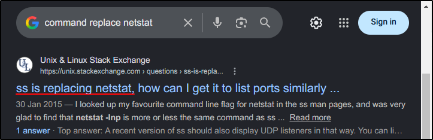
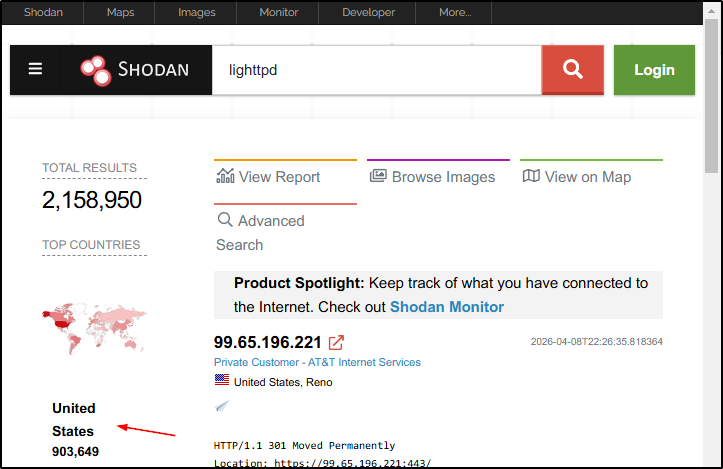
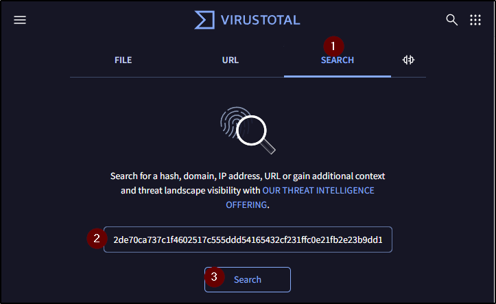
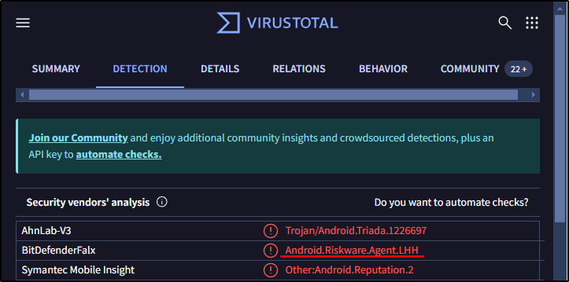
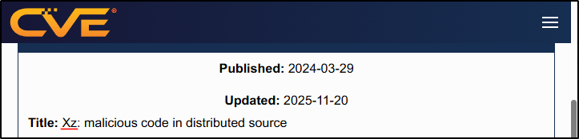
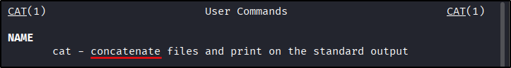
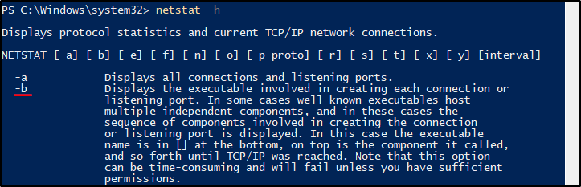

##### Link: [Search Skills](https://tryhackme.com/room/searchskills)
---
##### Task 1: Introduction
1. Check how many results you get when searching for learn hacking. At the time of writing, we got 1.5 billion results when searching on Google.
	- `No answer needed`
---
##### Task 2: Evaluation of Search Results
1. What do you call a cryptographic method or product considered bogus or fraudulent?
	- `Snake oil`
2. What is the name of the command replacing `netstat` in Linux systems?
	- Image
		- 
	- `ss`
---
##### Task 3: Search Engines
1. How would you limit your Google search to PDF files containing the terms `cyber warfare report`?
	- `filetype:pdf cyber warfare report`
2. What phrase does the Linux command `ss` stand for?
	- `socket statistics`
---
##### Task 4: Specialized Search Engines
1. What is the top country with `lighttpd` servers?
	- Search in `Shodan`
		- 
	- `United States`
2. What does `BitDefenderFalx` detect the file with the hash `2de70ca737c1f4602517c555ddd54165432cf231ffc0e21fb2e23b9dd14e7fb4` as?
	- Search in `https://www.virustotal.com/`
		- 
		- 
	- `Android.Riskware.Agent.LHH`
---
##### Task 5: Vulnerabilities and Exploits
1. What utility does `CVE-2024-3094` refer to?
	- Visit: `https://www.cve.org/CVERecord?id=CVE-2024-3094`
		- 
	- `xz`
---
##### Task 6: Technical Documentation
1. What does the Linux command `cat` stand for?
	- Run `man cat` in terminal
		- 
	- `concatenate`
2. What is the `netstat` parameter in MS Windows that displays the executable associated with each active connection and listening port?
	- Run `netstat -h` in `PowerShell`
		- 
	- `-b`
---
##### Task 7: Social Media
1. You are hired to evaluate the security of a particular company. What is a popular social media website you would use to learn about the technical background of one of their employees?
	- `LinkedIn`
2. Continuing with the previous scenario, you are trying to find the answer to the secret question, “Which school did you go to as a child?”. What social media website would you consider checking to find the answer to such secret questions?
	- `Facebook`
---
##### Task 8: Conclusion
1. Ensure you have noted the various search engines and resources mentioned in this room as they will be convenient in any cyber security path you follow.
	- `No answer needed`
---
