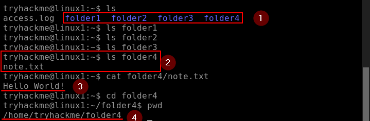
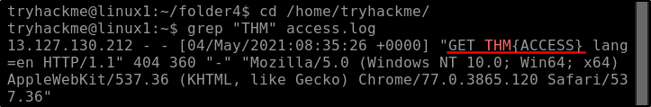

##### Link: [Linux Fundamentals Part 1](https://tryhackme.com/room/linuxfundamentalspart1)
---
##### Task 1: Introduction
1. Let's get started!
	- `No answer needed`
---
##### Task 2: Introduction
1. Research: What year was the first release of a Linux operating system?
	- `1991`
---
##### Task 3: Interacting With Your First Linux Machine (In-Browser)
1. I've deployed my first Linux machine!
	- `No answer needed`
---
##### Task 4: Running Your First few Commands
1. If we wanted to output the text `TryHackMe`, what would our command be?
	- Image
		- 
	- `echo TryHackMe`
2. What is the username of who you're logged in as on your deployed Linux machine?
	- `tryhackme`
---
##### Task 5: Interacting With the Filesystem!’
1. On the Linux machine that you deploy, how many folders are there?
	- Use `ls` command
		- 
	- Answer: `4`
2. Which directory contains a file? 
	- Use `ls` command on each directory
		- `ls folder1`
		- `ls folder2`
		- `ls folder3`
		- `ls folder4`
	- Answer:  `folder4`
3. What is the contents of this file?
	- Use `cat` command
		- `cat folder4/note.txt`
	- Answer:  `Hello World!`
4. Use the `cd` command to navigate to this file and find out the new current working directory. What is the path?
	- Use `cd folder4` then `pwd`
	- Answer:  `/home/tryhackme/folder4`
---
##### Task 6: Searching for Files
1. Use grep on "access.log" to find the flag that has a prefix of `THM`. What is the flag? Note: The `access.log` file is located in the `/home/tryhackme/` directory.
	- Move to directory where file located
		- `cd /home/tryhackme/`
	- Use`grep` to find the file with matching prefix 
		- `grep "THM" access.log`
		- 
	- Answer: `THM{ACCESS}`
2. And I still haven't found what I'm looking for!
	- `No answer needed`
---
##### Task 7: An Introduction to Shell Operators
1. If we wanted to run a command in the background, what operator would we want to use?
	- `&`
2. If I wanted to replace the contents of a file named "`passwords`" with the word "`password123`", what would my command be?
	- `echo password123 > passwords`
3. Now if I wanted to add "`tryhackme`" to this file named "`passwords`" but also keep "`passwords123`", what would my command be
	- `echo tryhackme >> passwords`
4. Now use the deployed Linux machine to put these into practice
	- `No answer needed`
---
##### Task 8: Conclusions & Summaries
1. I'll have a play around!
	- `No answer needed`
---
##### Task 9: Linux Fundamentals Part 2
1. Terminate the machine deployed in this room from task 3. 
	- `No answer needed`
2. Join Linux Fundamentals Part 2!
	- `No answer needed`
---
