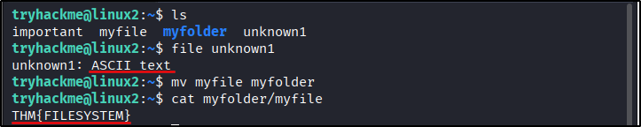
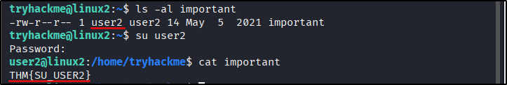

##### Link: [Linux Fundamentals Part 2](https://tryhackme.com/room/linuxfundamentalspart2)
---
##### Task 1: Introduction
1. Let's proceed!
	- `No answer needed`
---
##### Task 2: Accessing Your Linux Machine Using SSH (Deploy)
1. I've logged into the Linux Fundamentals Part 2 machine using SSH!
	- `No answer needed`
---
##### Task 3: Introduction to Flags and Switches
1. Explore the manual page of the ls command
	- `No answer needed`
2. What directional arrow key would we use to navigate down the manual page?
	- `Down`
3. What flag would we use to display the output in a "human-readable" way?
	- Run `man ls`  
		- 
	- Answer: `-h`
---
##### Task 4: Filesystem Interaction Continued
1. How would you create the file named "`newnote`"?
	- `touch newnote`
2. On the deployable machine, what is the file type of "`unknown1`" in "`tryhackme`'s" home directory?
	- Use `file` command
		- 
	- Answer: `ASCII text`
3. How would we move the file "`myfile`" to the directory "`myfolder`" 
	- Answer: `mv myfile myfolder`
4. What are the contents of this file?
	- Run command `cat myfolder/myfile`
	- Answer: `THM{FILESYSTEM}`
5. Continue to apply your knowledge and practice the commands from this task.
	- `No answer needed`
---
##### Task 5: Permissions 101
1. On the deployable machine, who is the owner of "`important`"?
	- Command: `ls -al important`
		- 
	- Answer: `user2`
2. What would the command be to switch to the user "`user2`"?
	- Answer: `su user2`
3. Now switch to this user "`user2`" using the password "`user2`"
	- `No answer needed`
4. Output the contents of "`important`", what is the flag?
	- Command: `cat important`
	- Answer: `THM{SU_USER2}`
---
##### Task 6: Common Directories
1. Read me!
	- `No answer needed`
2. What is the directory path that would we expect logs to be stored in?
	- `/var/log`
3. What root directory is similar to how RAM on a computer works?
	- `/tmp`
4. Name the home directory of the root user 
	- `/root`
5. Now apply your learning and navigate through these directories on the deployed Linux machine.
	- `No answer needed`
---
##### Task 7: Conclusions and Summaries
1. Proceed to the next task to continue your learning
	- `No answer needed`
---
##### Task 8: Linux Fundamentals Part 3
1. Terminate the machine from task 2!
	- `No answer needed
2. Join Linux Fundamentals Part 3!
	- `No answer needed
---
 