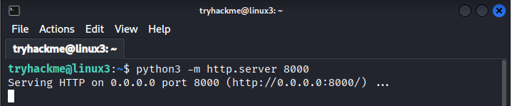
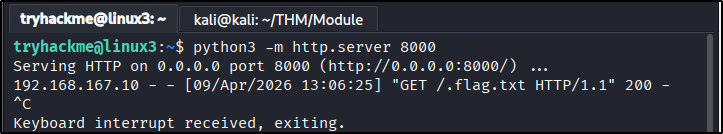
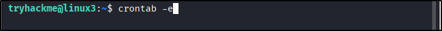
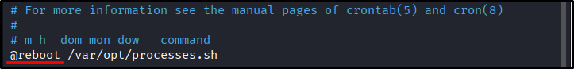

##### Link: [Linux Fundamentals Part 3](https://tryhackme.com/room/linuxfundamentalspart3)
---
##### Task 1: Introduction
1. Let's proceed!
	- `No answer needed`
---
##### Task 2: Deploy Your Linux Machine
1. I've logged into the Linux Fundamentals Part 3 machine using SSH and have deployed the AttackBox successfully!
	- `No answer needed`
---
##### Task 3: Terminal Text Editors
1. Create a file using Nano
	- `No answer needed
2. Edit `task3` located in `tryhackme`'s home directory using Nano. What is the flag?
	- Command: `nano task3`
		- 
		- 
	- Answer: `THM{TEXT_EDITORS}`
---
##### Task 4: General/Useful Utilities
1. Ensure you are connected to the deployed instance (``xx.xx.xx.xx``)
	- `No answer needed
2. Now, use Python 3's `HTTPServer` module to start a web server in the home directory of the `tryhackme` user on the deployed instance.
	- Command: `python3 -m http.server 8000`
		- 
	- `No answer needed
3. Download the file [http://`xx.xx.xx.xx`.:8000/.flag.txt (opens in new tab)](http://`xx.xx.xx.xx`.:8000/.flag.txt) onto the `TryHackMe` `AttackBox`. Remember, you will need to do this in a new terminal. What are the contents?
	- We will download flag file from target to our attack **host**
	- Open new tab, use `wget` to download the file
		- `wget http://`xx.xx.xx.xx`.:8000/.flag.txt`
	- Then read it
		- `cat .flag.txt`
			- 
	- Answer: `THM{WGET_WEBSERVER}` 
4. Use `Ctrl + C` to stop the Python3 `HTTPServer` module once you are finished.
	- Image:
		- 
	- `No answer needed`
---
##### Task 5: Processes 101
1. Read me!
	- `No answer needed`
2. If we were to launch a process where the previous ID was `300`, what would the ID of this new process be?
	- `301`
3. If we wanted to **cleanly** kill a process, what signal would we send it?
	- `SIGTERM`
4. Locate the process that is running on the deployed instance (`xx.xx.xx.xx`.). What flag is given?
	- We use `ps` and combine it with grep to only show the process with the flag
		- `ps aux | grep "THM"`
			- 
	- Answer: `THM{PROCESSES}`
5. What command would we use to stop the service `myservice`?
	- `systemctl stop myservice`
6. What command would we use to start the same service on the boot-up of the system?
	- `systemctl enable myservice`
7. What command would we use to bring a previously backgrounded process back to the foreground?
	- `fg`
---
##### Task 6: Maintaining Your System: Automation
1. Ensure you are connected to the deployed instance and look at the running crontabs.
	- `No answer needed`
2. When will the crontab on the deployed instance (`xx.xx.xx.xx`) run?
	- Open crontab file
		- `crontab -e`
			- 
			- 
	- Answer: `@reboot`
---
##### Task 7: Maintaining Your System: Package Management
1. Since `TryHackMe` instances do not have an internet connection...this task only requires you to read through the material.
	- `No answer needed`
---
##### Task 8: Maintaining Your System: Logs
1. Look for the apache2 logs on the deployable Linux machine
	- `No answer needed
2. What is the IP address of the user who visited the site?
	- Check log directory to see which on accessible by us
		- `ls -al /var/log/apache2/`
	- We can read `access.log.1`, let’s read it
		- `cat /var/log/apache2/access.log.1`
		- 
	- We get the IP and name of accessed file
	- Answer: `10.9.232.111`
3. What file did they access?
	- Answer: `catsanddogs.jpg`
---
##### Task 9: Conclusions & Summaries
1. Terminate the machine deployed in this room from task 2. 
	- `No answer needed

---