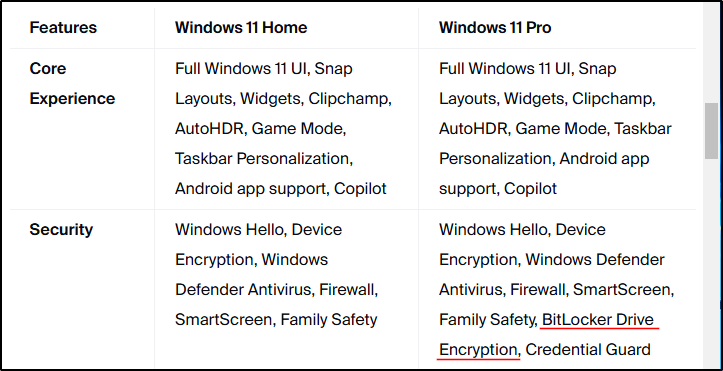
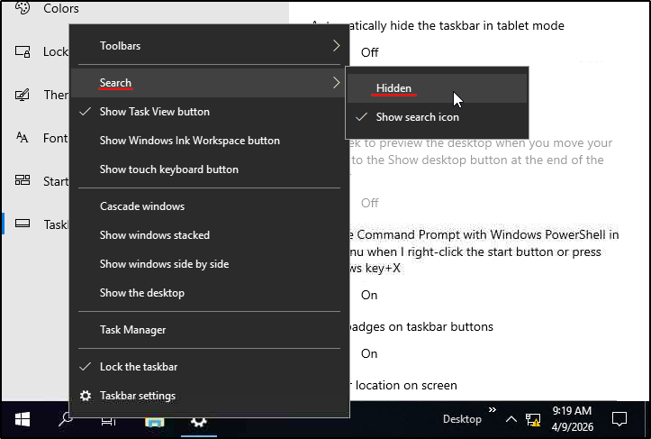
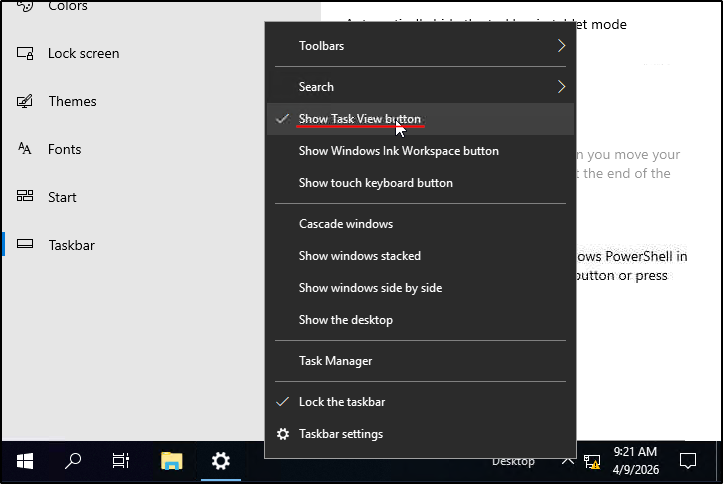
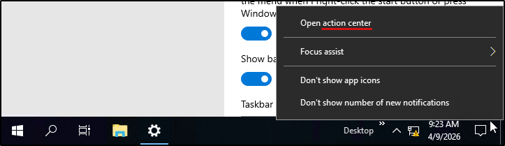
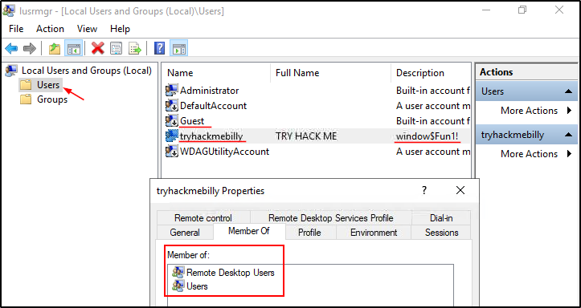
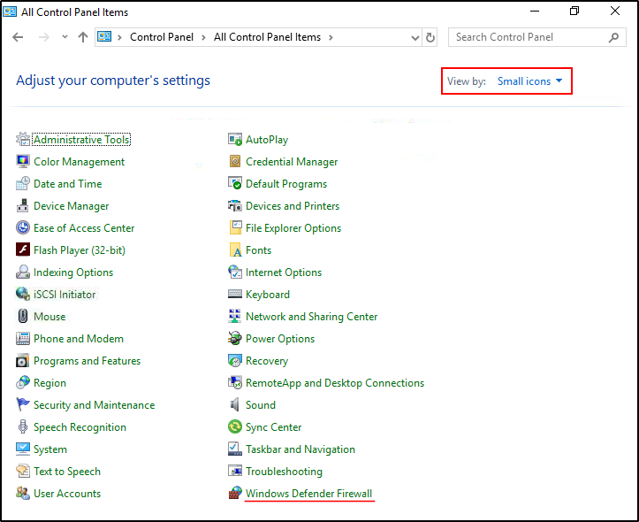
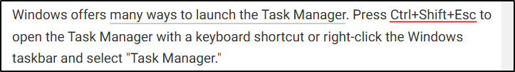

##### Link: [Windows Fundamentals 1](https://tryhackme.com/room/windowsfundamentals1xbx)
---
##### Task 1: Windows Editions
1. What encryption can you enable on Pro that you can't enable in Home?
	- From `https://www.zdnet.com/article/windows-11-home-windows-11-pro-compared/`
		- 
	- Answer: `BitLocker`
---
##### Task 2: The Desktop (GUI)
1. Which selection will hide/disable the Search box?
	- Right click on taskbar → `Search` → `Hidden`
		- 
	- Answer: `Hidden`
2. Which selection will hide/disable the Task View button?
	- Right click on taskbar → `Show Task View Button`
		- 
	- Answer: `Show Task View button`
3. Besides Clock and Network, what other icon is visible in the Notification Area?
	- Message icon at bottom right cornet
		- 
	- Answer: `Action Center`
	
---
##### Task 3: Introduction to Windows
1. Read above and start the virtual machine.
	- `No answer needed`
---
##### Task 4: The File System
1. What is the meaning of NTFS?
	- `New Technology File System`
---
##### Task 5: The Windows\System32 Folders
1. What is the system variable for the Windows folder?
	- `%windir%`
---
##### Task 6: User Accounts, Profiles, and Permissions
1. What is the name of the other user account?
	- Open `lusrmgr.msc` → `Users`
		- 
	- Answer: `tryhackmebilly`
2. What groups is this user a member of?
	- Double click on `tryhackmebilly`
	- Answer: `Remote Desktop Users,Users`
3. What built-in account is for guest access to the computer?
	- `Guest`
4. What is the account description?
	- `window$Fun1!`
---
##### Task 7: User Account Control
1. What does UAC mean?
	- `User Account Control`
---
##### Task 8: Settings and the Control Panel
1. In the Control Panel, change the view to Small icons. What is the last setting in the Control Panel view?
	- Image:
		- 
	- `Windows Defender Firewall`
---
##### Task 9: Task Manager
1. What is the keyboard shortcut to open Task Manager?
	- 
	- Answer: `Ctrl+Shift+Esc`
---
##### Task 10:  Conclusion
1. Read above and terminate the Windows machine you deployed in this room.
	- `No answer needed`
---
