##### Link: [Windows Fundamentals 2](https://tryhackme.com/room/windowsfundamentals2x0x)
---
##### Task 1: Introduction
1. Read above and start the virtual machine.
	- `No answer needed`
---
##### Task 2: System Configuration and Advanced System Settings
1. What is the name of the service that lists Systems Internals as the manufacturer?
	- Open `msconfig` → `Services`
		- 
	- Answer: `PsShutdown`
2. Whom is the Windows license registered to?
	- `msconfig` →`Tools` → `About Windows` → `Launch`
		- 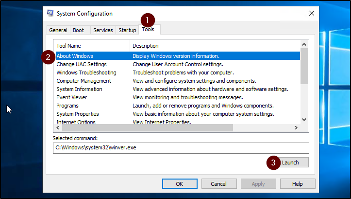
		- 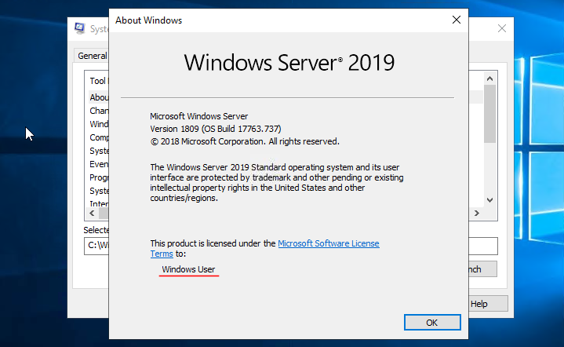
	- Answer: `Windows User`
3. What is the command for Windows Troubleshooting?
	- Select `Windows Troubleshooting`:
		- 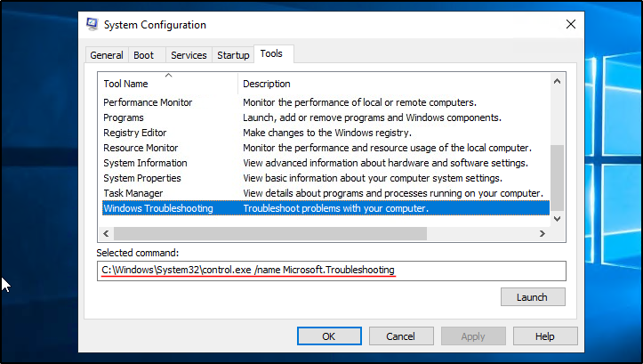
	- Answer: `C:\Windows\System32\control.exe /name Microsoft.Troubleshooting`
4. What command will open the Control Panel? (The answer is  the name of .exe, not the full path)
	- Select `System Properties`
		- 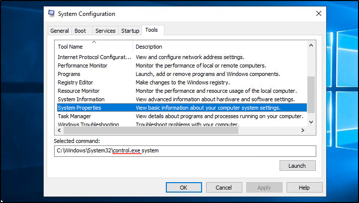
	- Answer: `control.exe`
---
##### Task 3: Change UAC Settings
1. What is the command to open User Account Control Settings? (The answer is the name of the .exe file, not the full path)
	- Select `Change UAC Settings`
		- 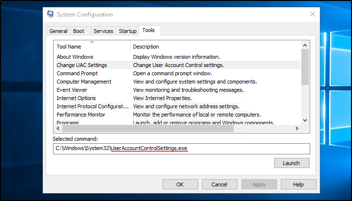
	- `UserAccountControlSettings.exe`
---
##### Task 4: Computer Management
1. What is the command to open Computer Management? (The answer is the name of the .msc file, not the full path)
	- `msconfig` → `Tools`
		- 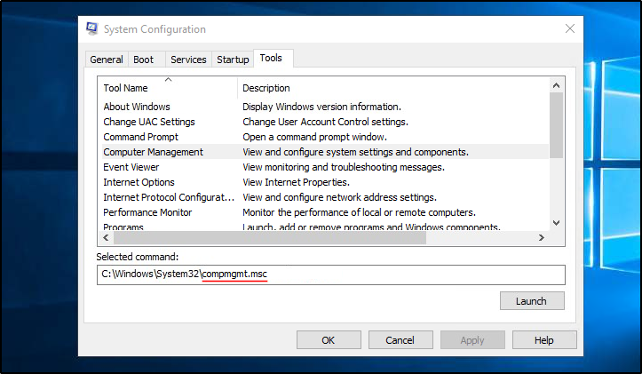
	- Answer: `compmgmt.msc`
2. When is the `npcapwatchdog` scheduled task set to run at?
	- Launch `Computer Management` from previous question, go to `Task Scheduler`
		- 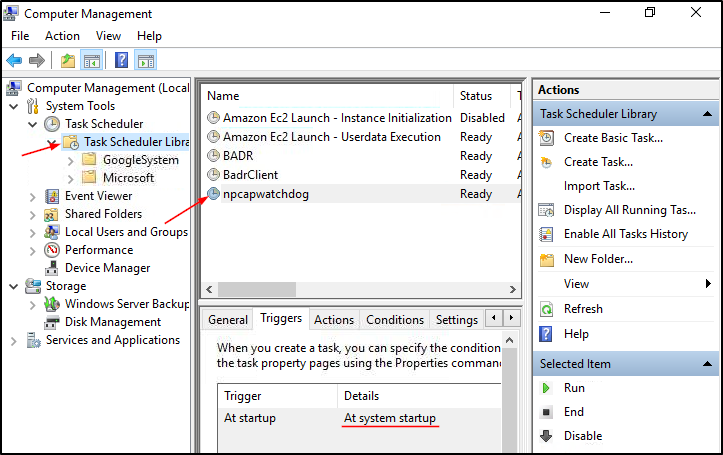
	- Answer: `At system startup`
3. What is the name of the hidden folder that is shared?
	- From previous question, go to `Shared Folders` → `Sharesl
		- 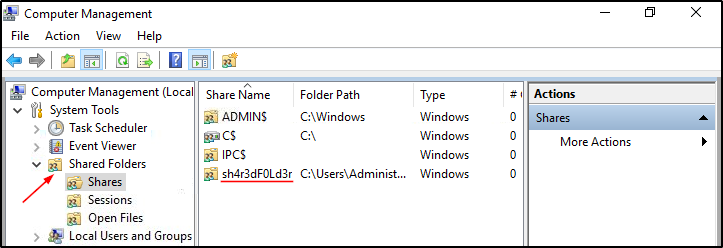`
	- Answer: `sh4r3dF0Ld3r`
---
##### Task 5: System Information
1. What is the command to open `System Information`? (The answer is the name of the .exe file, not the full path)
	- From `System Configuration`
		- 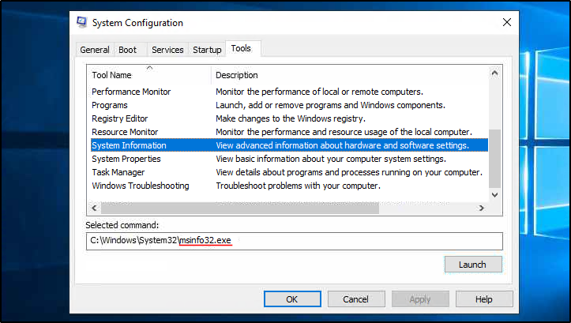
	- Answer: `msinfo32.exe`
2. What is listed under System Name?
	- Launch `System Information` from previous question
		- 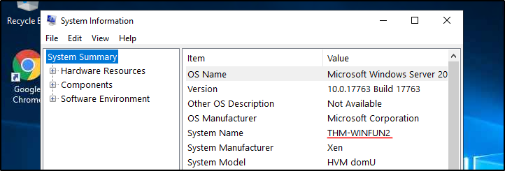
	- Answer: `THM-WINFUN2`
3. Under Environment Variables, what is the value for `ComSpec`?
	- `System Information` → `Software Environment` → `Environment Variables`
		- 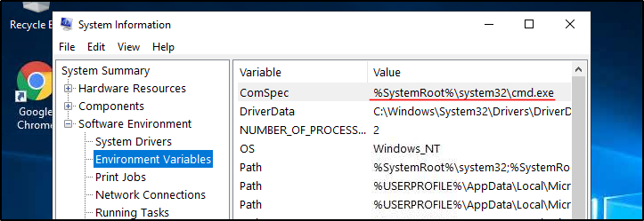
	- Answer: `%SystemRoot%\system32\cmd.exe`
---
##### Task 6: Resource Monitor
1. What is the command to open Resource Monitor? (The answer is the name of the .exe file, not the full path)
	- From `System Configuration`
		- 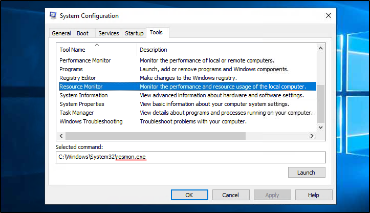
	- `resmon.exe`
---
##### Task 7: Command Prompt
1. In System Configuration, what is the full command for Internet Protocol Configuration?
	- From `System Configuration`
		- 
	- Answer: `C:\Windows\System32\cmd.exe /k %windir%\system32\ipconfig.exe`
2. For the `ipconfig` command, how do you show detailed information?
	- Run `ipconfig -h` in Powershell
		- 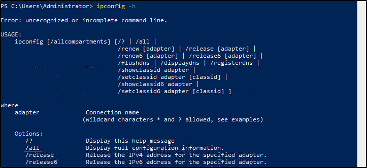
	- Answer: `ipconfig /all`
---
##### Task 8: Registry Editor
1. What is the command to open the Registry Editor? (The answer is the name of  the .exe file, not the full path)
	- From `System Configuration`
		- 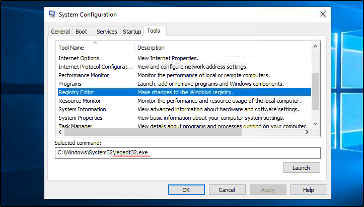
	- Answer: `regedt32.exe`
---
##### Task 9: Conclusion
1. Read above.
	- `No answer needed`
---
 