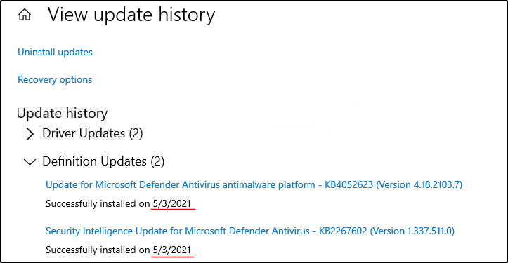
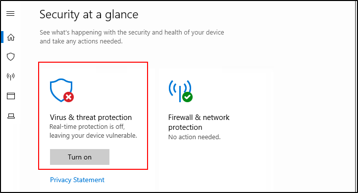
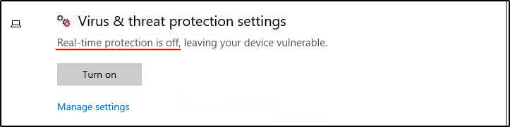
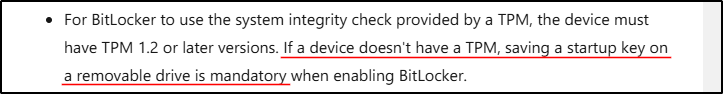

##### Link: [Windows Fundamentals 3](https://tryhackme.com/room/windowsfundamentals3xzx)
---
##### Task 1: Introduction
1. Read the above and start the virtual machine.
	- `No answer needed`
---
##### Task 2: Windows Updates
1. There were two definition updates installed in the attached VM. On what date were these updates installed?
	- Open `Windows Update` → `View update history -> Definition Updates`
		- 
	- `5/3/2021`
---
##### Task 3: Windows Security
1. Checking the Security section on your VM, which area needs immediate attention?
	- Open `Windows Security`
		- 
	- `Virus & threat protection`
---
##### Task 4: Virus & threat protection
1. Specifically, what is turned off that Windows is notifying you to turn on?
	- From previous question, select `Virus & threat protection`
		- 
	- `Real-time protection`
---
##### Task 5: Firewall & network protection
1. If you were connected to airport Wi-Fi, what most likely will be the active firewall profile?
	- `Public network`
---
##### Task 6: App & browser control
1. Read the above.
	- `No answer needed`
---
##### Task 7: Device security
1. What is the TPM?
	- `Trusted Platform Module`
---
##### Task 8: BitLocker
1. We should use a removable drive on systems without a TPM version 1.2 or later. What does this removable drive contain?
	- Open link provided in module
		- 
	- `startup key`
---
##### Task 9: Volume Shadow Copy Service
1. What is VSS?
	- `Volume Shadow Copy Service`
---
##### Task 10:  Conclusion
1. Read the above.
	- `No answer needed`
---
