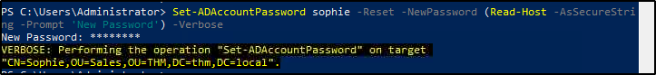
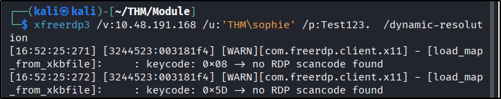
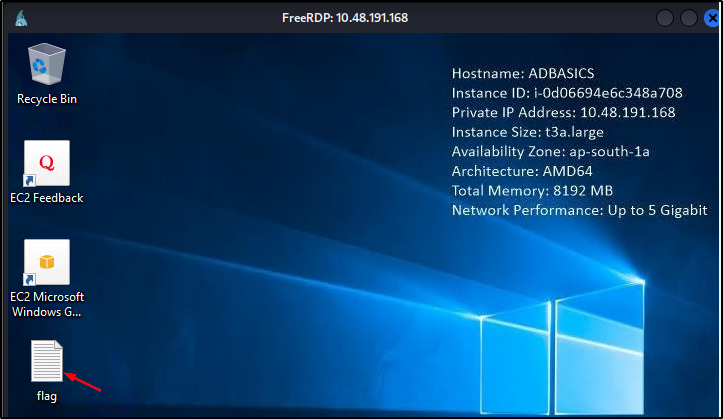
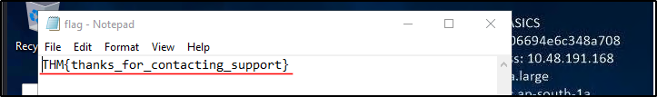
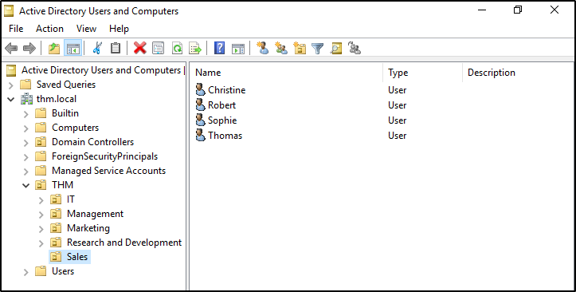
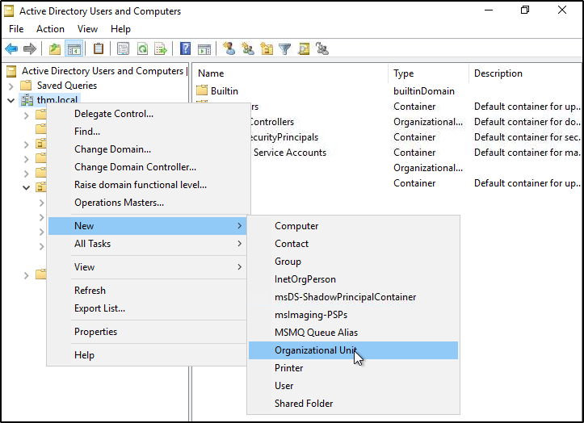
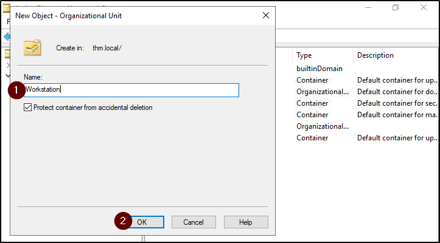
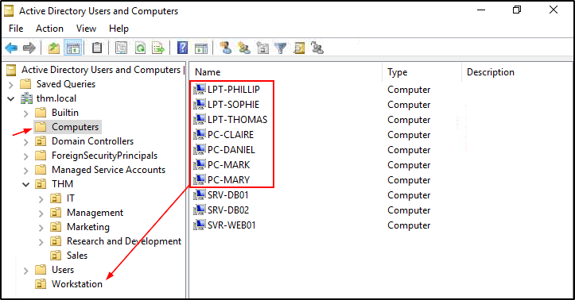
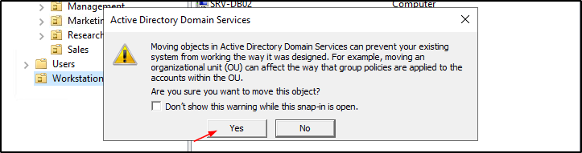
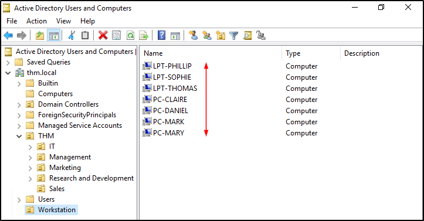

##### Link: [Active Directory Basics](https://tryhackme.com/room/winadbasics)
---
##### Task 1: Introduction
1. Click and continue learning!
	- `No answer needed`
---
##### Task 2: Windows Domains
1. In a Windows domain, credentials are stored in a centralized repository called...
	- `Active Directory`
2. The server in charge of running the Active Directory services is called...
	- `Domain Controller`
---
##### Task 3: Active Directory
1. Which group normally administrates all computers and resources in a domain?
	- `Domain Admins`
2. What would be the name of the machine account associated with a machine named TOM-PC?
	- `TOM-PC$`
3. Suppose our company creates a new department for Quality Assurance. What type of containers should we use to group all Quality Assurance users so that policies can be applied consistently to them?
	- `Organizational Units`
---
##### Task 4: Managing Users in AD
1. What was the flag found on Sophie's desktop?
	- Open `Powershell`, change Sophie’s password to `Test123.`
		- `Set-ADAccountPassword sophie -Reset -NewPassword (Read-Host -AsSecureString -Prompt 'New Password') -Verbose`
			- 
	- From attack host, connect as `Sophie` with new password
		- `xfreerdp3 /v:xx.xx.xx.xx. /u:'THM\sophie' /p:Test123. /dynamic-resolution`
			- 
			- 
	- Read the flag file
		- 
	- Answer: `THM{thanks_for_contacting_support}`
2. The process of granting privileges to a user over some OU or other AD Object is called...
	- `delegation`
---
##### Task 5: Managing Computers in AD
1. After organizing the available computers, how many ended up in the Workstations OU?
	- Open `Active Directory Users & Computers`
		- 
	- Create `Workstation` OU by right click on `thm.local` → `New` → `Organizational Unit`
		- 
	- Name it `Workstation`
		- 
	- Go to computers, drag all computer with prefix `LPT-` & `PC-`
		- 
	- If there’s warning. just select `Yes`
		- 
	- Count the result
		- 
	- Answer: `7`
2. Is it recommendable to create separate OUs for Servers and Workstations? (yay/nay)
	- `Yay`
---
##### Task 6: Group Policies
1. What is the name of the network share used to distribute `GPO`s to domain machines?
	- `sysvol`
2. Can a `GPO` be used to apply settings to users and computers? (yay/nay)
	- `yay`
---
##### Task 7: Authentication Methods
1. Will a current version of Windows use `NetNTLM` as the preferred authentication protocol by default? (yay/nay)
	- `nay`
2. When referring to `Kerberos`, what type of ticket allows us to request further tickets known as TGS`?`
	- `Ticket Granting Ticket`
3. When using `NetNTLM`, is a user's password transmitted over the network at any point? (yay/nay)
	- `nay`
---
##### Task 8: Trees, Forests and Trusts
1. What is a group of Windows domains that share the same namespace called?
	- `Tree`
2. What should be configured between two domains for a user in Domain A to access a resource in Domain B?
	- `A Trust Relationship`
---
##### Task 9: Conclusion
1. Click and continue learning!
	- `No answer needed`
---
