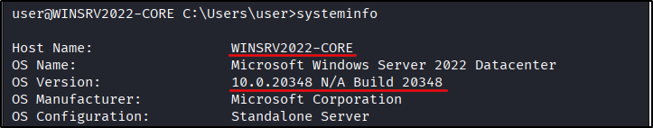
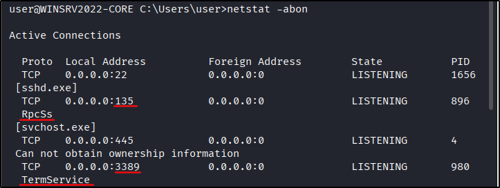
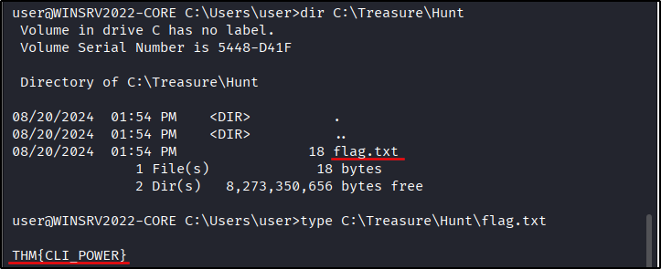
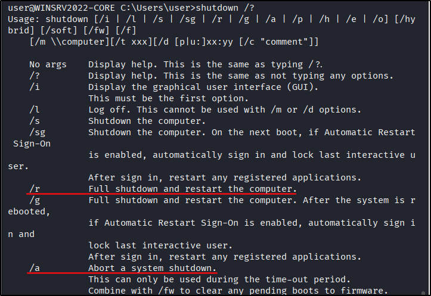

##### Link: [Windows Command Line](https://tryhackme.com/room/windowscommandline)
---
##### Task 1: Introduction
1. What is the default command line interpreter in the Windows environment?
	- `cmd.exe`
---
##### Task 2: Basic System Information
1. What is the OS version of the Windows VM?
	- Run `systeminfo`
		- 
	- `10.0.20348.2655`
2. What is the hostname of the Windows VM?
	- `WINSRV2022-CORE`
---
##### Task 3: Network Troubleshooting
1. Which command can we use to look up the server’s physical address (MAC address)?
	- `ipconfig /all`
2. What is the name of the service listening on port `135`?
	- run `netstat -abon`
		- 
	- `RpcSs`
3. What is the name of the service listening on port `3389`?
	- `TermService`
---
##### Task 4: File and Disk Management
1. What are the file’s contents in C:\Treasure\Hunt?
	- Identify filename
		- `dir C:\Treasure\Hunt`
			- 
	- Read the file
		- `type C:\Treasure\Hunt\flag.txt`
	- `THM{CLI_POWER}`
---
##### Task 5: Task and Process Management
1. What command would you use to find the running processes related to `notepad.exe`?
	- `tasklist /FI "imagename eq notepad.exe"`
2. What command can you use to kill the process with PID `1516`?
	- `taskkill /PID 1516`
---
##### Task 6: Conclusion
1. The command `shutdown /s` can shut down a system. What is the command you can use to restart a system?
	- Run `shutdown /?`
		- 
	- `shutdown /r`
2. What command can you use to abort a scheduled system shutdown?
	- `shutdown /a`
---
 