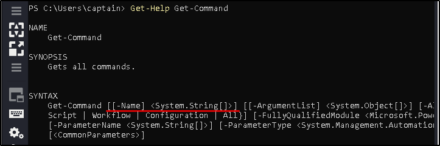
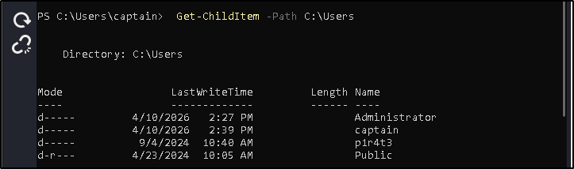
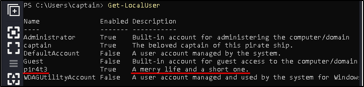
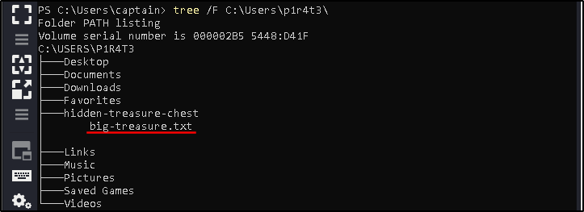
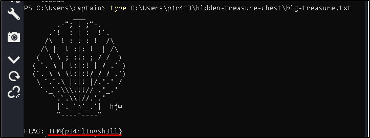
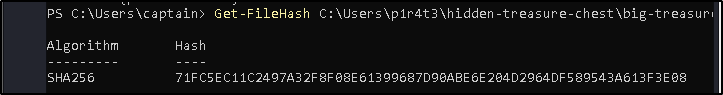

)##### Link: [Windows PowerShell](https://tryhackme.com/room/windowspowershell
---
##### Task 1: Introduction
1. Raise the anchor, hoist the sails—it's time to set sail!
	- `No answer needed`
---
##### Task 2: What Is PowerShell
1. What do we call the advanced approach used to develop PowerShell?
	- `object-oriented`
---
##### Task 3: PowerShell Basics
1. How would you retrieve a list of commands that start with the verb `Remove`? (for the sake of this question, avoid the use of quotes (" or ') in your answer)
	- Run `Get-Help Get-Command` to view the manual
		- 
	- Use `-Name` parameter followed by search keyword
	- `Get-Command -Name Remove*`
2. What cmdlet has its traditional counterpart `echo` as an alias?
	- Use `Get-Alias` with `findstr` to filter the output
		- 
	- `Write-Output`
3. What is the command to retrieve some example usage for the cmdlet `New-LocalUser`?
	- `Get-Help New-LocalUser -examples`

---
##### Task 4: Navigating the File System and Working with Files
1. What cmdlet can you use instead of the traditional Windows command `type`?
	- `Get-Content`
2. What PowerShell command would you use to display the content of the "C:\Users" directory? (for the sake of this question, avoid the use of quotes (" or ') in your answer)
	- ` Get-ChildItem -Path C:\Users`
3. How many items are displayed by the command described in the previous question?
	- Image
		- 
	- `4`
---
##### Task 5: Piping, Filtering, and Sorting Data
1. How would you retrieve the items in the current directory with size greater than 100? (for the sake of this question, avoid the use of quotes (" or ') in your answer)
	- To filter based on size, we use `Length` property as filter
	- `Get-ChildItem | Where-Object -Property Length -gt 100`
---
##### Task 6: System and Network Information
1. Other than your current user and the default `Administrator` account, what other user is enabled on the target machine?
	- Run `Get-LocalUser`
		- 
	- `p1r4t3`
2. This lad has hidden his account among the others with no regard for our beloved captain! What is the motto he has so bluntly put as his account's description?
	- `A merry life and a short one.`
3. Now a small challenge to put it all together. This shady lad that we just found hidden among the local users has his own home folder in the "`C:\Users`" directory.  Can you navigate the filesystem and find the hidden treasure inside this pirate's home?
	- We use `tree /F` to show directory content recursively
		- `tree /F C:\Users\p1r4t3\`
		- 
	- Now read the file
		- `type C:\Users\p1r4t3\hidden-treasure-chest\big-treasure.txt`
		- 
	- `THM{p34rlInAsh3ll}`
---
##### Task 7: Real-Time System Analysis
1. In the previous task, you found a marvelous treasure carefully hidden in the target machine. What is the hash of the file that contains it?
	- `Get-FileHash C:\Users\p1r4t3\hidden-treasure-chest\big-treasure.txt`
		- 
	- `71FC5EC11C2497A32F8F08E61399687D90ABE6E204D2964DF589543A613F3E08`
2. What property retrieved by default by `Get-NetTCPConnection` contains information about the process that has started the connection?
	- `OwningProcess`
3. It's time for another small challenge. Some vital service has been installed on this pirate ship to guarantee that the captain can always navigate safely. But something isn't working as expected, and the captain wonders why. Investigating, they find out the truth, at last: the service has been tampered with! The shady lad from before has modified the service `DisplayName` to reflect his very own motto, the same that he put in his user description. With this information and the PowerShell knowledge you have built so far, can you find the service name?
	- Use `Get-Service` and filter the output with `findstr`
		- `Get-Service | findstr merry`
		- 
	- `p1r4t3-s-compass`
---
##### Task 8: Scripting
1. What is the syntax to execute the command `Get-Service` on a remote computer named "RoyalFortune"? Assume you don't need to provide credentials to establish the connection. (for the sake of this question, avoid the use of quotes (" or ') in your answer)
	- `Invoke-Command -ComputerName RoyalFortune -ScriptBlock { Get-Service }`
---
##### Task 9: Conclusion
1. I'm ready to go on to the next adventure!
	- `No answer needed`
---
 