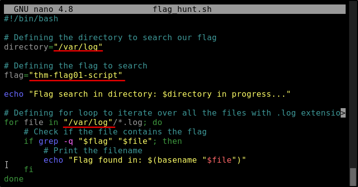
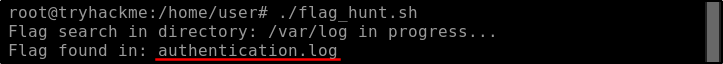
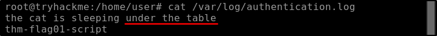

##### Link: [Linux Shells](https://tryhackme.com/room/linuxshells)
---
##### Task 1: Introduction to Linux Shells
1. Who is the facilitator between the user and the OS?
	- `Shell`
---
##### Task 2: How To Interact With a Shell?
1. What is the default shell in most Linux distributions?
	- `Bash`
2. Which command utility is used to list down the contents of a directory?
	- `ls`
3. Which command utility can help you search for anything in a file?
	- `grep`
---
##### Task 3: How To Interact With a Shell?
1. Which shell comes with syntax highlighting as an out-of-the-box feature?
	- `Fish`
2. Which shell does not have auto spell correction?
	- `Bash`
3. Which command displays all the previously executed commands of the current session?
	- `history`
---
##### Task 4: Shell Scripting and Components
1. What is the shebang used in a Bash script?
	- `#!/bin/bash`
2. Which command gives executable permissions to a script?
	- `chmod +x`
3. Which scripting functionality helps us configure iterative tasks?
	- `loops`
---
##### Task 5: The Locker Script
1. What would be the correct PIN to authenticate in the locker script?
	- `7385`
---
##### Task 6: Practical Exercise
1. Which file has the keyword?
	- Switch to root user with password `user@Tryhackme` when prompted
		- `sudo su`
		- 
	- Open file with `nano` text editor
		- `nano flag_hunt.sh`
	- We find 3 lines to be modified, edit it
		- 
	- Save and quit with `Ctrl+x` then `Y` then `enter`
	- Execute the script, we find the file where the flag stored
		- `./flag_hunt.sh `
		- 
	- Answer: `authentication.log`
2. Where is the cat sleeping?
	- Read the file
		- `cat /var/log/authentication.log`
		- 
	- Answer: `under the table`
---
##### Task 7: Conclusion
1. Complete the room.
	- `No answer needed`
---
