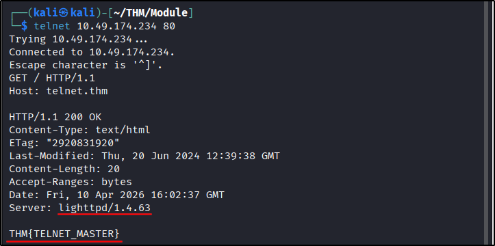

##### Link: [Networking Concepts](https://tryhackme.com/room/networkingconcepts
---
##### Task 1: Introduction
1. Get your notepad ready, and let’s begin.
	- `No answer needed`
---
##### Task 2: OSI Model
1. Which layer is responsible for end-to-end communication between running applications?
	- `4`
2. Which layer is responsible for routing packets to the proper network?
	- `3`
3. In the OSI model, which layer is responsible for encoding the application data?
	- `6`
4. Which layer is responsible for transferring data between hosts on the same network segment?
	- `2`
---
##### Task 3: TCP/IP Model
1. To which layer does HTTP belong in the TCP/IP model?
	- `Application Layer`
2. How many layers of the OSI model does the application layer in the TCP/IP model cover?
	- `3`
---
##### Task 4: IP Addresses and Subnets
1. Which of the following IP addresses is not a private IP address?
	- `192.168.250.125`
	- `10.20.141.132`
	- `49.69.147.197`
	- `172.23.182.251`
	- Answer: `49.69.147.197`
2. Which of the following IP addresses is not a valid IP address?
	- `192.168.250.15`
	- `192.168.254.17`
	- `192.168.305.19`
	- `192.168.199.13`
	- Answer: `192.168.305.19`
---
##### Task 5: UDP and TCP
1. Which protocol requires a three-way handshake?
	- `TCP`
2. What is the approximate number of port numbers (in thousands)?
	- `65`
---
##### Task 6: Encapsulation
1. On a Wi-Fi, within what will an IP packet be encapsulated?
	- `Frame`
2. What do you call the UDP data unit that encapsulates the application data?
	- `Datagram`
3. What do you call the data unit that encapsulates the application data sent over TCP?
	- `Segment`
---
##### Task 7: Telnet
1. Use `telnet` to connect to the web server on `xx.xx.xx.xx`. What is the name and version of the HTTP server?
	- `telnet 10.49.174.234 80`
	- `GET / HTTP/1.1`
	- `GET / HTTP/1.1`
	- Press `enter` twice
		- 
	- Answer: `lighttpd/1.4.63`
2. What flag did you get when you viewed the page?
	- `THM{TELNET_MASTER}`
---
##### Task 8: Conclusion
1. Please note and remember all the concepts, network layers, and protocols explained in this room.
	- `No answer needed`
---