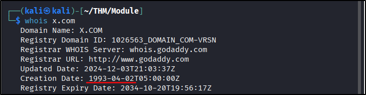
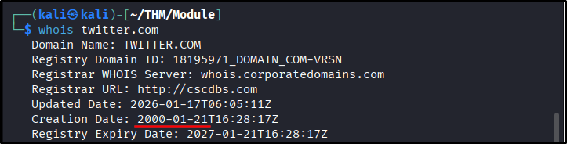
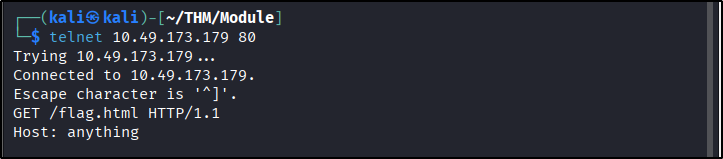
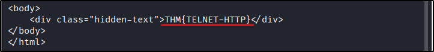
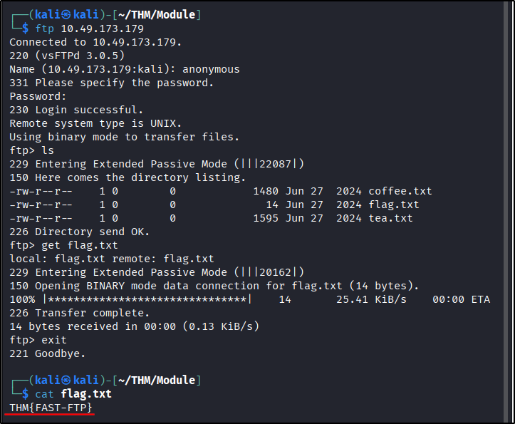
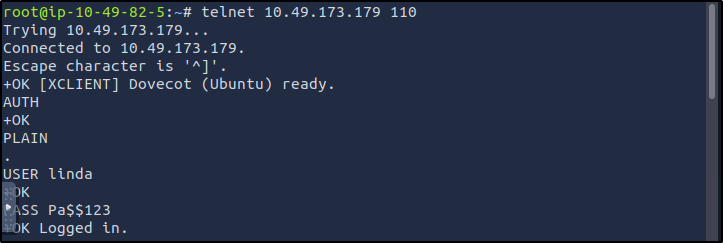
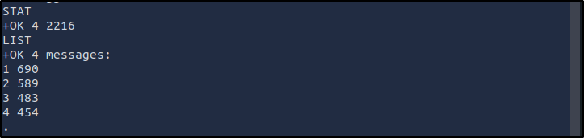
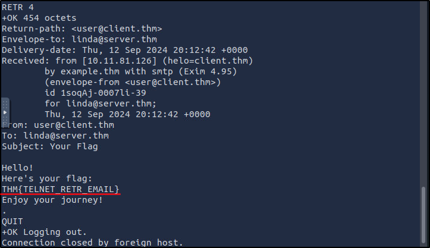

##### Link: [Networking Core Protocols](https://tryhackme.com/room/networkingcoreprotocols)
---
##### Task 1: Introduction
1. Get your notepad ready, and let’s begin.
	- `No answer needed`
---
##### Task 2: DNS: Remembering Addresses
1. Which DNS record type refers to IPv6?
	- `AAAA`
2. Which DNS record type refers to the email server?
	- `MX`
---
##### Task 3: WHOIS
1. When was the x.com record created? Provide the answer in YYYY-MM-DD format.
	- `whois x.com`
		- 
	- `1993-04-02`
2. When was the twitter.com record created? Provide the answer in YYYY-MM-DD format.
	- `whois twitter.com`
		- 
	- `2000-01-21`
---
##### Task 4: HTTP(S): Accessing the Web
1. Use `telnet` to access the file `flag.html` on `MACHINE_IP`. What is the hidden flag?
	- `telnet 10.49.173.179 80`
	- `GET /flag.html HTTP/1.1`
	- `Host: anything`
	- Press enter twice
		- 
		- 
	- Answer: `THM{TELNET-HTTP}`
---
##### Task 5: FTP: Transferring Files
1. Using the FTP client ftp on the `AttackBox`, access the `FTP` server at `MACHINE_IP` and retrieve flag.txt. What is the flag found?
	- `ftp 10.49.173.179`
	- `anonymous`
	- When prompted for password, just press enter
	- `ls`
	- `get flag.txt`
	- `exit`
	- `cat flag.txt`
		- 
	- Answer: `THM{FAST-FTP}`
---
##### Task 6: SMTP: Sending Email
1. Which SMTP command indicates that the client will start the contents of the email message?
	- `DATA`
2. What does the email client send to indicate that the email message has been fully entered?
	- `.`
---
##### Task 7: POP3: Receiving Email
1. Looking at the traffic exchange, what is the name of the POP3 server running on the remote server?
	- `Dovecot`
2. Use `telnet` to connect to `10.49.173.179`’s POP3 server. What is the flag contained in the fourth message? 
	- Note: It doesn’t work on my `Kali` machine so I use `attackbox` for this
	- Connect & get authenticated
		- `telnet 10.49.173.179 110`
		- `AUTH`
		- `PLAIN`
		- `USER linda`
		- `PASS Pa$$123`
			- 
	- View available messages
		- `STAT`
		- `LIST`
			- 
	- Read each message until we find the flag
		- `RETR 1`
		- `RETR 2`
		- `RETR 3`
		- `RETR 4` → Flag
		- `QUIT`
			- 
	- Answer: `THM{TELNET_RETR_EMAIL}`
---
##### Task 8: IMAP: Synchronizing Email
1. What IMAP command retrieves the fourth email message?
	- `FETCH 4 body[]`
---
##### Task 9: Conclusion
1. Let’s join Networking Secure Protocols and learn how to secure these protocols.
	- `No answer needed`
---
