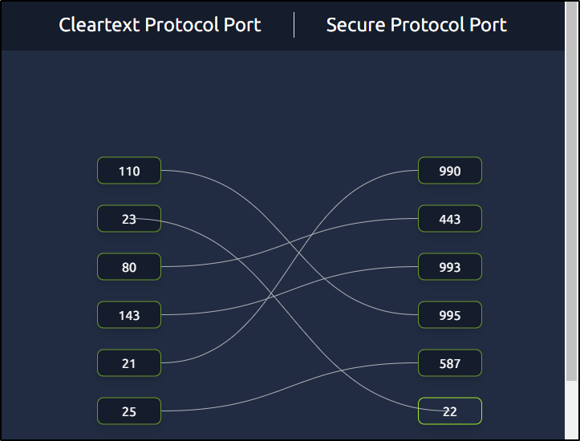
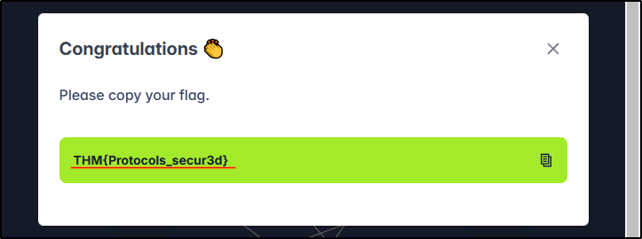
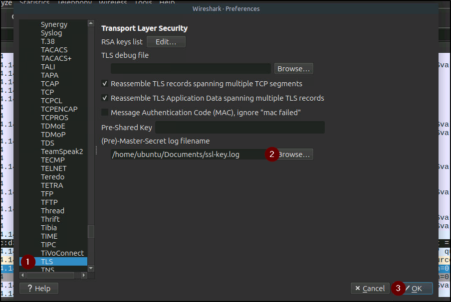
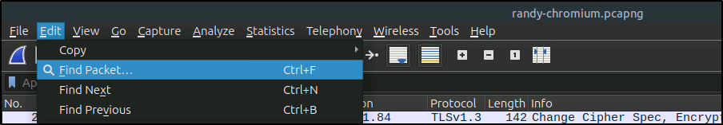
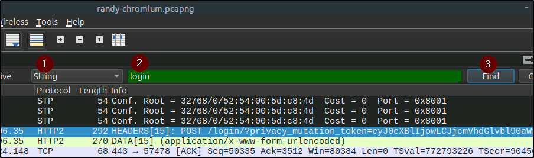
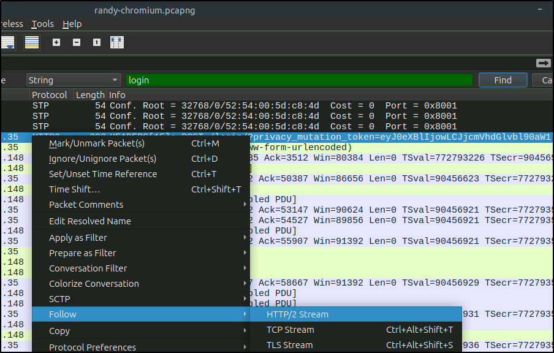
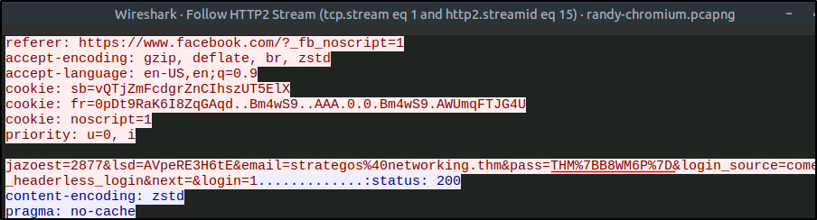

##### Link: [Networking Secure Protocols](https://tryhackme.com/room/networkingsecureprotocols)
---
##### Task 1: Introduction
1. Please ensure you have finished the Networking Core Protocols room at minimum.
	- `No answer needed`
---
##### Task 2: TLS
1. What is the protocol name that TLS upgraded and built upon?
	- `SSL`
2. Which type of certificates should not be used to confirm the authenticity of a server?
	- `self-signed certificate`
---
##### Task 3: HTTPS
1. How many packets did the TLS negotiation and establishment take in the Wireshark HTTPS screenshots above?
	- Packet section marked with `1` & `2` = 3+5 = 8
	- `8`
2. What is the number of the packet that contain the `GET /login` when accessing the website over HTTPS?
	- `10`
---
##### Task 4: SMTPS, POP3S, and IMAPS
1. If you capture network traffic, in which of the following protocols can you extract login credentials: `SMTPS`, `POP3S`, or `IMAP`?
	- `IMAP`
---
##### Task 5: SSH
1. What is the name of the open-source implementation of the SSH protocol?
	- `OpenSSH`
---
##### Task 6: SFTP and FTPS
1. Click on the `View Site` button to access the related site. Please follow the instructions on the site to obtain the flag.
	- Image
		- 
		- 
	- Answer: `THM{Protocols_secur3d}`
---
##### Task 7: VPN
1. What would you use to connect the various company sites so that users at a remote office can access resources located within the main branch?
	- `VPN`
---
##### Task 8: Closing Notes
1. One of the packets contains login credentials. What password did the user submit?
	1. Open `wireshark` then open `randy-chromium.pcapng`
		1. Image
			- 
			- 
	2. We see `TLSv1.3` with info `Application data` indicating it’s encrypted. We need to decrypt it
		1. Go to `Edit -> Preferences -> Protocols -> TLS` 
			- 
			- 
		2. Click `Browse` then select `ssl-key.log` in `Documents` then press `Ok`
			- 
			- 
	3. The data has been decrypted. Now we find the credential
		1. We will use find feature, go to `Edit -> Find Packet`
			- 
		2. Set it as `string`, enter `login` as keyword, then press find
			- 
			1. It points to packet number `365` (sorry the image got cropped). To see full request, `right click → Follow → HTTP/2 Stream`
			- 
		3. We find the URL encoded version of password `THM%7BB8WM6P%7D` which decoded into ``THM{B8WM6P}``
			- 
	- Answer: `THM{B8WM6P}`
---
 