##### Link: [Wireshark: The Basics](https://tryhackme.com/room/wiresharkthebasics
---
##### Task 1: Introduction
1. Which file is used to simulate the screenshots?
	- `http1.pcapng`
2. Which file is used to answer the questions?
	- `Exercise.pcapng`
---
##### Task 2: Tool Overview
- Use the `Exercise.pcapng` file to answer the questions. 
1. Read the `capture file comments`. What is the flag?
	- Open `Capture File Properties` from the icon at the bottom left
	- We find the flag and also answer for question `3`
		- 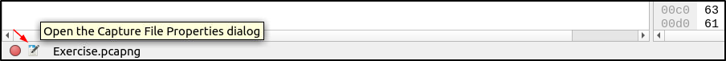
		- 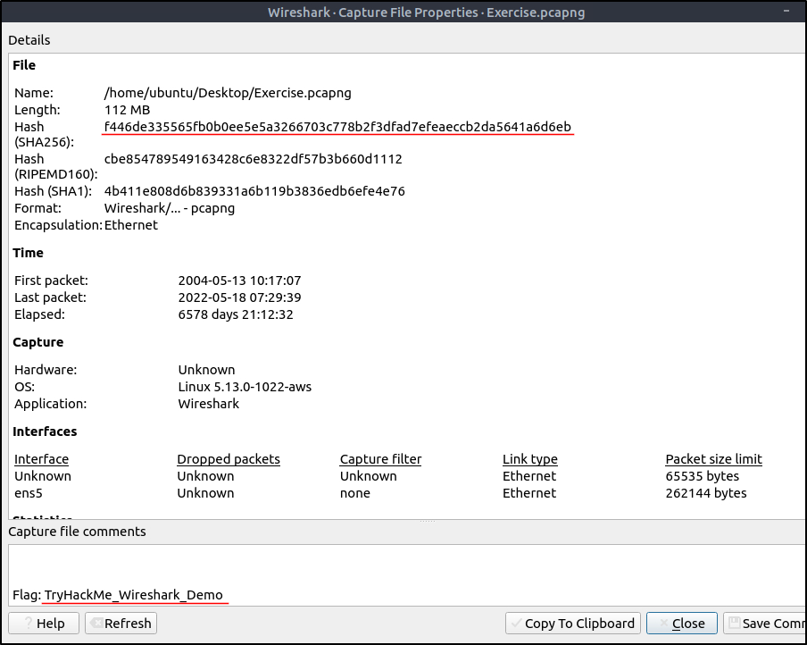
	- Answer: `TryHackMe_Wireshark_Demo`
2. What is the total number of packets?
	- Continue from previous question, scroll down to `Statistics` section
		- 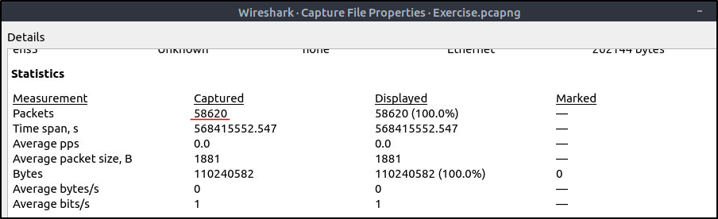
	- Answer: `58620`
3. What is the `SHA256 hash` value of the capture file?
	- Answer: `f446de335565fb0b0ee5e5a3266703c778b2f3dfad7efeaeccb2da5641a6d6eb`
---
##### Task 3: Packet Dissection
- Use the `Exercise.pcapng` file to answer the questions. 
1. View packet number `38`. Which markup language is used under the HTTP protocol?
	- Check protocol column
		- 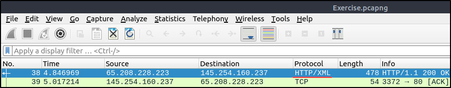
	- Answer: `eXtensible Markup Language`
2. What is the arrival date of the packet? (Answer format: Month/Day/Year)
	- Check `Frame` 
		- 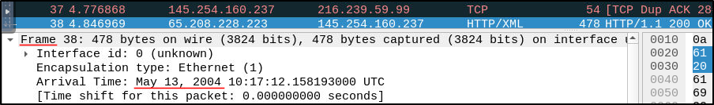Answer: `05/13/2004`
3. What is the TTL value?
	- Check `Internet Protocol Version` 
		- 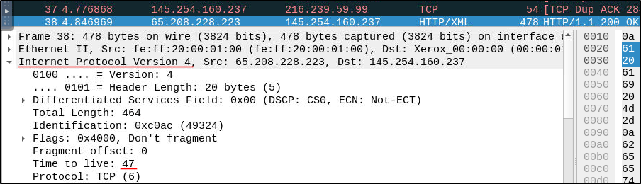
	- Answer: `47`
4. What is the TCP payload size?
	- Check `Transmission Control Protocol` 
		- 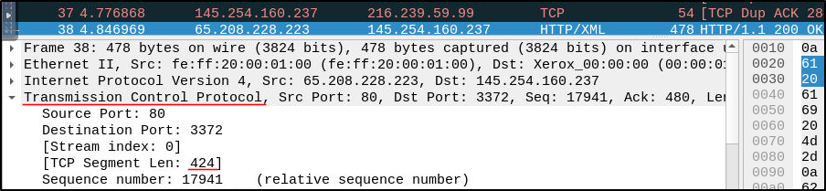
	- Answer: `424`
5. What is the e-tag value?  (For example: `82ecb-6321-9e904585`)
	- Check `Hypertext Transfer Protocol`
		- 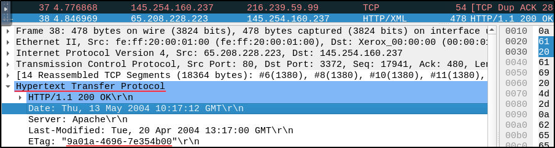
	- Answer: `9a01a-4696-7e354b00`
---
##### Task 4: Packet Navigation
- Use the `Exercise.pcapng` file to answer the questions. 
1. Search the `r4w string` in packet details. What is the name of artist `1`?
	- Go to `Edit -> Find`
		- 
	- Search for `string`, keyword `r4w`, then click `Find`. It will automatically select packet that match the keyword.
		- 
	- Answer: `r4w8173`
2. `Go to packet 12` and read the packet comments. What is the answer?  Note: use `md5sum <filename>` terminal command to get `MD5` hash
	- Go to packet 12, right-click → `Packet Comment`. It says to go to packet `39765`
		- 
		- 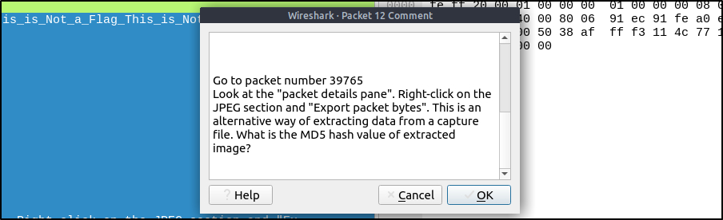
	- Go to packet `39765`, right click, select `Export Packet Bytes`
		- 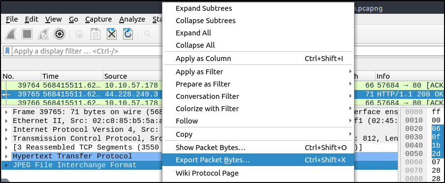
	- Give it a name then check its hash with `md5sum` command
		- 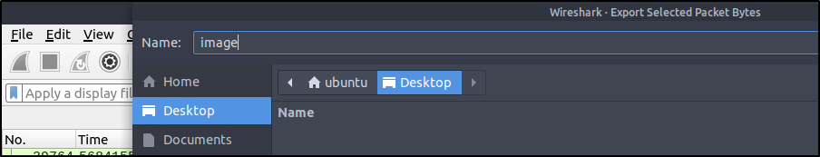
		- 
	- Answer: `911cd574a42865a956ccde2d04495ebf`
3. There is a `.txt` file inside the capture file. Find the file and read it; what is the alien's name?
	- Go to `File -> Export Objects -> HTTP`
		- 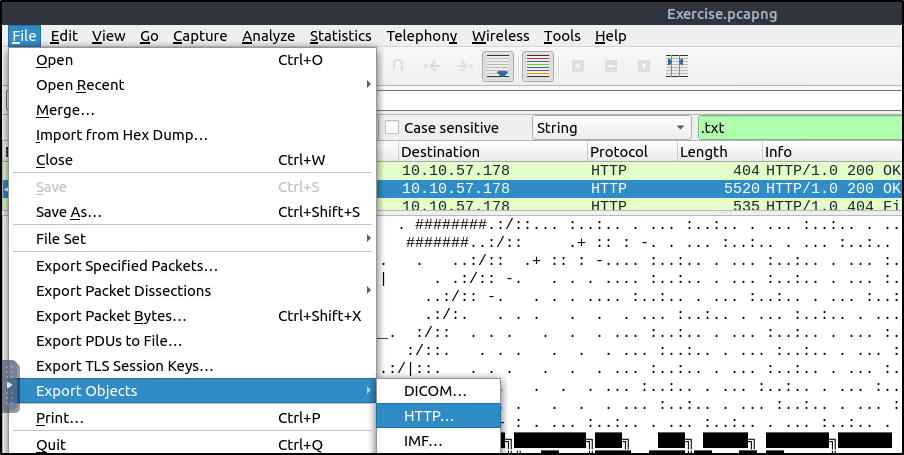
	- There will be many object can be imported, but by using filter we can see only 1 `.txt` file available. 
		- 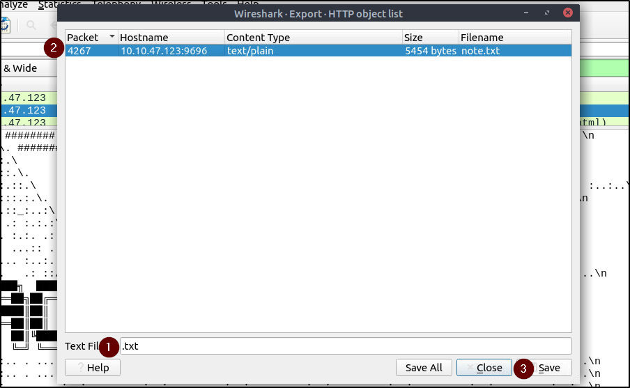
	- Then read the exported file with `cat` command
		- 
	- Answer: `PACKETMASTER`
4. Look at the expert info section. What is the number of warnings?
	- Go to `Analyze -> Expert Information`
		- 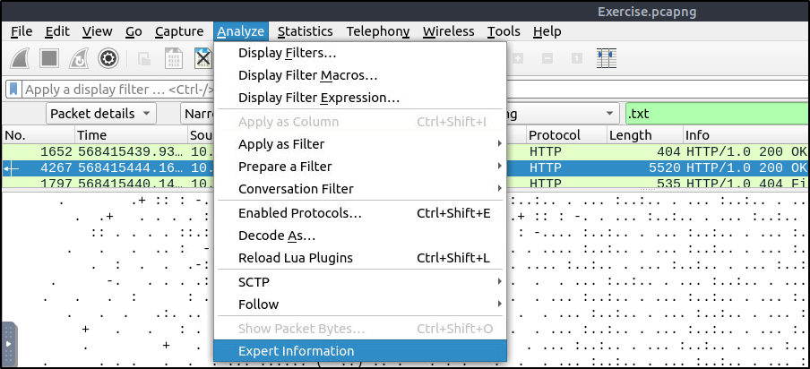
		- 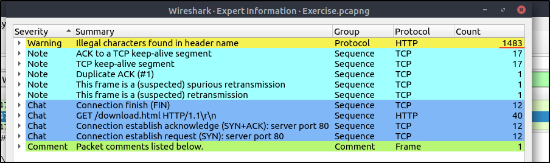
	- Answer: `1636`

---
##### Task 5: Packet Filtering
- Use the `Exercise.pcapng` file to answer the questions. 
1. Go to packet number `4`. Right-click on the `Hypertext Transfer Protocol` and apply it as a filter. Now, look at the filter pane. What is the filter query?
	- Right-click at `Hypertext Transfer Protocol -> Apply as Filter -> Selected`
		- 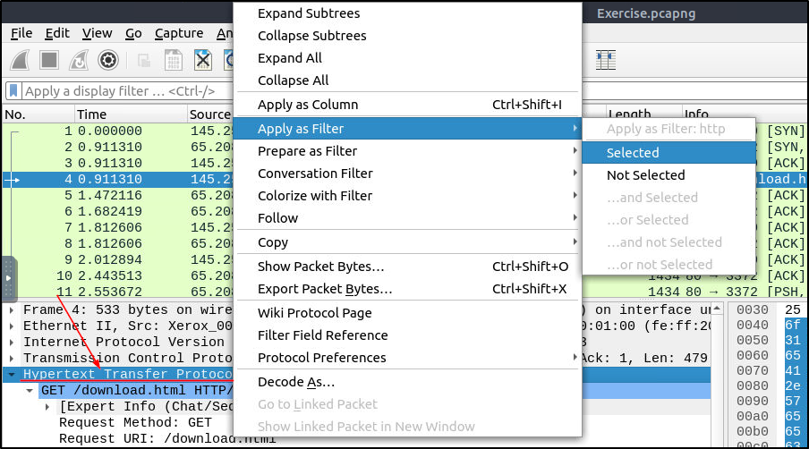
		- 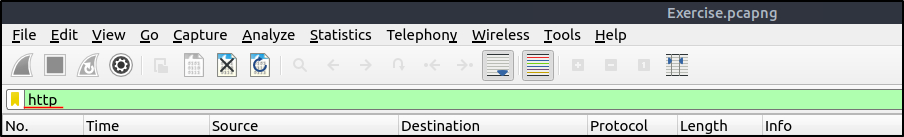
	- Answer: `http`
2. What is the number of displayed packets?
	- From previous question, look at bottom right
		- 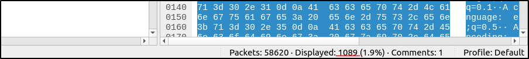
	- Answer: `1089`
3. Go to packet number `33790,` follow the HTTP stream, and look carefully at the responses.  Looking at the web server's response, what is the total number of artists?
	- Find packet `33790`, Right-click → Follow → HTTP Stream
		- 
	- A new window will appear, we see the number is going until 3
		- 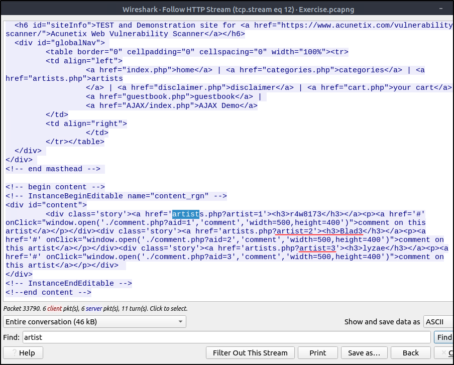
	- Answer: `3`
4. What is the name of the second artist?
	- Answer: `Blad3`
---
##### Task 6: Conclusion
1. Proceed to the next room and keep learning!
	- `No answer needed`
---
