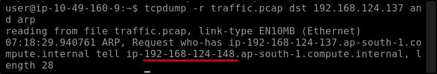
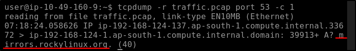
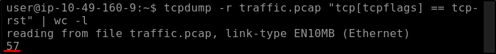
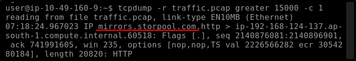
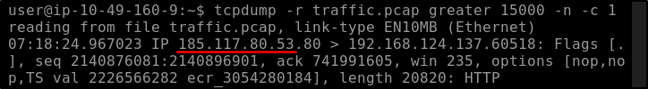
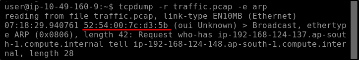

##### Link: [Tcpdump: The Basics](https://tryhackme.com/room/tcpdump)
---
##### Task 1: Introduction
1. What is the name of the library that is associated with `tcpdump`?
	- `libpcap`
---
##### Task 2: Basic Packet Capture
1. What option can you add to your command to display addresses only in numeric format?
	- `-n`
---
##### Task 3: Filtering Expressions
1. How many packets in `traffic.pcap` use the ICMP protocol?
	- Use `ICMP` and pipe them with `wc` to count number of output 
		- `tcpdump -r traffic.pcap icmp | wc -l`
		- 
	- Answer: `26`
2. What is the IP address of the host that asked for the MAC address of `192.168.124.137`?
	- Ask for MAC address means it use `ARP` protocol with `192.168.124.137` as the destination
		- `tcpdump -r traffic.pcap ARP and dst host 192.168.124.137`
		- 
	- Answer: `192.168.124.148`
3. What hostname (subdomain) appears in the first DNS query?
	- `DNS` query use port `53`  and we use `-c` to limit the number of output
		- `tcpdump -r traffic.pcap port 53 -c 1`
		- 
	- Answer: `mirrors.rockylinux.org`
---
##### Task 4: Advanced Filtering
1. How many packets have only the `TCP Reset (RST)` flag set?
	- We use `tcp[tcpflags]` to filter it
		- `tcpdump -r traffic.pcap "tcp[tcpflags] == tcp-rst" | wc -l`
		- 
	- Answer: `57`
2. What is the IP address of the host that sent packets larger than `15000` bytes?
	- We use `greater` filter and `-c 1` so it only return 1 result
		- `tcpdump -r traffic.pcap greater 15000 -c 1`
		- 
	- We see all `IP` addresses resolved into hostname, we use `-n` prevent it
		- `tcpdump -r traffic.pcap -n greater 15000 -c 1`
		- 
	- Answer: `185.117.80.53`
---
##### Task 5: Displaying Packets
1. What is the `MAC` address of the host that sent an ARP request?
	- Use `-e` to show `MAC` address
		- `tcpdump -r traffic.pcap -e arp`
		- 
	- Answer: `52:54:00:7c:d3:5b`
---
##### Task 6: Conclusion
1. Ensure you have noted the various `Tcpdump` options we covered in this room.
	- `No answer needed`
---
