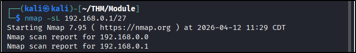
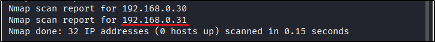
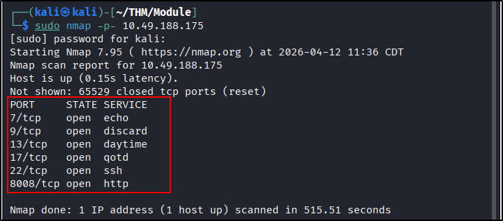
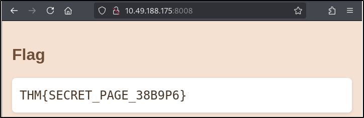
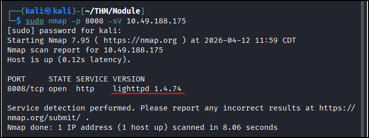

##### Link: [Nmap: The Basics](https://tryhackme.com/room/nmap)
---
##### Task 1: Introduction
1. It’s time to find out who is listening on the network.
	- `No answer needed`
---
##### Task 2: Host Discovery: Who Is Online
1. What is the last IP address that will be scanned when your scan target is 192.168.0.1/27?
	- Manual method:
		- `/27` means the host bits is `5` because there are 32 bits in IPv4 address
		- Number of addressed = `2^host bits` = `2^6` = `32`
		- The range will be `192.168.1.0` - `192.168.1.31`
	- With `Nmap`
		- `nmap -sL 192.168.0.1/27`
		- 
		- 
	- Answer: `192.168.0.31`
---
##### Task 3: Port Scanning: Who Is Listening
1. How many TCP ports are open on the target system at `10.49.188.175`?
	- `sudo nmap -p- 10.49.188.175`
		- 
	- Answer: `6`
2. Find the listening web server on `10.49.188.175` and access it with your browser. What is the flag that appears on its main page?
	- From `nmap` finding. `http` server run on port `8008`
		- 
	- Answer: `THM{SECRET_PAGE_38B9P6}`
---
##### Task 4: Version Detection: Extract More Information
1. What is the name and detected version of the web server running on `10.49.188.175`?
	- Use `-sV` option
		- `sudo nmap -p 8008 -sV 10.49.188.175`
		- 
	- Answer: `lighttpd 1.4.74`
---
##### Task 5: Timing: How Fast is Fast
1. What is the non-numeric equivalent of `-T4`?
	- `-T aggressive`
---
##### Task 6: Output: Controlling What You See
1. What option must you add to your `nmap` command to enable debugging?
	- `-d`
---
##### Task 7: Conclusion and Summary
1. What kind of scan will Nmap use if you run `nmap 10.49.188.175` with local user privileges?
	- `Connect Scan`
---
