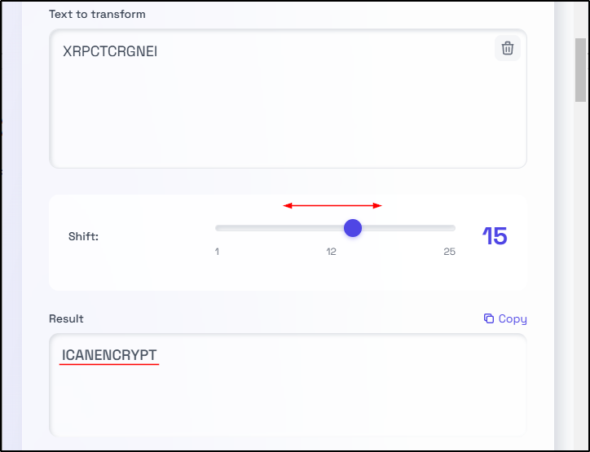
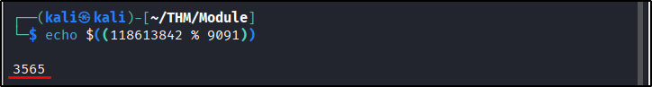
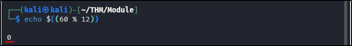

##### Link: [Cryptography Basics](https://tryhackme.com/room/cryptographybasics)
---
##### Task 1: Introduction
1. I’m ready to start learning about cryptography!
	- `No answer needed`
---
##### Task 2: Importance of Cryptography
1. What is the standard required for handling credit card information?
	- `PCI DSS`
---
##### Task 3: Plaintext to Ciphertext
1. What do you call the encrypted plaintext?
	- `ciphertext`
2. What do you call the process that returns the plaintext?
	- `decryption`
---
##### Task 4: Historical Ciphers
1. Knowing that XRPCTCRGNEI was encrypted using Caesar Cipher, what is the original plaintext?
	- Use: `https://caesar-cipher.com/?mode=decrypt`
	- Try each shift until we get readable result
		- 
	- `ICANENCRYPT`
---
##### Task 5: Types of Encryption
1. Should you trust DES? (Yea/Nay)
	- `Nay`
2. When was AES adopted as an encryption standard?
	- `2001`
---
##### Task 6: Basic Math
1. What’s `1001 ⊕ 1010`?
	- `⊕` or `XOR` or `exclusive OR` only return 1 if both bits are different
	- Bits 1: `1⊕1 = 0`
	- Bits 2: `0⊕0 = 0`
	- Bits 3: `0⊕1 = 1`
	- Bits 4: `1⊕0 = 1`
	- Answer: `0011`
2. What’s `118613842%9091`?
	- We can use terminal with `$(()))` to make it evaluated as math expression
	- `echo $((118613842 % 9091))`
		- 
	- Answer: `3565`
3. What’s `60%12`?
	- `echo $((60 % 12))` 
		- 
	- Answer: `0`
---
##### Task 7: Summary
1. Before proceeding to the next room, make sure you have taken note of all the key terms and concepts introduced in this room.
	- `No answer needed`
---
