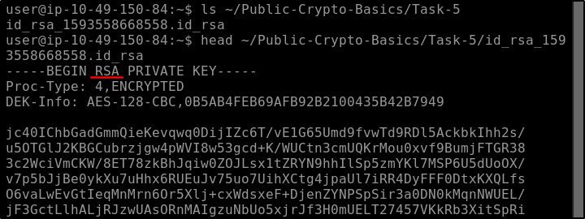
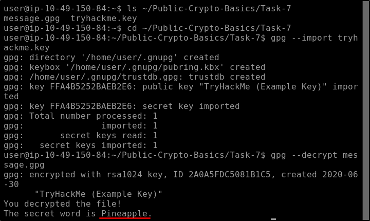

##### Link: ([Public Key Cryptography Basics](https://tryhackme.com/room/publickeycrypto)
---
##### Task 1: Introduction
1. Let’s begin!
	- `No answer needed`
---
##### Task 2: Common Use of Asymmetric Encryption
1. In the analogy presented, what real object is analogous to the public key?
	- `Lock`
---
##### Task 3: RSA
1. Knowing that `p = 4391` and `q = 6659`. What is `n`?
	- `n = p * q = 4391 * 6659 = 29239669`  `
	- Answer: `29239669`
2. Knowing that `p = 4391` and `q = 6659`. What is `ϕ(n)`?
	- `ϕ(n) = n - p - q + 1 = 29239669 - 4391 - 6659 + 1 = 29228620`
	- Answer: `29228620`
---
##### Task 4: Diffie-Hellman Key Exchange
1. Consider `p = 29, g = 5, a = 12`. What is `A`?
	- `A = (g ^ a) mod p = (5 ^ 12) mod 29 = 7`
	- Answer: `7`
2. Consider p = `29, g = 5, b = 17`. What is `B`?
	- `B = (g ^ b) mod p = (5 ^ 17) mod 29 = 9`
	- Answer: `9`
3. Knowing that p` = 29, a = 12`, and you have `B` from the second question, what is the key calculated by Bob? (`key = Ba mod p`)
	- `key = (B ^ a) mod p = (9 ^ 12) mod 29 = 24`
	- Answer: `24`
4. Knowing that `p = 29, b = 17`, and you have `A` from the first question, what is the key calculated by Alice? (`key = Ab mod p`)
	- `key = (A ^ b) mod p = (7 ^ 17) mod 29 = 24`
	- Answer: `24`
---
##### Task 5: SSH
1. Check the SSH Private Key in `~/Public-Crypto-Basics/Task-5`. What algorithm does the key use?
	- `ls ~/Public-Crypto-Basics/Task-5`
	- `head ~/Public-Crypto-Basics/Task-5/id_rsa_1593558668558.id_rsa `
		- 
	- Answer: `RSA`
---
##### Task 6: Digital Signatures and Certificates
1. What does a remote web server use to prove itself to the client?
	- `Certificate`
2. What would you use to get a free `TLS` certificate for your website?
	- `Let's Encrypt`
---
##### Task 7: PGP and GPG
1. Use GPG to decrypt the message in `~/Public-Crypto-Basics/Task-7`. What secret word does the message hold?
	- `ls ~/Public-Crypto-Basics/Task-7` → We find `message.gpg` & `tryhackme.key`
	- `cd ~/Public-Crypto-Basics/Task-7`
	- `gpg --import tryhackme.key`
	- `gpg --decrypt message.gpg`
		- 
	- `Pineapple`
---
##### Task 8: Conclusion
1. Ensure you have noted the various techniques and tools discussed in this room.
	- `No answer needed`
---
