##### Link: [John the Ripper: The Basics](https://tryhackme.com/room/johntheripperbasics)
---
##### Task 1: Introduction
1. Let’s begin!
	- `No answer needed`
---
##### Task 2: Basic Terms
1. What is the most popular extended version of John the Ripper?
	- `Jumbo John`
---
##### Task 3: Setting Up Your System
1. Which website’s breach was the `rockyou.txt` wordlist created from?
	- `rockyou.com`
---
##### Task 4: Cracking Basic Hashes
1. What type of hash is `hash1.txt`?
	- Run `hash-id.py`
		- `cat hash1.txt | python3 hash-id.py`
			- 
	- Answer: `md5` (Confirmed because it successfully cracked on next question)
2. What is the cracked value of `hash1.txt`?
	- Check the expected format
		- `john --list=formats | grep "MD5"`
			- 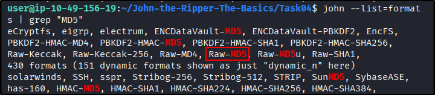
	- Then run `John`
		- `john --format=Raw-MD5 --wordlist=/usr/share/wordlists/rockyou.txt hash1.txt`
			- 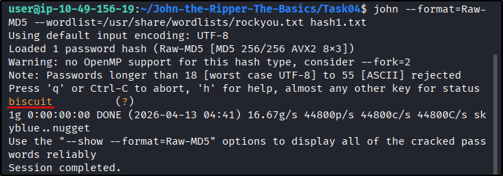
	- Answer: `biscuit`
3. What type of hash is `hash2.txt`?
	- Run `hash-id.py`
		- `cat hash2.txt | python3 hash-id.py`
			- 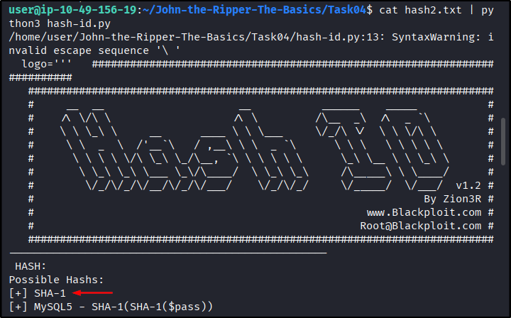
	- Answer: `sha1` (Confirmed because it successfully cracked on next question)
4. What is the cracked value of `hash2.txt`?
	- Check the expected format
		- `john --list=formats | grep "SHA-1"`
		- `john --list=formats | grep "SHA1"`
			- 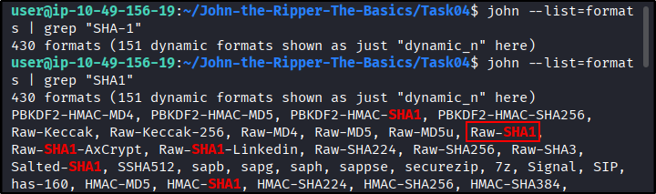
	- Then run `John`
		- `john --format=Raw-SHA1 --wordlist=/usr/share/wordlists/rockyou.txt hash2.txt`
			- 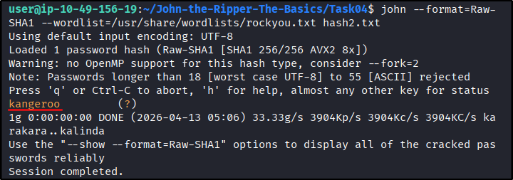
	- Answer: `kangeroo`
5. What type of hash is `hash3.txt`?
	- Run `hash-id.py`
		- `cat hash3.txt | python3 hash-id.py`
			- 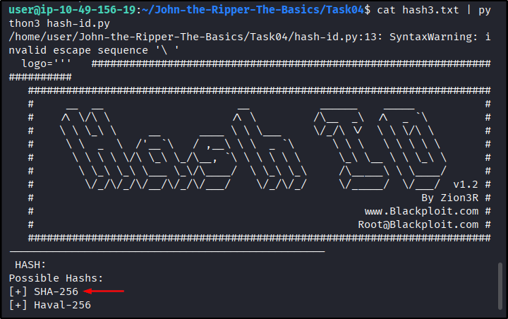
	- Answer: `sha256` (Confirmed because it successfully cracked on next question)
6. What is the cracked value of `hash3.txt`?
	- Check the expected format
		- `john --list=formats | grep "SHA-256"`
		- `john --list=formats | grep "SHA256"`
			- 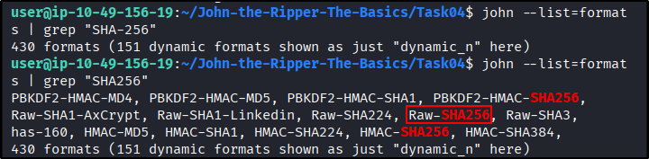
	- Then run `John`
		- `john --format=Raw-SHA256 --wordlist=/usr/share/wordlists/rockyou.txt hash3.txt`
			- 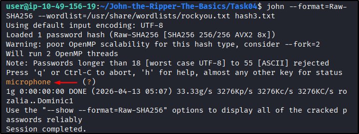
	- Answer: `microphone`
7. What type of hash is `hash4.txt`?
	- Run `hash-id.py`
		- `cat hash4.txt | python3 hash-id.py`
			- 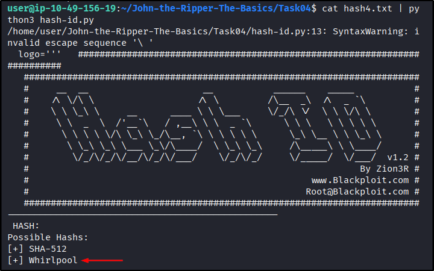
		- Despite the 1st option is `SHA-512`, it doesn’t work
			- 
	- Answer: `whirlpool`
8. What is the cracked value of `hash4.txt`?
	- Check the expected format
		- `john --list=formats | grep "Whirlpool"`
		- `john --list=formats | grep "Whirl"`
		- `john --list=formats | grep "whirl"`
			- 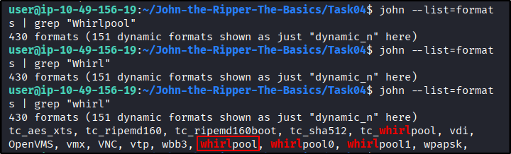
	- Then run `John`
		- `john --format=Raw-MD5 --wordlist=/usr/share/wordlists/rockyou.txt hash1.txt`
			- 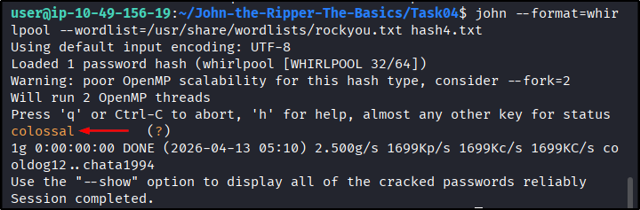
	- Answer: `colossal`
---
##### Task 5: Cracking Windows Authentication Hashes
1. What do we need to set the` --format` flag to in order to crack this hash?
	- Check `John` format list
		- `john --list=formats | grep "NT"`
			- 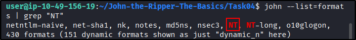
2. What is the cracked value of this password?
	- Crack with `John`
		- `john --format=NT --wordlist=/usr/share/wordlists/rockyou.txt ntlm.txt`
			- 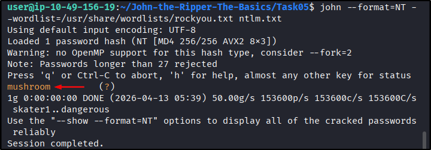
	- Answer: `mushroom`
---
##### Task 6: Cracking /etc/shadow Hashes
1. What is the root password?
	- Because the unshadowed file has been provided, we can use it immediately
		- `john --format=sha512crypt --wordlist=/usr/share/wordlists/rockyou.txt etc_hashes.txt`
			- 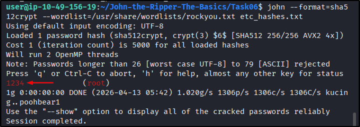
	- `1234`
---
##### Task 7: Single Crack Mode
1. What is Joker’s password?
	- Use `hash-id.py` to identify hash type
		- `cat hash07.txt | python3 ~/John-the-Ripper-The-Basics/Task04/hash-id.py`
			- 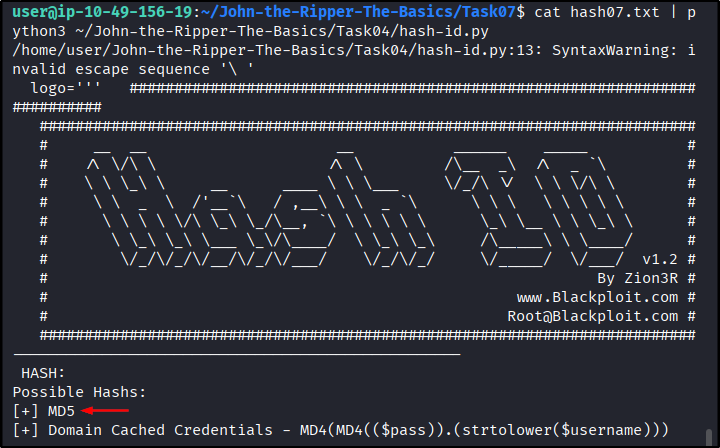
	- It’s `MD5`. From previous task, we know the format is `Raw-MD5`
	- Now modify append username to hash
		- `cat hash07.txt`
		- `echo "Joker:7bf6d9bb82bed1302f331fc6b816aada" > hash.txt`
		- `cat hash.txt`
			- 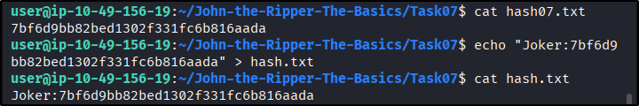
	- Then run `John` in single crack mode
		- `john --single --format=Raw-MD5 hash.txt`
			- 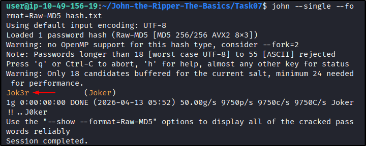
	- Answer: `Jok3r`
---
##### Task 8: Custom Rules
1. What do custom rules allow us to exploit?
	- `Password complexity predictability`
2. What rule would we use to add all capital letters to the end of the word?
	- `Az` → Append to end of word
	- `[A-Z}` → All capital letters
	- Answer: `Az"[A-Z]"`
3. What flag would we use to call a custom rule called `THMRules`?
	- `--rule=THMRules`
---
##### Task 9: Cracking Password Protected Zip Files
1. What is the password for the secure.zip file?
	- Extract password hash with `zip2john`
		- `zip2john secure.zip > secure.zip.hash`
	- Crack it
		- `john --wordlist=/usr/share/wordlists/rockyou.txt secure.zip.hash`
	- Unzip file
		- `unzip secure.zip`
	- Read the flag
		- `cat zippy/flag.txt`
			- 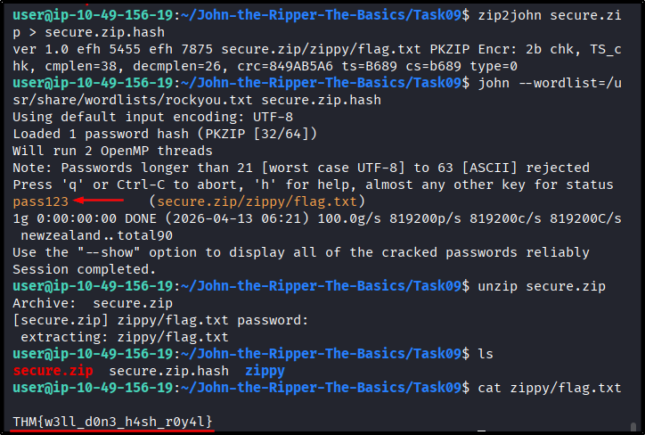
	- Answer: `pass123`
2. What is the contents of the flag inside the zip file?
	- `THM{w3ll_d0n3_h4sh_r0y4l}`
---
##### Task 10:  Cracking Password-Protected RAR Archives
1. What is the password for the `secure.rar` file?
	- Extract password hash with `rar2john`
		- `rar2john secure.rar > secure.rar.hash`
	- Crack it
		- `john --wordlist=/usr/share/wordlists/rockyou.txt secure.rar.hash`
	- Unzip file
		- `unrar -e secure.rar`
	- Read the flag
		- `cat flag.txt`
			- 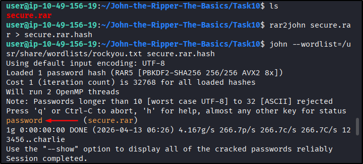
			- 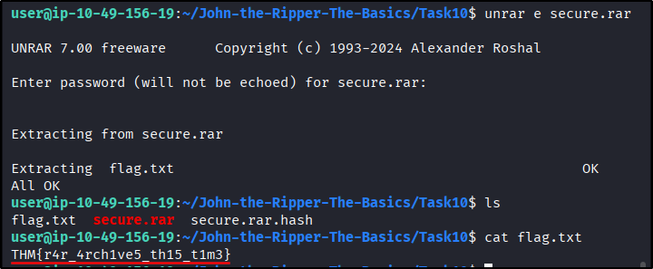
	- Answer: `password`
2. What are the contents of the flag inside the `rar` file?
	- `THM{r4r_4rch1ve5_th15_t1m3}`
---
##### Task 11:  Cracking SSH Keys with John
1. What is the SSH private key password?
	- Extract password hash with `ssh2john`
		- `/opt/john/ssh2john.py id_rsa > id_rsa.hash`
	- Crack it
		- `john --wordlist=/usr/share/wordlists/rockyou.txt id_rsa.hash`
			- 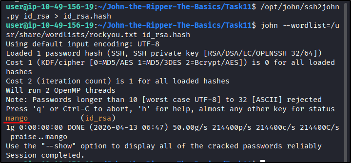
	- Answer: `Mango`
---
##### Task 12:  Further Reading
1. Time for a new challenge!
	- `No answer needed`
---
