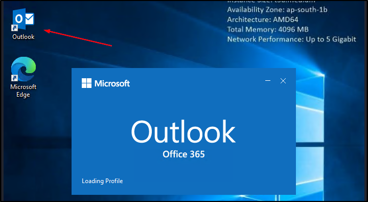
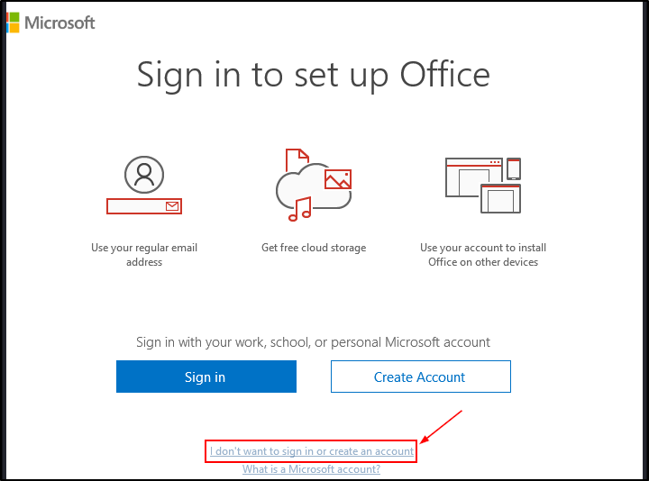
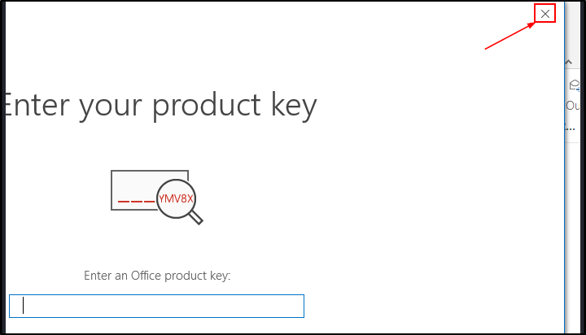
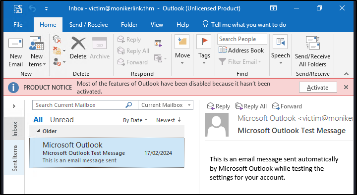
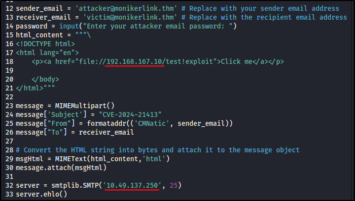
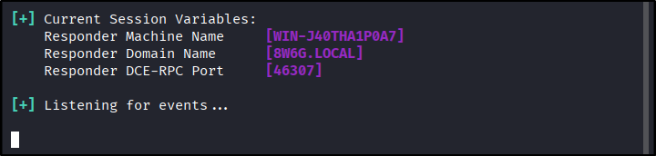
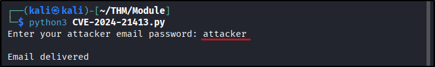
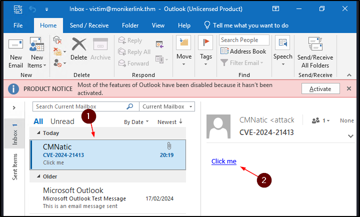
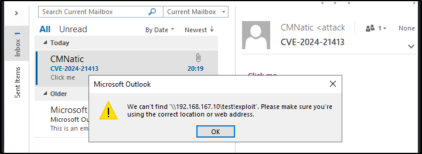
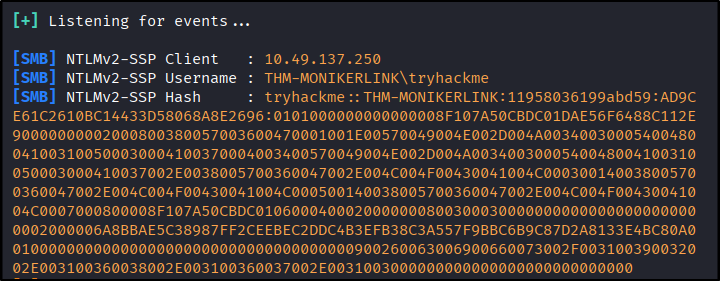

##### Link: [Moniker Link (CVE-2024-21413)](https://tryhackme.com/room/monikerlink)
---
##### Task 1: Introduction
1. What "Severity" rating has the CVE been assigned?
	- `Critical`
---
##### Task 2: Moniker Link (CVE-2024-21413)
1. What Moniker Link type do we use in the hyperlink?
	- `file://`
2. What is the special character used to bypass Outlook's "Protected View"?
	- `!`
---
##### Task 3: Exploitation
1. Open `Outlook`
	1. Open `Outlook` from desktop
		- 
	2. At login prompt, click `I don't want to sign in...`
		- 
	3. At product key prompt, just close the window
		- 
	4. `Outlook` is open
		- 
2. Prepare exploit
	1. Copy & modify exploit
	2. Perhaps there are typo in description because it says to modify line 12 & 31 despite the actual line is 18 & 32
	3. Put attacker IP Address (`tun0` if you use attack host) on line 18 & target IP on line 32
		- 
	4. Run `responder`
		- `sudo responder -I tun0`
		- 
3. Start Exploitation
	1. Run the exploit, 
	2. When prompted, enter password: `attacker` 
		- 
	3. Back to `outlook`, we see the exploit email has been delivered. 
	4. Open it and click the link
		- 
	5. We will get error, but check `responder`, we’ve capture `NTLMv2` hash for as `tryhackme`
		- 
		- 
---
1. What is the name of the application that we use on the `AttackBox` to capture the user's hash?
	- `responder`
2. What type of hash is captured once the hyperlink in the email has been clicked?
	- `netNTLMv2`
---
##### Task 4: Detection
1. Click me to proceed onto the next task!
	- `No answer needed`
---
##### Task 5: Remediation
1. Click me to proceed onto the next task.
	- `No answer needed`
---
##### Task 6: Conclusion
1. Mischief managed.
	- `No answer needed`
--- 
