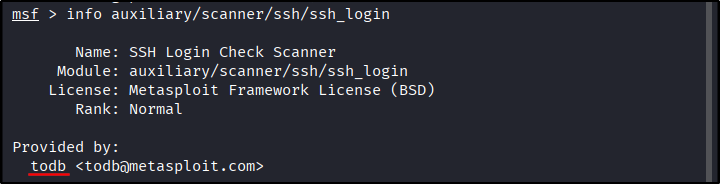

##### [Metasploit: Introduction](https://tryhackme.com/room/metasploitintro)
---
##### Task 1: Introduction to Metasploit
1. No answer needed
	- `No answer needed`
---
##### Task 2: Main Components of Metasploit
1. What is the name of the code taking advantage of a flaw on the target system?
	- `Exploit`
2. What is the name of the code that runs on the target system to achieve the attacker's goal?
	- `Payload`
3. What are self-contained payloads called?
	- `Singles`
4. Is `windows/x64/pingback_reverse_tcp` among singles or staged payload?
	- `Singles`
---
##### Task 3: Msfconsole
1. How would you search for a module related to `Apache`?
	- `search apache`
2. Who provided the `auxiliary/scanner/ssh/ssh_login` module?
	- `info auxiliary/scanner/ssh/ssh_login`
		- 
	- `todb`
---
##### Task 4: Working with modules
1. How would you set the `LPORT` value to `6666`?
	- `set LPORT 6666`
2. How would you set the global value for `RHOSTS`  to `10.10.19.23` ?
	- `setg RHOSTS 10.10.19.23`
3. What command would you use to clear a set payload?
	- `unset PAYLOAD`
4. What command do you use to proceed with the exploitation phase?
	- `exploit`
---
##### Task 5: Summary
1. No answer needed.
	- `No answer needed`
---
