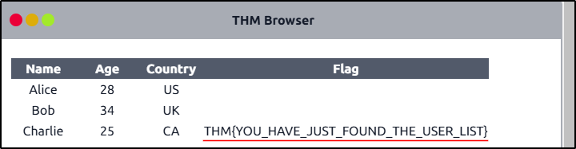
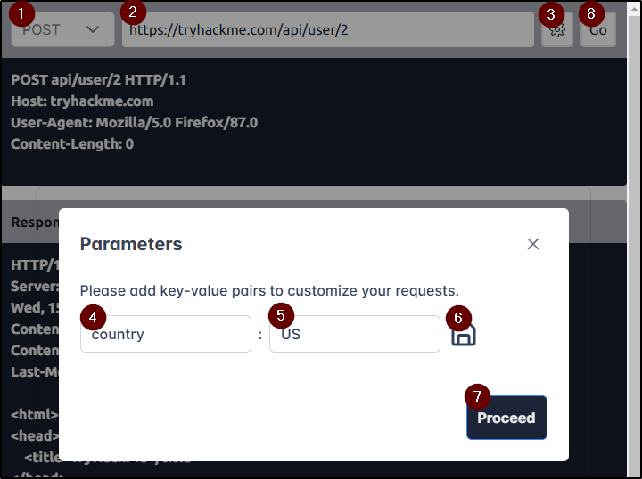
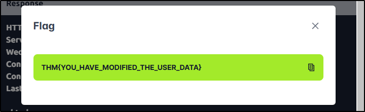
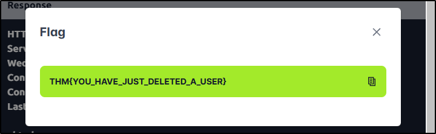

##### Link: [Web Application Basics](https://tryhackme.com/room/webapplicationbasics)
---
##### Task 1: Introduction
1. I am ready to learn about Web Applications!
	- `No answer needed`
---
##### Task 2: Introduction
1. Which component on a computer is responsible for hosting and delivering content for web applications?
	- `web server`
2. Which tool is used to access and interact with web applications?
	- `web browser`
3. Which component acts as a protective layer, filtering incoming traffic to block malicious attacks, and ensuring the security of the the web application?
	- `web application firewall`
---
##### Task 3: Uniform Resource Locator
1. Which protocol provides encrypted communication to ensure secure data transmission between a web browser and a web server?
	- `HTTPS`
2. What term describes the practice of registering domain names that are misspelt variations of popular websites to exploit user errors and potentially engage in fraudulent activities?
	- `Typosquatting`
3. What part of a URL is used to pass additional information, such as search terms or form inputs, to the web server?
	- `Query String`
---
##### Task 4: HTTP Messages
1. Which HTTP message is returned by the web server after processing a client's request?
	- `HTTP response`
2. What follows the headers in an HTTP message?
	- `Empty Line`
---
##### Task 5: HTTP Messages
1. Which HTTP protocol version became widely adopted and remains the most commonly used version for web communication, known for introducing features like persistent connections and chunked transfer encoding?
	- `HTTP/1.1`
2. Which HTTP request method describes the communication options for the target resource, allowing clients to determine which HTTP methods are supported by the web server?
	- `OPTIONS`
3. In an HTTP request, which component specifies the specific resource or endpoint on the web server that the client is requesting, typically appearing after the domain name in the URL?
	- `URL Path`
---
##### Task 6: HTTP Request: Headers and Body
1. Which HTTP request header specifies the domain name of the web server to which the request is being sent?
	- `Host`
2. What is the default content type for form submissions in an HTTP request where the data is encoded as key=value pairs in a query string format?
	- `application/x-www-form-urlencoded`
3. Which part of an HTTP request contains additional information like host, user agent, and content type, guiding how the web server should process the request?
	- `Request Headers`
---
##### Task 7: HTTP Response: Status Line and Status Codes
1. What part of an HTTP response provides the HTTP version, status code, and a brief explanation of the response's outcome?
	- `Status Line`
2. Which category of HTTP response codes indicates that the web server encountered an internal issue or is unable to fulfil the client's request?
	- `Server Error Responses`
3. Which HTTP status code indicates that the requested resource could not be found on the web server?
	- `404`
---
##### Task 8: HTTP Response: Headers and Body
1. Which HTTP response header can reveal information about the web server's software and version, potentially exposing it to security risks if not removed?
	- `Server`
2. Which flag should be added to cookies in the Set-Cookie HTTP response header to ensure they are only transmitted over HTTPS, protecting them from being exposed during unencrypted transmissions?
	- `Secure`
3. Which flag should be added to cookies in the Set-Cookie HTTP response header to prevent them from being accessed via JavaScript, thereby enhancing security against XSS attacks?
	- `HttpOnly`
---
##### Task 9: Security Headers
1. In a Content Security Policy (CSP) configuration, which property can be set to define where scripts can be loaded from?
	- `script-src`
2. When configuring the Strict-Transport-Security (HSTS) header to ensure that all subdomains of a site also use HTTPS, which directive should be included to apply the security policy to both the main domain and its subdomains?
	- `includeSubDomains`
3. Which HTTP header directive is used to prevent browsers from interpreting files as a different MIME type than what is specified by the server, thereby mitigating content type sniffing attacks?
	- `nosniff`
---
##### Task 10:  Practical Task: Making HTTP Requests
1. Make a `GET` request to `/api/users`. What is the flag?
	- `GET request to https://tryhackme.com/api/users`
		- 
		- 
	- `THM{YOU_HAVE_JUST_FOUND_THE_USER_LIST}`
2. Make a `POST` request to `/api/user/2` and update the country of Bob from UK to US. What is the flag?
	- `POST request to https://tryhackme.com/api/user/2`
		- 
		- 
	- `THM{YOU_HAVE_MODIFIED_THE_USER_DATA}`
3. Make a `DELETE` request to `/api/user/1` to delete the user. What is the flag?
	- `DELETE request to https://tryhackme.com/api/user/1`
		- 
		- 
	- `THM{YOU_HAVE_JUST_DELETED_A_USER}`
---
##### Task 11: Conclusion
1. I'm ready to move forward and learn more about web application security.
	- `No answer needed`
---
