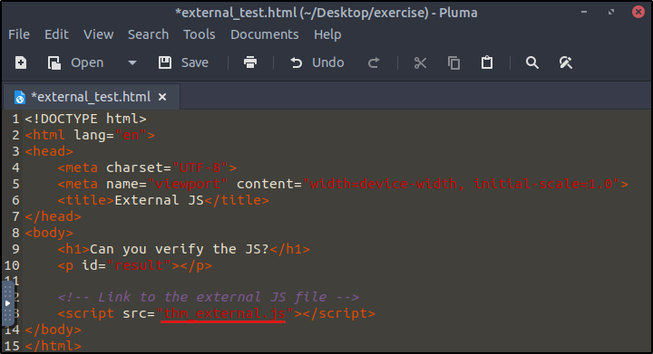
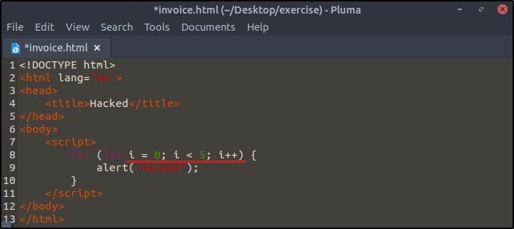
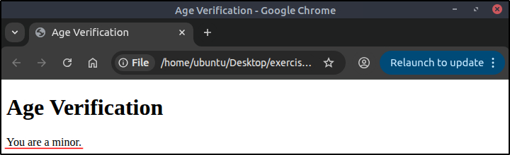
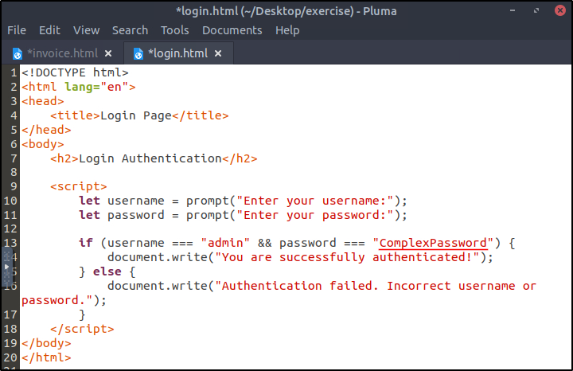
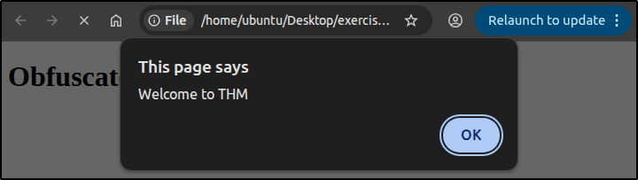

##### Link: [JavaScript Essentials](https://tryhackme.com/room/javascriptessentials)
---
##### Task 1: Introduction
1. I have successfully started the attached VM.
	- `No answer needed`
---
##### Task 2: Essential Concepts
1. What term allows you to run a code block multiple times as long as it is a condition?
	- Answer: `Loop`
---
##### Task 3: JavaScript Overview
1. What is the code output if the value of x is changed to 10?
	- 
	- Answer: `The result is: 20`
2. Is JavaScript a compiled or interpreted language?
	- Answer: `Interpreted`
---
##### Task 4: Integrating JavaScript in HTML
1. Which type of JavaScript integration places the code directly within the HTML document?
	- Answer: `Internal`
2. Which method is better for reusing JS across multiple web pages?
	- Answer: `External`
3. What is the name of the external JS file that is being called by `external_test.html`?
	- 
	- Answer: `thm_external.js`
4. What attribute links an external JS file in the `<script>` tag?
	- Answer: `src`
---
##### Task 5: Abusing Dialogue Functions
1. In the file `invoice.html`, how many times does the code show the alert Hacked?
	- 
	- Answer: `5`
2. Which of the JS interactive elements should be used to display a dialogue box that asks the user for input?
	- Answer: `prompt`
3. If the user enters Tesla, what value is stored in the `carName= prompt("What is your car name?")`? in the `carName` variable?
	- Answer: `Tesla`
---
##### Task 6: Bypassing Control Flow Statements
1. What is the message displayed if you enter the age less than 18?
	- 
	- Answer: `You are a minor.`
2. What is the password for the user admin?
	- 
	- Answer: `ComplexPassword`
---
##### Task 7: Exploring Minified Files
1. What is the alert message shown after running the file hello.html?
	- 
	- Answer: `Welcome to THM`
2. What is the value of the `age` variable in the following obfuscated code snippet? `age=0x1*0x247e+0x35*-0x2e+-0x1ae3;`
	- 
	- Answer: `21`
---
##### Task 8: Best Practices
1. Is it a good practice to blindly include JS in your code from any source (yea/nay)?
	- Answer: `nay`
---
##### Task 9: Conclusion
1. I have successfully completed the room.
	- `No answer needed`
---
