##### Link: [SQL Fundamentals](https://tryhackme.com/room/sqlfundamentals)
---
##### Task 1: Introduction
1. Teach me the basics of SQL!
	- `No answer needed`
---
##### Task 2: Databases 101
1. What type of database should you consider using if the data you're going to be storing will vary greatly in its format?
	- `Non-relational database`
2. What type of database should you consider using if the data you're going to be storing will reliably be in the same structured format?
	- `relational database`
3. In our example, once a record of a book is inserted into our "Books" table, it would be represented as a ___ in that table?
	- `row`
4. Which type of key provides a link from one table to another?
	- `foreign key`
5. which type of key ensures a record is unique within a table?
	- `primary key`
---
##### Task 3: SQL
1. What serves as an interface between a database and an end user?
	- `DBMS`
2. What query language can be used to interact with a relational database?
	- `SQL`
---
##### Task 4: Database and Table Statements
1. Using the statement you've learned to list all databases, it should reveal a database with a flag for a name; what is it?
	- Show list of databases 
		- `SHOW DATABASES;`
		- 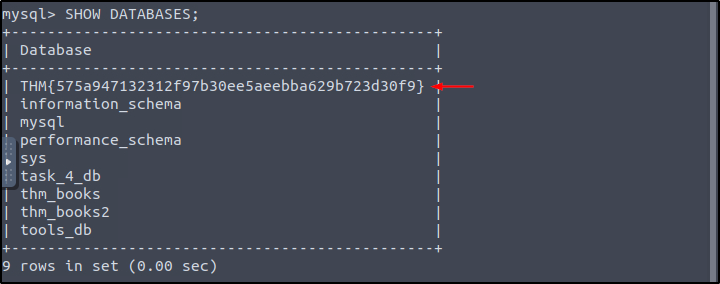
	- Answer: `THM{575a947132312f97b30ee5aeebba629b723d30f9}`
2. In the list of available databases, you should also see the  `task_4_db` database. Set this as your active database and list all tables in this database; what is the flag present here?
	- Select database then show table contents
		- `USE task_4_db;`
		- `SHOW TABLES;`
			- 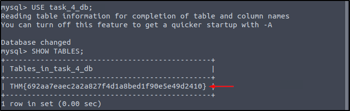
	- Answer: `THM{692aa7eaec2a2a827f4d1a8bed1f90e5e49d2410}`
---
##### Task 5: CRUD Operations
1. Using the `tools_db` database, what is the name of the tool in the `hacking_tools` table that can be used to perform man-in-the-middle attacks on wireless networks?
	- Select database then check table columns
		- `use tools_db;`
		- `DESCRIBE hacking_tools;`
			- 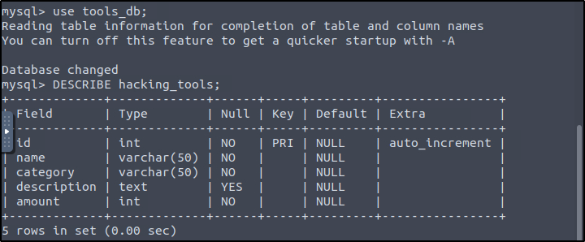
	- We only need `name` & `description` column
		- `SELECT name, description FROM hacking_tools;`
			- 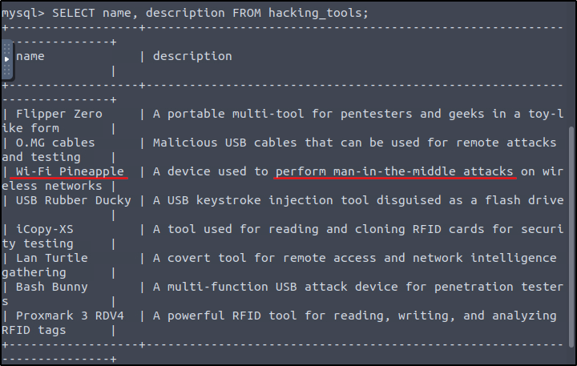
	- Answer: `Wi-Fi Pineapple`
2. Using the `tools_db` database, what is the shared category for both `USB Rubber Ducky` and `Bash Bunny`?
	- Show `name` & `category`
		- `SELECT name, category FROM hacking_tools;`
			- 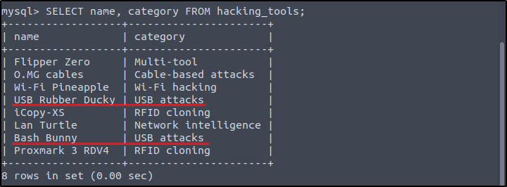
	- Answer: `USB attacks`
---
##### Task 6: Clauses
1. Using the `tools_db` database, what is the total number of distinct categories in the `hacking_tools` table?
	- Use `DISTINCT`
		- `SELECT DISTINCT category from hacking_tools;`
			- 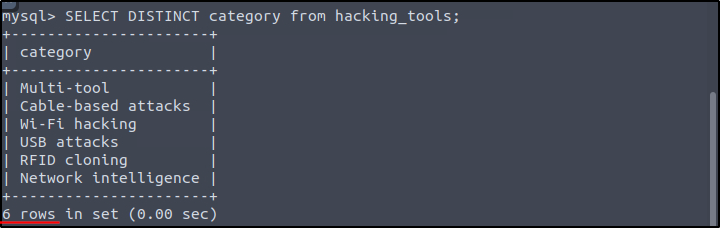
	- Answer: `6`
2. Using the `tools_db` database, what is the first tool (by name) in ascending order from the `hacking_tools` table?
	- Use `ORDER BY ASC`
		- `SELECT name from hacking_tools ORDER BY name ASC;`
			- 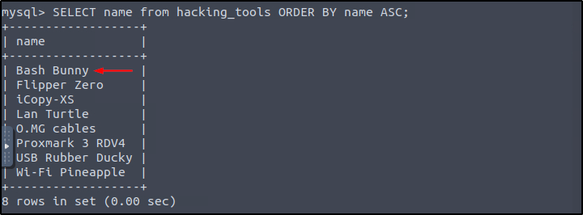
	- Answer: `Bash Bunny`
3. Using the `tools_db` database, what is the first tool (by name) in descending order from the `hacking_tools` table?
	- Use `ORDER BY DESC`
		- `SELECT name from hacking_tools ORDER BY name DESC;`
			- 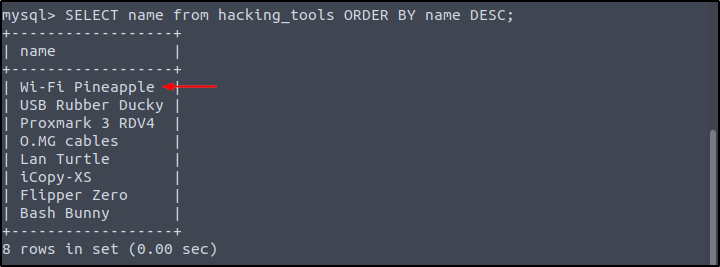
	- Answer: `Wi-Fi Pineapple`
---
##### Task 7: Operators
1. Using the `tools_db` database, which tool falls under the `Multi-tool` category and is useful for `pentesters` and `geeks`?
	- We use `WHERE` clause and `LIKE` operators
		- `SELECT * FROM hacking_tools WHERE category = "Multi-tool" AND description LIKE "%pentesters%" AND description LIKE "%geeks%";`
			- 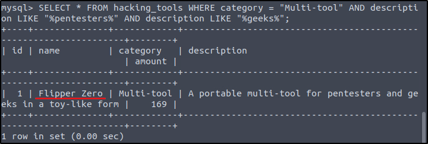
	- Answer: `Flipper Zero`
2. Using the `tools_db` database, what is the category of tools with an amount `greater than` or `equal` to `300`?
	- Use `>=`
		- `SELECT category FROM hacking_tools WHERE amount >= 300;`
			- 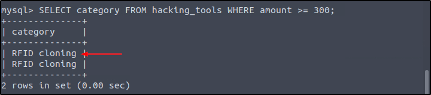
	- Answer: `RFID cloning`
3. Using the `tools_db` database, which tool falls under the `Network intelligence` category with an amount `less than 100`?
	- Use `<`
		- `SELECT name FROM hacking_tools WHERE category = "Network intelligence" AND amount < 100;`
			- 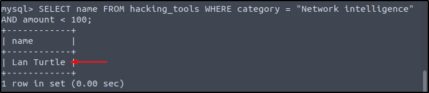
	- Answer: `Lan Turtle`
---
##### Task 8: Functions
1. Using the `tools_db` database, what is the tool with the longest name based on character length?
	- Use `LENGTH(name)` then sort it
		- `SELECT name FROM hacking_tools ORDER BY LENGTH(name) DESC;`
			- 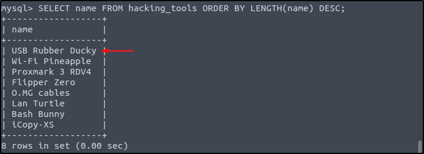
	- Answer: `USB Rubber Ducky`
2. Using the `tools_db` database, what is the total sum of all tools?’
	- Use `SUM`
		- `SELECT SUM(amount) FROM hacking_tools;`
			- 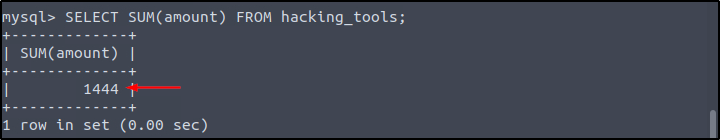
	- Answer: `1444`
3. Using the `tools_db` database, what are the tool names where the amount does not end in `0`, and `group` the tool names `concatenated` by " & ".
	- We can extract last digit of `amount` using `SUBSTRING(amount,-1,1)`
		- `SELECT GROUP_CONCAT(name SEPARATOR " & ") FROM hacking_tools WHERE SUBSTRING(amount,-1,1) != 0;`
			- 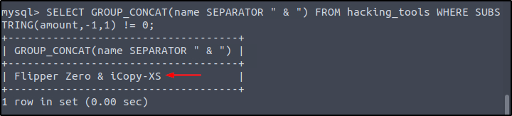
	- Answer: `Flipper Zero & iCopy-XS`
---
##### Task 9: Functions
1. I'm ready to move forward and learn more about web application security.
	- `No answer needed`
---
