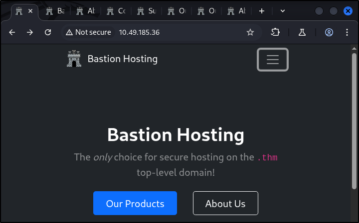
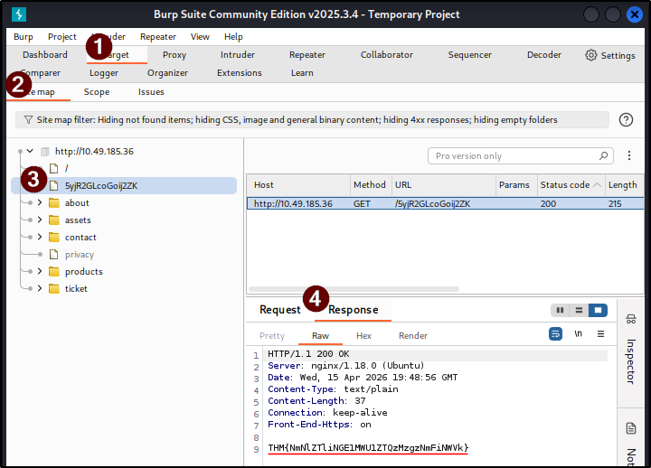

##### Link: [Burp Suite: The Basics](https://tryhackme.com/room/burpsuitebasics)
---
##### Task 1: Introduction
1. Let us start!
	- `No answer needed`
---
##### Task 2: What is Burp Suite
1. Which edition of Burp Suite runs on a server and provides constant scanning for target web apps?
	- `Burp Suite Enterprise`
2. Burp Suite is frequently used when attacking web applications and ______ applications.
	- `Mobile`
---
##### Task 3: Features of Burp Community
1. Which Burp Suite feature allows us to intercept requests between ourselves and the target?
	- `Proxy`
2. Which Burp tool would we use to brute-force a login form?
	- `Intruder`
---
##### Task 4: Installation
1. If you have chosen not to use the AttackBox, ensure that you have a copy of Burp Suite installed before proceeding.
	- `No answer needed`
---
##### Task 5: The Dashboard
1. What menu provides information about the actions performed by Burp Suite, such as starting the proxy, and details about connections made through Burp?
	- `Event log`
---
##### Task 6: Navigation
1. Which tab `Ctrl + Shift + P` will switch us to?
	- `Proxy tab`
---
##### Task 7: Options
1. In which category can you find a reference to a `Cookie jar`?
	- `Sessions`
2. In which base category can you find the `Updates` sub-category, which controls the Burp Suite update behavior?
	- `Suite`
3. What is the name of the sub-category which allows you to change the key bindings for shortcuts in Burp Suite?
	- `Hotkeys`
4. if we have uploaded Client-Side TLS certificates, can we override these on a per-project basis (yea/nay)?
	- `yea`
---
##### Task 8: Introduction to the Burp Proxy
1. Click me to proceed to the next task.
	- `No answer needed`
---
##### Task 9: Connecting through the Proxy (FoxyProxy)
1. Click me to proceed to the next task.
	- `No answer needed`
---
##### Task 10:  Site Map and Issue Definitions
1. What is the flag you receive after visiting the unusual endpoint?
	- Open target, click on all found link
		- 
	- Check in `Burp → Target -> Sitemap`, we find the unusual endpoint: `/5yjR2GLcoGoij2ZK `
		- 
	- `THM{NmNlZTliNGE1MWU1ZTQzMzgzNmFiNWVk}`
---
##### Task 11:  The Burp Suite Browser
1. Click me to proceed to the next task.
	- `No answer needed`
---
##### Task 12:  Scoping and Targeting
1. Add `http://10.49.185.36/` to your scope and change the proxy settings to only intercept traffic to in-scope targets. See the difference between the amount of traffic getting caught by the proxy before and after limiting the scope.
	- `No answer needed`
---
##### Task 13:  Proxying HTTPS
1. If you are not using the AttackBox, configure Firefox (or your browser of choice) to accept the PortSwigger CA certificate for TLS communication through the Burp Proxy.
	- `No answer needed`
---
##### Task 14:  Example Attack
1. Click me to proceed to the next task.
	- `No answer needed`
---
##### Task 15:  Conclusion
1. I understand the fundamentals of using Burp Suite!
	- `No answer needed`
---
