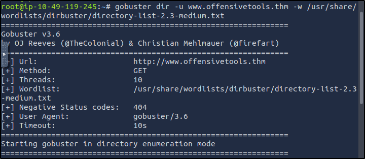
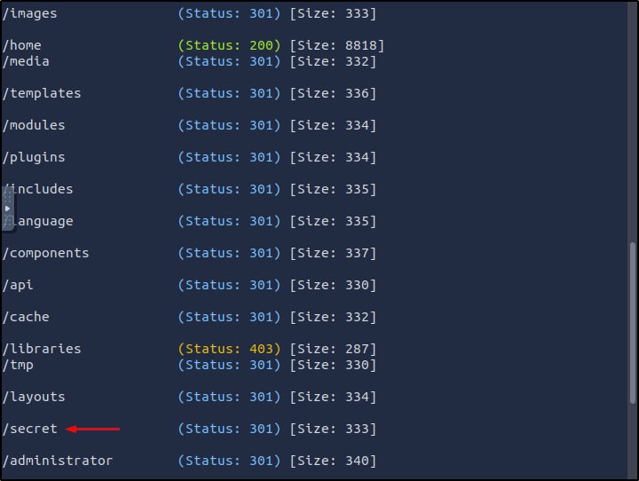
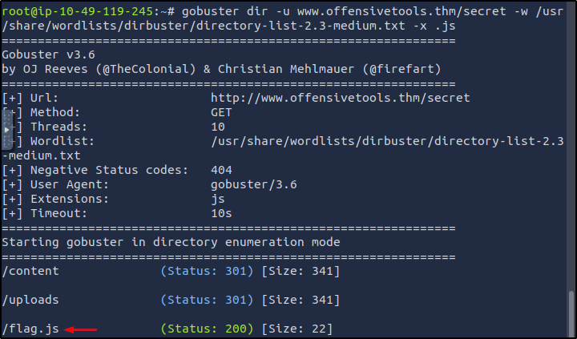
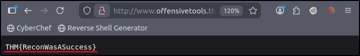
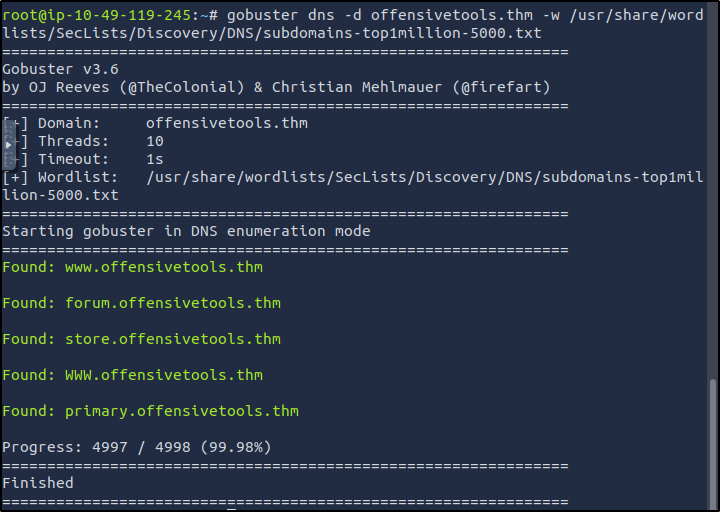
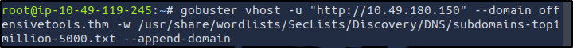
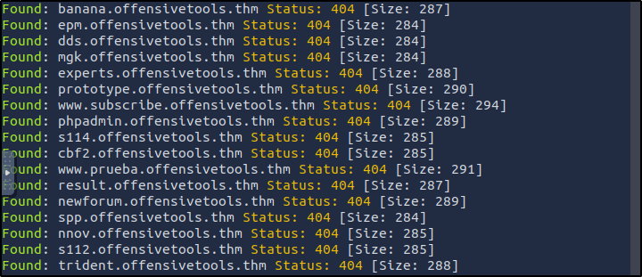
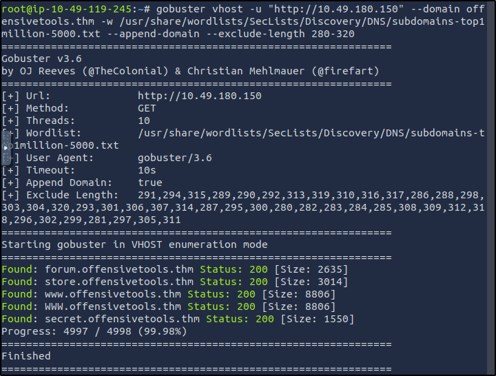

##### Link: [Gobuster: The Basics](https://tryhackme.com/room/gobusterthebasics)
---
##### Task 1: Introduction
1. I'm ready to learn about Gobuster!
	- `No answer needed`
---
##### Task 2: Introduction
1. I assigned the `MACHINE_IP` as the first `nameserver` in the `/etc/resolv-dnsmasq` file and restarted the `Dnsmasq` service.
	- `No answer needed`
---
##### Task 3: Gobuster: Introduction
1. What flag do we use to specify the target URL?
	- Answer: `-u`
2. What `command` do we use for the subdomain enumeration mode?
	- Answer: `dns`
---
##### Task 4: Use Case: Directory and File Enumeration
1. Which flag do we have to add to our command to skip the TLS verification? Enter the long flag notation.
	- Answer: `--no-tls-validation`
2. Enumerate the directories of `www.offensivetools.thm`. Which directory catches your attention?
	- Run `gobuster` in directory enumeration mode
		- `gobuster dir -u www.offensivetools.thm -w /usr/share/wordlists/dirbuster/directory-list-2.3-medium.txt`
			- 
			- 
	- Answer: `secret`
3. Continue enumerating the directory found in question 2. You will find an interesting file there with a `.js` extension. What is the flag found in this file?
	- Enumerate `/secret` for file with `.js` extension
		- `gobuster dir -u www.offensivetools.thm/secret -w /usr/share/wordlists/dirbuster/directory-list-2.3-medium.txt -x .js`
			- 
	- Open in browser
		- `http://www.offensivetools.thm/secret/flag.js`
			- 
	- Answer: `THM{ReconWasASuccess}`
---
##### Task 5: Use Case: Subdomain Enumeration
1. Apart from the `dns` keyword and the `-w` flag, which `shorthand flag` is required for the command to work?
	- Answer: `-d`
2. Use the commands learned in this task, how many subdomains are configured for the `offensivetools.thm` domain?
	- Run in subdomain enumeration mode
		- `gobuster dns -d offensivetools.thm -w /usr/share/wordlists/SecLists/Discovery/DNS/subdomains-top1million-5000.txt`
			- 
	- Excluding duplicate, the result is `4`
	- Answer: `4`
---
##### Task 6: Use Case: Vhost Enumeration
1. Use the commands learned in this task to answer the following question: How many `vhosts` on the `offensivetools.thm` domain reply with a status code `200`?
	- Run in `VHost` enumeration mode
		- `gobuster vhost -u "http://10.49.180.150" --domain offensivetools.thm -w /usr/share/wordlists/SecLists/Discovery/DNS/subdomains-top1million-5000.txt --append-domain`
			- 
			- 
	- We get many false positive with size between 280 - 320, we will run `gobuster` again while excluding it
		- `gobuster vhost -u "http://10.49.180.150" --domain offensivetools.thm -w /usr/share/wordlists/SecLists/Discovery/DNS/subdomains-top1million-5000.txt --append-domain --exclude-length 280-320`
			- 
	- Excluding duplicate, the result is `4`
	- Answer: `4`
---
##### Task 7: Conclusion
1. On to the next challenge.
	- `No answer needed`
---
 