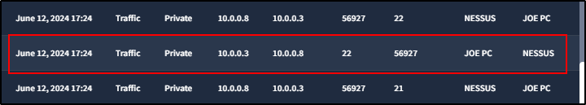
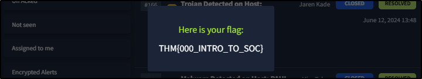

##### Link: [SOC Fundamentals](https://tryhackme.com/room/socfundamentals)
---
##### Task 1: Introduction to SOC
1. What does the term SOC stand for?
	- `Security Operations Center `
---
##### Task 2: Purpose and Components
1. The SOC team discovers an unauthorized user is trying to log in to an account. Which capability of SOC is this?
	- `Detection`
2. What are the three pillars of a SOC?
	- `People, Process, Technology`
---
##### Task 3: People
1. Alert triage and reporting is the responsibility of?
	- `SOC Analyst (Level 1)`
2. Which role in the SOC team allows you to work dedicatedly on establishing rules for alerting security solutions?
	- `Detection Engineer`
---
##### Task 4: Process
1. At the end of the investigation, the SOC team found that John had attempted to steal the system's data. Which 'W' from the 5 Ws does this answer?
	- `Who`
2. The SOC team detected a large amount of data exfiltration. Which 'W' from the 5 Ws does this answer?
	- `What`
---
##### Task 5: Technology
1. Which security solution monitors the incoming and outgoing traffic of the network?
	- `Firewall`
2. Do SIEM solutions primarily focus on detecting and alerting about security incidents? (yea/nay)
	- `yea`
---
##### Task 6: Practical Exercise of SOC
1. What: Activity that triggered the alert?
	- Check newest alert
		- 
	- `Port Scan`
2. When: Time of the activity?
	- `June 12, 2024 17:24`
3. Where: Destination host IP?
	- Click `Acknowledge -> Investigate in SIEM`
		- 
	- `10.0.0.3`
4. Who: Source host name?
	- `Nessus`
5. Why: Reason for the activity? Intended/Malicious
	- From scenario note: `The vulnerability assessment team notified the SOC team that they were running a port scan activity inside the network from the host: 10.0.0.8`
	- `Intended`
6. Additional Investigation Notes: Has any response been sent back to the port scanner IP? (yea/nay)
	- Check traffic
		- 
	- `yea`
7. What is the flag found after closing the alert?
	- Click `Complete Investigation -> Select Option B: False Positive -> Click close alert` 
		- 
	- `THM{000_INTRO_TO_SOC}`
---
##### Task 7: Conclusion
1. I understand the fundamentals of a SOC.
	- `No answer needed`
---
