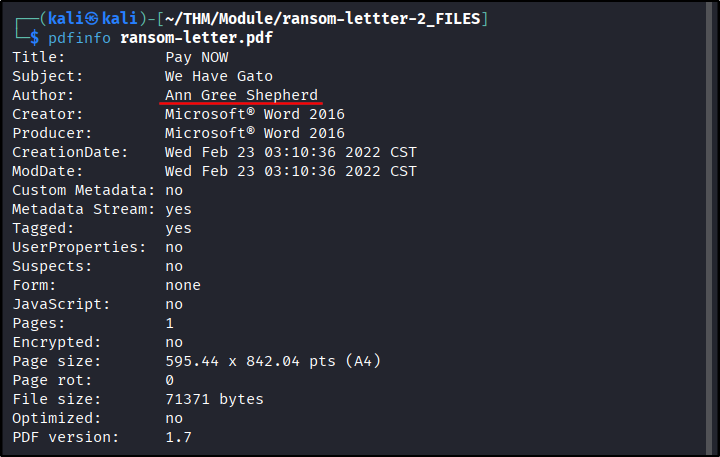
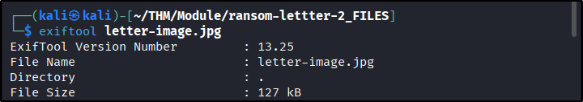
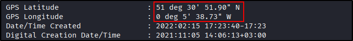

##### Link: [Digital Forensics Fundamentals](https://tryhackme.com/room/digitalforensicsfundamentals)
---
##### Task 1: Introduction to Digital Forensics
1. Which team was handed the case by law enforcement?
	- `digital forensics`
---
##### Task 2: Digital Forensics Methodology
1. Which phase of digital forensics is concerned with correlating the collected data to draw any conclusions from it?
	- `Analysis`
2. Which phase of digital forensics is concerned with extracting the data of interest from the collected evidence?
	- `Examination`
---
##### Task 3: Evidence Acquisition
1. Which tool is used to ensure data integrity during the collection?
	- `write blocker`
2. What is the name of the document that has all the details of the collected digital evidence?
	- `chain of custody`
---
##### Task 4: Windows Forensics
1. Which type of forensic image is taken to collect the volatile data from the operating system?
	- `Memory Image`
---
##### Task 5: Practical Example of Digital Forensics
1. Using `pdfinfo`, find out the author of the attached PDF file, `ransom-letter.pdf`.
	- Run `pdfinfo`
		- `pdfinfo ransom-letter.pdf`
			- 
	- Answer: `Ann Gree Shepherd`
2. Using `exiftool` or any similar tool, try to find where the kidnappers took the image they attached to their document. What is the name of the street?
	- Run `exiftool`
		- `exiftool letter-image.jpg`
			- 
			- 
	- Change coordinate format
		- `51 deg 30' 51.90" N,0 deg 5' 38.73" W` → `51°30'51.9"N 0°05'38.7"W`
	- Use in `Google Maps`
		- Image
			- 
	- Answer: `Milk Street`
3. What is the model name of the camera used to take this photo?
	- Run `exiftool`
		- `exiftool letter-image.jpg`
			- 
	- Answer: `Canon EOS R6`
---
