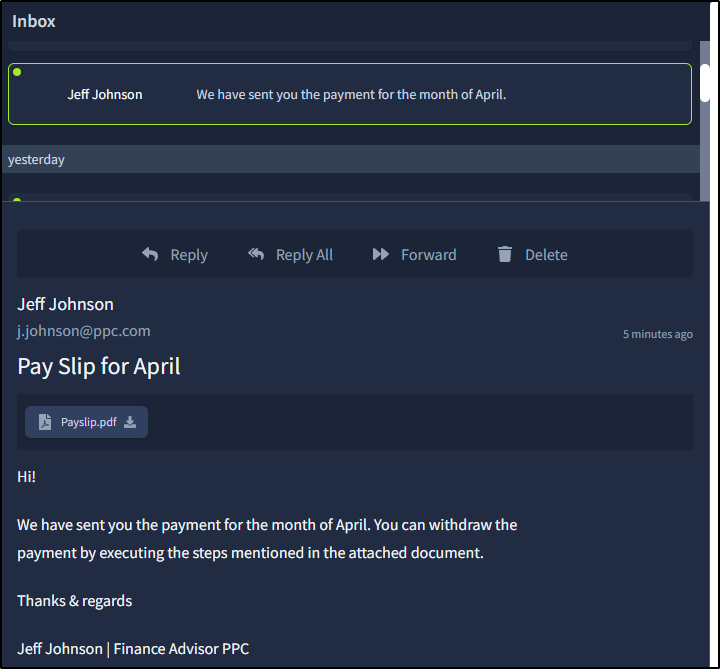
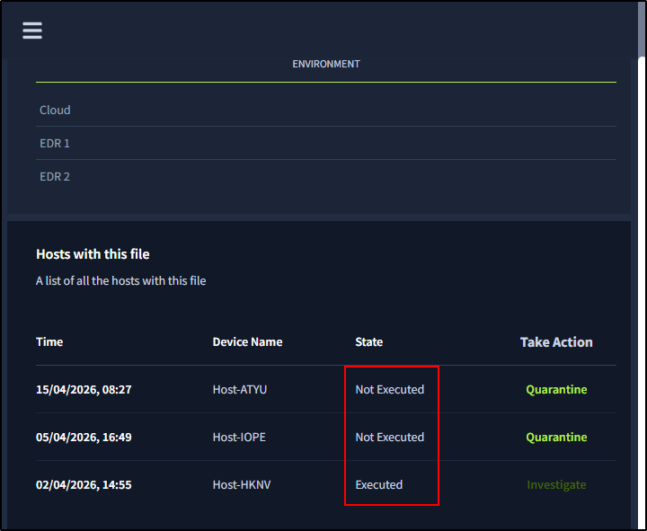
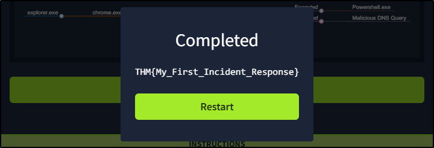

##### Link: [Incident Response Fundamentals](https://tryhackme.com/room/incidentresponsefundamentals)
---
##### Task 1: Introduction to Incident Response
1. Click me to proceed to the next task.
	- `No answer needed`
---
##### Task 2: What are Incidents?
1. What is triggered after an event or group of events point at a harmful activity?
	- `Alert`
2. If a security solution correctly identifies a harmful activity from a set of events, what type of alert is it?
	- `true positive`
3. If a fire alarm is triggered by smoke after cooking, is it a true positive or a false positive?
	- `false positive`
---
##### Task 3: Types of Incidents
1. A user's system got compromised after downloading a file attachment from an email. What type of incident is this?
	- `malware infection`
2. What type of incident aims to disrupt the availability of an application?
	- `Denial of service `
---
##### Task 4: Incident Response Process
1. The Security team disables a machine's internet connection after an incident. Which phase of the SANS IR lifecycle is followed here?
	- `containment`
2. Which phase of NIST corresponds with the lessons learned phase of the SANS IR lifecycle?
	- `Post Incident Activity`
---
##### Task 5: Incident Response Techniques
1. Step-by-step comprehensive guidelines for incident response are known as?
	- `Playbooks`
---
##### Task 6: Lab Work Incident Response
1. What was the name of the malicious email sender?
	- Image
		- 
	- `Jeff Johnson`
2. What was the threat vector?
	- `Email Attachment`
3. How many devices downloaded the email attachment?
	- Steps
		- `Open email` → `Download attachment` → `Malware notification appear` → `Take Actions` → `Quarantine` → `Investigate` → `Isolate Host` → `View Timeline` → `Finish Case`  
	- Image
		- 
	- `3`
4. How many devices executed the file?
	- `1`
5. What is the flag found at the end of the exercise?
	- Image
		- 
	- `THM{My_First_Incident_Response}`
---
##### Task 7: Conclusion
1. Complete the room.
	- `No answer needed`
---
