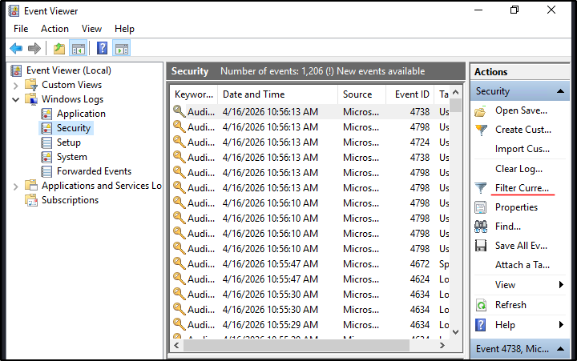
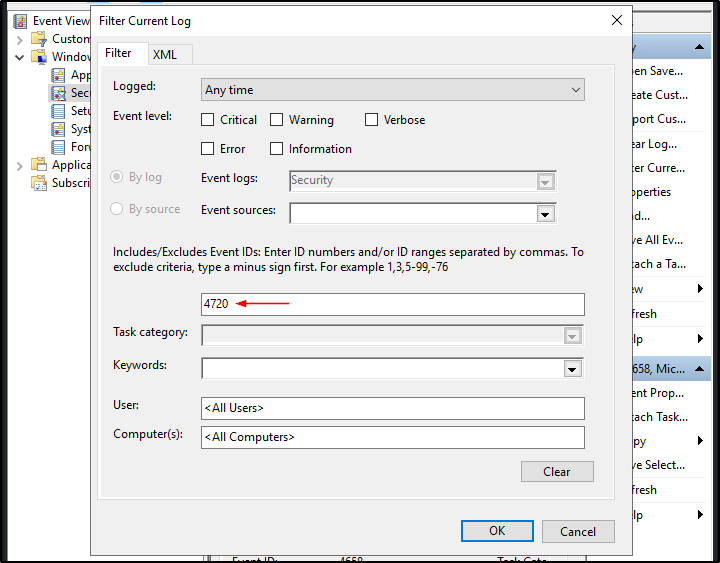
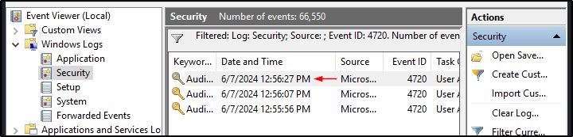
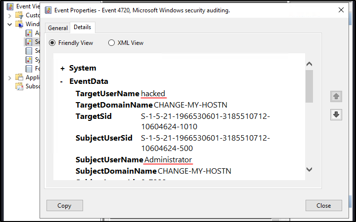
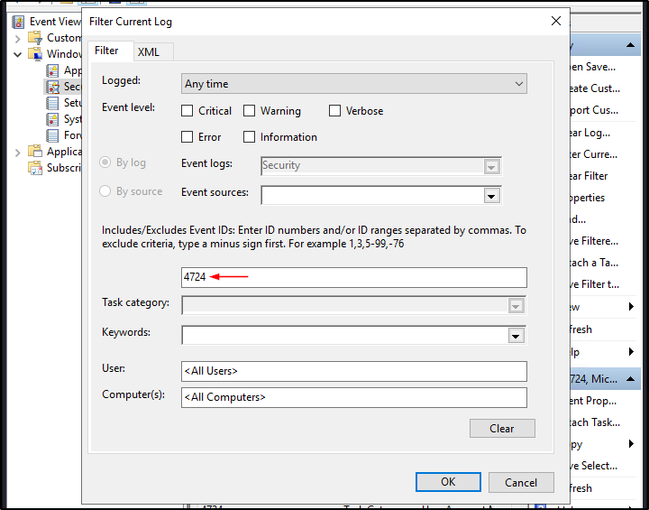
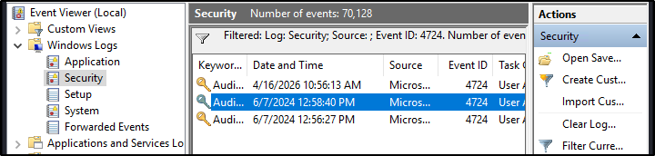
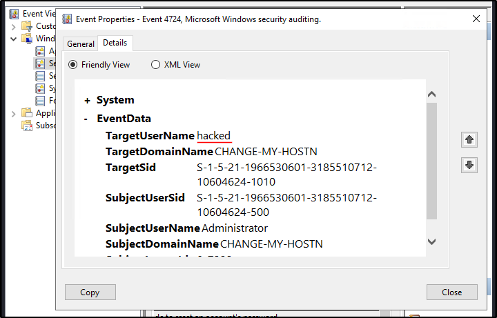
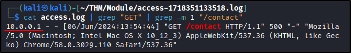
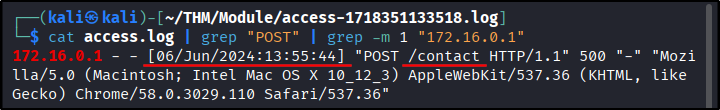

##### Link: [Logs Fundamentals](https://tryhackme.com/room/logsfundamentals)
---
##### Task 1: Introduction to Logs
1. Where can we find the majority of attack traces in a digital system?
	- `Logs`
---
##### Task 2: Types of Logs
1. Which type of logs contain information regarding the incoming and outgoing traffic in the network?
	- `Network Logs`
2. Which type of logs contain the authentication and authorization events?
	- `Security Logs`
---
##### Task 3: Windows Event Logs Analysis
1. What is the name of the last user account created on this system?
	- Open `Event Viewer` then `Filter`
		- `Event Viewer` → `Windows Logs` → `Security` → `Filter`
			- 
	- Set to `4720 (Account creation)`
		- 
	- There are 3 results, double-click on the latest one
		- 
	- Go to `Details` tab
		- 
	- Answer: `hacked`
2. Which user account created the above account?
	- Check screenshot above
	- Answer: `Administrator`
3. On what date was this user account enabled? Format: M/D/YYYY
	- Check screenshot above
	- Answer: `6/7/2024`
4. Did this account undergo a password reset as well? Format: Yes/No
	- Run filter again, this time for `4724 (Password reset)` then click the result
		- 
	- We find 3 result. Both entry on same date contains password reset log for `hacked` user
		- 
		- 
	- Answer: `Yes`
---
##### Task 4: Web Server Access Logs Analysis
1. What is the IP which made the last `GET` request to URL: `/contact`?
	- Use `grep` 2 times with `-m` to limit number of output
		- `cat access.log | grep "GET" | grep -m 1 "/contact"`
			- 
	- Answer: `10.0.0.1`
2. When was the last `POST` request made by IP: `172.16.0.1`?
	- Use `grep` 2 times with `-m` to limit number of output
		- `cat access.log | grep "POST" | grep -m 1 "172.16.0.1"`
			- 
	- Answer: `06/Jun/2024:13:55:44`
3. Based on the answer from question number 2, to which URL was the `POST` request made?
	- Answer: `/contact`
---
##### Task 5: Conclusion
1. Complete the room.
	- `No answer needed`
---
 