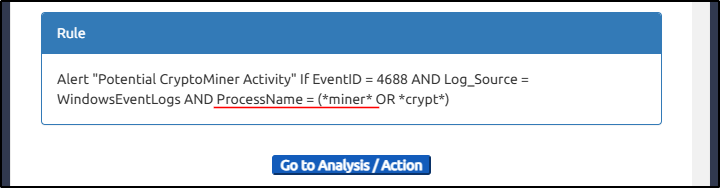
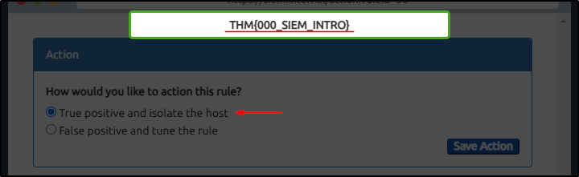

##### Link: [Introduction to SIEM](https://tryhackme.com/room/introtosiem)
---
##### Task 1: Introduction
1. What does SIEM stand for?
	- `Security Information and Event Management system`
---
##### Task 2: Logs Everywhere, Answers Nowhere
1. Is Registry-related activity host-centric or network-centric?
	- `host-centric`
2. Is VPN-related activity host-centric or network-centric?
	- `network-centric`
---
##### Task 3: Why SIEM?
1. Read the task above.
	- `No answer needed`
---
##### Task 4: Log Sources and Ingestion
1. In which location within a Linux environment are HTTP logs stored?
	- `/var/log/httpd`
---
##### Task 5: Alerting Process and Analysis
1. Which Event ID is generated when event logs are removed?
	- `104`
2. What type of alert may require tuning?
	- `False Positive`
---
##### Task 6: Lab Work
1. After clicking on the `Start Suspicious Activity button`, which process caused the alert?
	- Image
		- 
	- `cudominer.exe`
2. Find the event that caused the alert and identify the user responsible for the process execution.
	- Image
		- 
	- `chris`
3. What is the hostname of the suspect user?
	- `HR_02`
4. Examine the rule and the suspicious process; which term matched the rule that caused the alert?
	- Image
		- 
	- `miner`
5. Which option best represents the event? Choose from the following: False Positive/True Positive
	- Image
		- 
	- `True Positive`
6. Selecting the right ACTION will display the FLAG. What is the FLAG?
	- `THM{000_SIEM_INTRO}`
---
##### Task 7: Conclusion
1. Complete this room.
	- `No answer needed`
---
