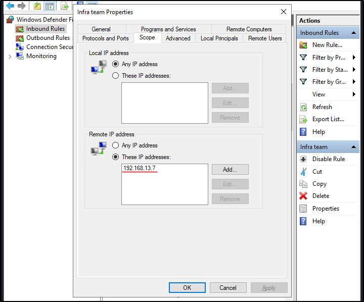

##### Link: [Firewall Fundamentals](https://tryhackme.com/room/firewallfundamentals)
---
##### Task 1: What Is the Purpose of a Firewall
1. Which security solution inspects the incoming and outgoing traffic of a device or a network?
	- `Firewall`
---
##### Task 2: Types of Firewalls
1. Which type of firewall maintains the state of connections?
	- `stateful firewall`
2. Which type of firewall offers heuristic analysis for the traffic?
	- `next-generation firewall`
3. Which type of firewall inspects the traffic coming to an application?
	- `proxy firewall`
---
##### Task 3: Rules in Firewalls
1. Which type of action should be defined in a rule to permit any traffic?
	- `allow`
2. What is the direction of the rule that is created for the traffic leaving our network?
	- `outbound`
---
##### Task 4: Windows Defender Firewall
1. What is the name of the rule that was created to block all incoming traffic on the SSH port?
	- Open firewall, sort by port, find port 22
		- 
	- Red circle means block the connection
	- `Core Op`
2. A rule was created to allow SSH from one single IP address. What is the rule name?
	- From image above, green checkmark means allow connection
	- `Infra team`
3. Which IP address is allowed under this rule?
	- Click `Infra team` rule → `Scope`
		- 
	- `192.168.13.7`
---
##### Task 5: Linux iptables Firewall
1. Which Linux firewall utility is considered to be the successor of `iptables`?
	- `nftables`
2. What rule would you issue with `ufw` to deny all outgoing traffic from your machine as a default policy? (answer without sudo)
	- `ufw default deny outgoing`
---
