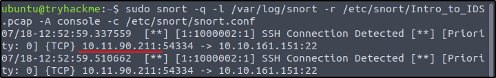
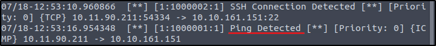
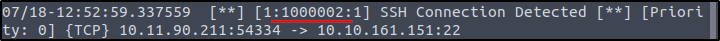

##### Link: [IDS Fundamentals](https://tryhackme.com/room/idsfundamentals)
---
##### Task 1: What Is an IDS
1. Can an intrusion detection system (IDS) prevent the threat after it detects it? Yea/Nay
	- `Nay`
---
##### Task 2: Types of IDS
1. Which type of IDS is deployed to detect threats throughout the network?
	- `Network Intrusion Detection System`
2. Which IDS leverages both signature-based and anomaly-based detection techniques?
	- `Hybrid IDS`
---
##### Task 3: IDS Example: Snort
1. Which mode of Snort helps us to log the network traffic in a PCAP file?
	- `Packet Logging Mode`
2. What is the primary mode of Snort called?
	- `Network Intrusion Detection System Mode`
---
##### Task 4: Snort Usage
1. Where is the main directory of Snort that stores its files?
	- `/etc/snort`
2. Which field in the Snort rule indicates the revision number of the rule?
	- `rev`
3. Which protocol is defined in the sample rule created in the task?
	- `icmp`
4. What is the file name that contains custom rules for Snort?
	- `local.rules`
---
##### Task 5: Practical Lab
1. What is the IP address of the machine that tried to connect to the subject machine using SSH?
	- Run `snort` on `.pcap` file
		- `sudo snort -q -l /var/log/snort -r /etc/snort/Intro_to_IDS.pcap -A console -c /etc/snort/snort.conf`
		- 
	- `10.11.90.211`
2. What other rule message besides the SSH message is detected in the PCAP file?
	- From previous output
		- 
	- `Ping Detected`
3. What is the `sid` of the rule that detects SSH?
	- From previous output
		- 
	- `1000002`
---
