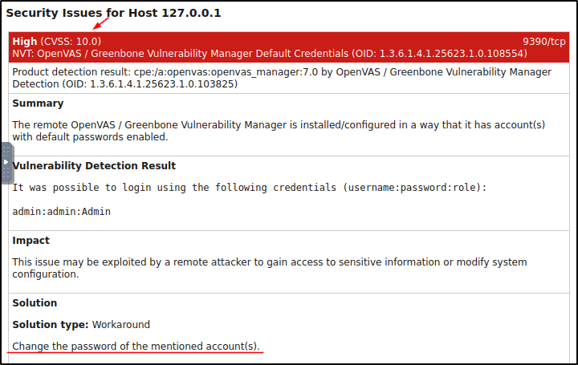

##### Link: [Vulnerability Scanner Overview](https://tryhackme.com/room/vulnerabilityscanneroverview)
---
##### Task 1: What Are Vulnerabilities?
1. What is the process of fixing the vulnerabilities called?
	- `Patching`
---
##### Task 2: Vulnerability Scanning
1. Which type of vulnerability scans require the credentials of the target host?
	- `Authenticated`
2. Which type of vulnerability scan focuses on identifying the vulnerabilities that can be exploited from outside the network?
	- `External `
---
##### Task 3: Tools for Vulnerability Scanning
1. Is Nessus currently an open-source vulnerability scanner? (Yea/Nay)
	- `Nay`
2. Which company developed the `Nexpose` vulnerability scanner?
	- `Rapid7`
3. What is the name of the open-source vulnerability scanner developed by `Greenbone` Security?
	- `OpenVAS`
---
##### Task 4: CVE & CVSS
1. OpenVAS
	- `Common Vulnerabilities and Exposures`
2. Which organization developed CVE?
	- `MITRE Corporation`
3. What would be the severity level of the vulnerability with a score of 5.3?
	- `Medium`
---
##### Task 5: OpenVAS
1. What is the IP address of the machine scanned in this task?
	- `10.10.154.44`
2. How many vulnerabilities were discovered on this host?
	- `13`
---
##### Task 6: Practical Exercise
1. What is the score of the single high-severity vulnerability found in the scan?
	- Open finished report in desktop
		- 
	- Answer: `10`
2. What is the solution suggested by OpenVAS for this vulnerability?
	- `Change the password of the mentioned account(s).`
---
