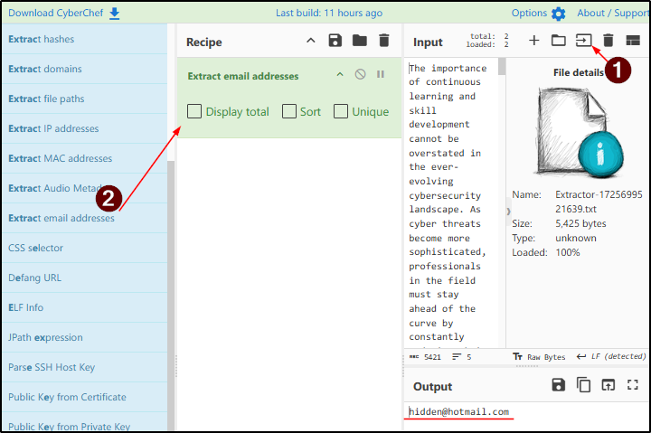
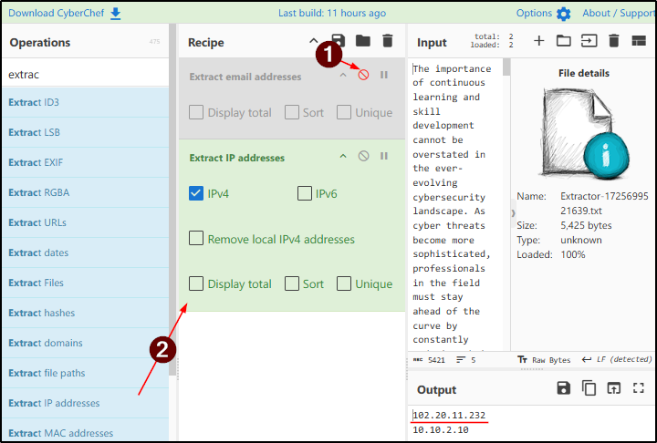
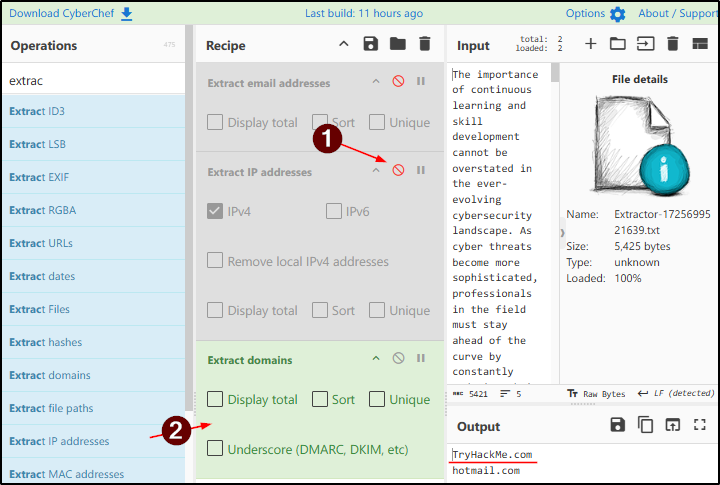
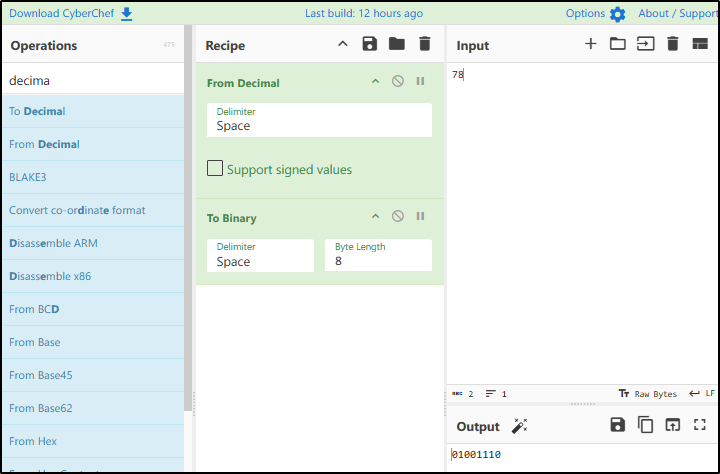
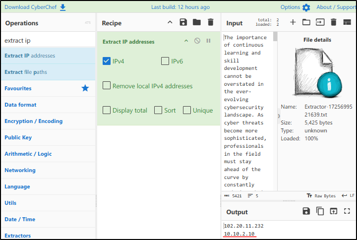
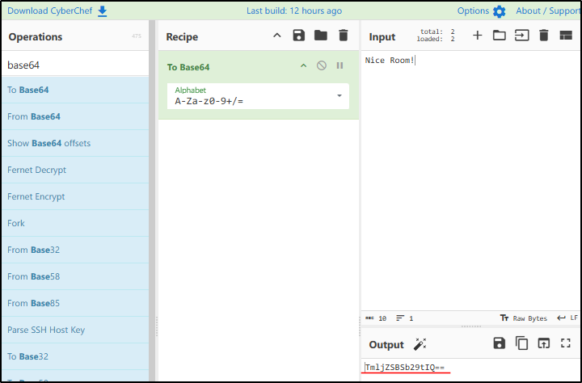
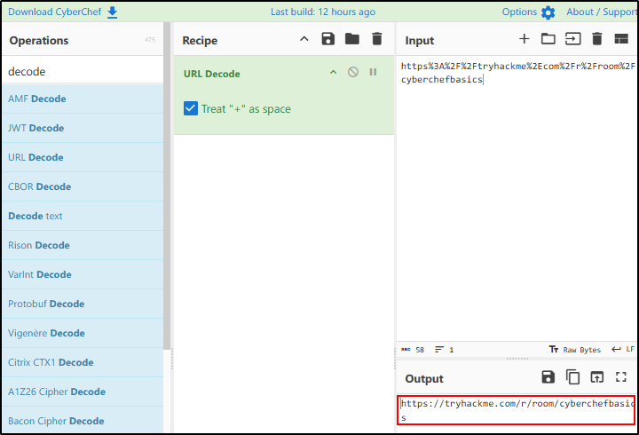
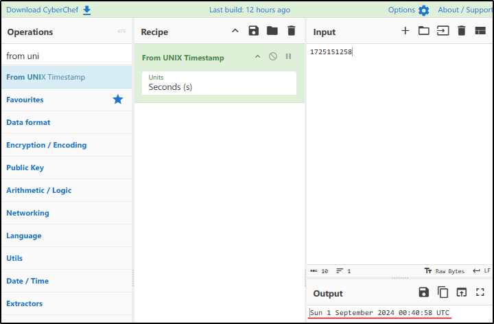
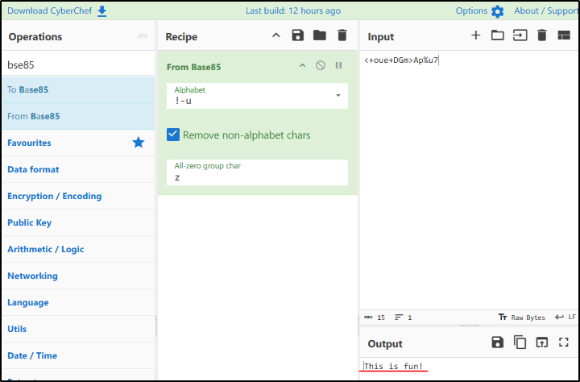

##### Link: [CyberChef: The Basics](https://tryhackme.com/room/cyberchefbasics)
---
##### Task 1: Introduction
1. Proceed with the next tasks to learn more!
	- `No answer needed`
---
##### Task 2: Accessing the Tool
1. I have access to CyberChef and I’m ready to dive into it.
	- `No answer needed`
---
##### Task 3: Navigating the Interface
1. In which area can you find `From Base64`?
	- `operations`
2. Which area is considered the heart of the tool?
	- `Recipe`
---
##### Task 4: Before Anything Else
1. At which step would you determine, what do I want to accomplish?
	- `1`
---
##### Task 5: Practice, Practice, Practice
1. What is the hidden email address?
	- Use `Open file as input` to upload `Extractor-1725699521639.txt`
	- Find `Extract email addresses` operation and drag them to `recipe` column
	- Check `Output` panel 
		- 
	- Answer: `hidden@hotmail.com`
2. What is the hidden IP address that ends in .232?
	- Disable previous operation
	- Find `Extract email addresses` operation and drag them to `recipe` column
	- Check `Output` panel 
		- 
	- Answer: `102.20.11.232`
3. Which domain address starts with the letter `T`?
	- Disable previous operation
	- Find `Extract IP addresses` operation and drag them to `recipe` column
	- Check `Output` panel 
		- 
	- Answer: `TryHackMe.com`
4. What is the binary value of the decimal number 78?
	- We can use `To Binary` operation, but it won’t work as expected because it consider the input as `seven & eight`, not `seventy eight`
	- We need to convert it from decimal to ASCII before using `To Binary`
		- 
	- Answer: `01001110`
5. What is the URL encoded value of `https://tryhackme.com/r/careers`?
	- Use `URL Encode` with `Encode all special chars` enabled
		- 
	- Answer: `https%3A%2F%2Ftryhackme%2Ecom%2Fr%2Fcareers`
---
##### Task 6: Your First Official Cook
1. Using the file you downloaded in Task 5, which IP starts and ends with `10`?
	- Use `Extract IP Addresses`
		- 
	- Answer: `10.10.2.10`
2. What is the base64 encoded value of the string `Nice Room!`?
	- Use `To Base64`
		- 
	- Answer: `TmljZSBSb29tIQ==`
3. What is the URL decoded value for `https%3A%2F%2Ftryhackme%2Ecom%2Fr%2Froom%2Fcyberchefbasics`?
	- Use `URL Decode`
		- 
	- Answer: `https://tryhackme.com/r/room/cyberchefbasics`
4. What is the datetime string for the Unix timestamp `1725151258`?
	- Use `From UNIX Timestamp`
		- 
	- Answer: `Sun 1 September 2024 00:40:58 UTC`
5.  What is the Base85 decoded string of the value `<+oue+DGm>Ap%u7`?
	- Use `From Base85`
		- 
	- Answer: `This is fun!`
---
##### Task 7: Conclusion
1. I will have `CyberChef`, the Swiss Army knife of cyber security, ready for my upcoming journeys!
	- `No answer needed`
---
