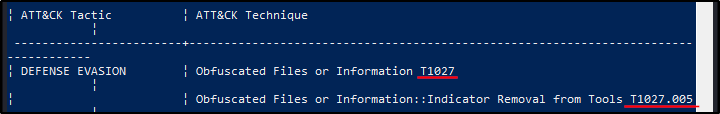
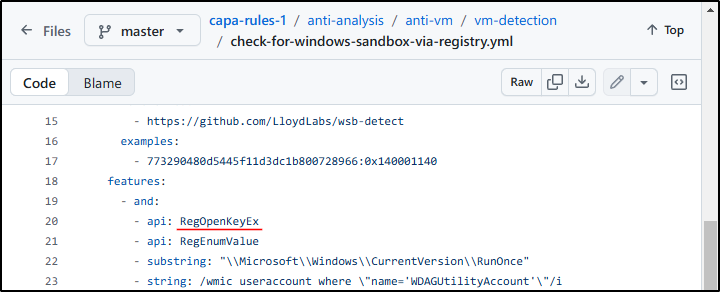

##### Link: [CAPA: The Basics](https://tryhackme.com/room/capabasics)
---
##### Task 1: Introduction
1. I'm excited to learn more about CAPA!
	- `No answer needed`
---
##### Task 2: Tool Overview: How CAPA Works
1. What command-line option would you use if you need to check what other parameters you can use with the tool? Use the shortest format.
	- `-h`
2. What command-line options are used to find detailed information on the malware's capabilities? Use the shortest format.
	- `-v`
3. What command-line options do you use to find very verbose information about the malware's capabilities? Use the shortest format.
	- `-vv`
4. What PowerShell command will you use to read the content of a file?
	- `Get-Content`
---
##### Task 3: Dissecting CAPA Results Part 1: General Information, MITRE and MAEC
1. What is the sha256 of `cryptbot.bin`?
	- Check output
		- 
	- `ae7bc6b6f6ecb206a7b957e4bb86e0d11845c5b2d9f7a00a482bef63b567ce4c`
2. What is the `Technique` Identifier of `Obfuscated Files or Information`?
	- Check output
		- 
	- `T1027`
3. What is the `Sub-Technique` Identifier of `Obfuscated Files or Information::Indicator Removal from Tools`?
	- `T1027.005`
4. When CAPA tags a file with this MAEC value, it indicates that it demonstrates behavior similar to, but not limited to, `Activating persistence mechanisms`?
	- `launcher`
5. When CAPA tags a file with this MAEC value, it indicates that the file demonstrates behavior similar to, but not limited to, `Fetching additional payloads or resources from the internet`?
	- `Downloader`
---
##### Task 4: Dissecting CAPA Results Part 2: Malware Behavior Catalogue
1. What serves as a catalogue of malware objectives and behaviors?
	- `Malware Behavior Catalogue`
2.  Which field is based on ATT&CK tactics in the context of malware behavior?
	- `Objective`
3. What is the Identifier of `"Create Process`" micro-behavior?
	- `C0017`
4. What is the behavior with an Identifier of `B0009`?
	- `Virtual Machine Detection`
5. Malware can be used to obfuscate data using base64 and XOR. What is the related `micro-behavior` for this?
	- `Encode Data`
6. Which micro-behavior refers to "`Malware is capable of initiating HTTP communications`"?
	- `HTTP Communication`
---
##### Task 5: Dissecting CAPA Results Part 3: Namespaces
1. Which top-level Namespace contains a set of rules specifically designed to detect behaviors, including obfuscation, packing, and anti-debugging techniques `exhibited by malware to evade analysis`?
	- `anti-analysis`
2. Which namespace contains rules to `detect virtual machine (VM) environments`? Note that this is not the TLN or Top-Level Namespace.
	- `anti-vm/vm-detection`
3. Which Top-Level Namespace contains rules related to `behaviors associated with maintaining access or persistence within a compromised system`? This namespace is focused on understanding how malware can establish and maintain a presence within a compromised environment, allowing it to persist and carry out malicious activities over an extended period.
	- `persistence`
4. Which namespace addresses techniques such as `String Encryption, Code Obfuscation, Packing, and Anti-Debugging Tricks`, which conceal or obscure the true purpose of the code?
	- `obfuscation`
5. Which Top-Level Namespace Is a `staging ground` for rules that are not quite polished?
	- `Nursery`
6. Proceed to the next task for the 2nd part of the discussion!
	- `No answer needed`
---
##### Task 6: Dissecting CAPA Results Part 4: Capability
1. What `rule yaml file` was matched if the Capability or rule name is `check HTTP status code`?
	- `check-http-status-code.yml`
2. What is the `name of the Capability` if the rule YAML file is `reference-anti-vm-strings.yml`?
	- `reference anti-VM strings`
3. Which `TLN` or Top-Level Namespace includes the Capability or rule name `run PowerShell expression`?
	- `load-code`
4. Check the conditions inside the `check-for-windows-sandbox-via-registry.yml` rule file from this [link (opens in new tab)](https://github.com/MBCProject/capa-rules-1/blob/master/anti-analysis/anti-vm/vm-detection/check-for-windows-sandbox-via-registry.yml). What is the `value of the API` that ends in `Ex` is it looking for?
	- Image
		- 
	- `RegOpenKeyEx`
---
##### Task 7: More Information, more fun!
1. Which parameter allows you to output the result of CAPA into a `.json file`?
	- `-j`
2. What tool allows you to interactively explore CAPA results in your web browser?
	- `CAPA Web Explorer`
3. Which feature of this CAPA Web Explorer allows you to filter options or results?
	- `Global Search Box`
---
##### Task 8: Conclusion
1. This room was fantastic! Let's proceed with other rooms for continuous learning!
	- `No answer needed`
---
 