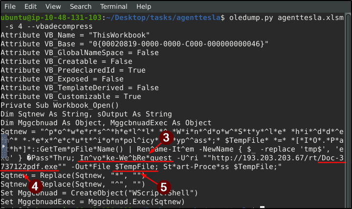
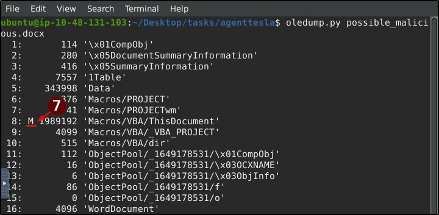
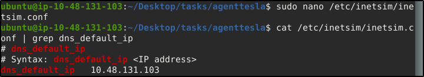
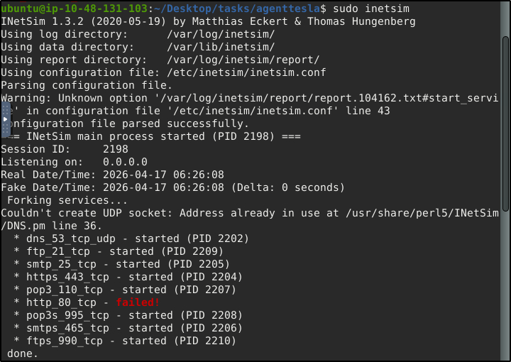
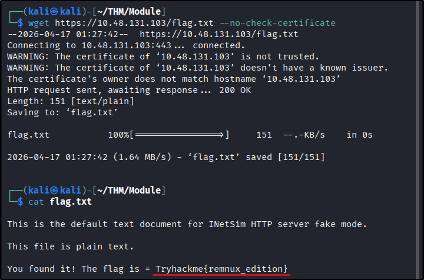
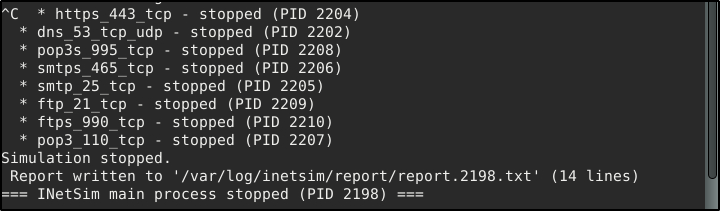
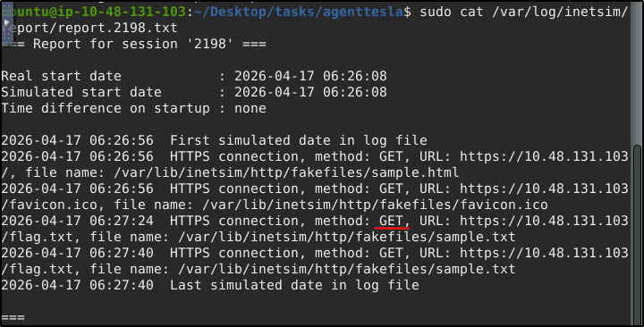
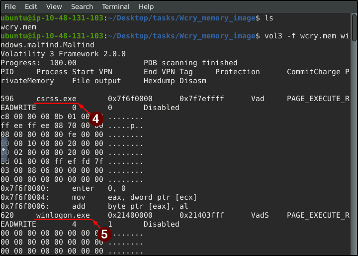
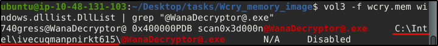

##### Link: [REMnux: Getting Started](https://tryhackme.com/room/remnuxgettingstarted)
---
##### Task 1: Introduction
1. Proceed with the next tasks to learn more!
	- `No answer needed`
---
##### Task 2: Machine Access
1. I'm excited to learn more about the tools inside the `REMnux` VM!
	- `No answer needed`
---
##### Task 3: File Analysis
1. What Python tool analyzes OLE2 files, commonly called Structured Storage or Compound File Binary Format?
	- Answer: `oledump.py`
2. What tool parameter we used in this task allows you to select a particular data stream of the file we are using it with?
	- Answer: `-s`
3. During our analysis, we were able to decode a PowerShell script. What command is commonly used for downloading files from the internet?
	- Use `oledump.py`
		- `oledump.py agenttesla.xlsm -s 4 --vbadecompress`
			- 
	- Answer: `Invoke-WebRequest`
4. What file was being downloaded using the PowerShell script?
	- Answer: `Doc-3737122pdf.exe`
5. During our analysis of the PowerShell script, we noted that a file would be downloaded. Where will the file being downloaded be stored?
	- Answer: `$TempFile`
6. Using the tool, scan another file named `possible_malicious.docx` located in the `/home/ubuntu/Desktop/tasks/agenttesla/` directory. How many data streams were presented for this file?
	- Use `oledump.py`
		- `oledump.py possible_malicious.docx`
			- 
	- Answer: `16`
7. Using the tool, scan another file named `possible_malicious.docx` located in the `/home/ubuntu/Desktop/tasks/agenttesla/` directory. At what data stream number does the tool indicate a macro present?
	- Find data stream with `M`
	- Answer: `8`
---
##### Task 4: Fake Network to Aid Analysis
1. Download and scan the file named `flag.txt` from the terminal using the command sudo `wget https://10.48.131.103/flag.txt --no-check-certificate`. What is the flag?
	- On target, change  `INetSim` setting
		- `sudo nano /etc/inetsim/inetsim.conf`
		- Replace `#dns_default_ip  0.0.0.0` with `dns_default_ip	 10.48.131.103`
	- Confirm changes
		- `cat /etc/inetsim/inetsim.conf | grep dns_default_ip`
			- 
	- Run `INetSim`
		- `sudo inetsim`
			- 
	- From attack host, download and read the file
		- `wget https://10.48.131.103/flag.txt --no-check-certificate`
		- `cat flag.txt`
			- 
	- Answer: `Tryhackme{remnux_edition}`
2. After stopping the `inetsim`, read the generated report. Based on the report, what URL Method was used to get the file flag.txt?
	- Stop `INetSim` 
		- Press `Ctrl+C`
			- 
	- Read the report
		- `sudo cat /var/log/inetsim/report/report.2198.txt`
			- 
	- Answer: `GET`
---
##### Task 5: Memory Investigation: Evidence Preprocessing
1. What plugin lists processes in a tree based on their parent process ID?
	- Answer: `PsTree`
2. What plugin is used to list all currently active processes in the machine?
	- Answer: `PsList`
3. What Linux utility tool can extract the ASCII, 16-bit little-endian, and 16-bit big-endian strings?
	- Answer: `strings`
4. By running `vol3` with the `Malfind` parameter, what is the first (1st) process identified suspected of having an injected code?
	- Run `vol3`
		- `vol3 -f wcry.mem windows.malfind.Malfind`
			- 
	- Answer: `csrss.exe`
5. Continuing from the previous question (Question 4), what is the second (2nd) process identified suspected of having an injected code?
	- Answer: `winlogon.exe`
6. By running vol3 with the `DllList` parameter, what is the file path or directory of the binary `@WanaDecryptor@.exe`?
	- Use `vol3` with `grep`
		- `vol3 -f wcry.mem windows.dlllist.DllList | grep "@WanaDecryptor@.exe"`
			- 
	- Answer: `C:\Intel\ivecuqmanpnirkt615`
---
##### Task 6: Conclusion
1. Fantastic room indeed!
	- `No answer needed`
---
