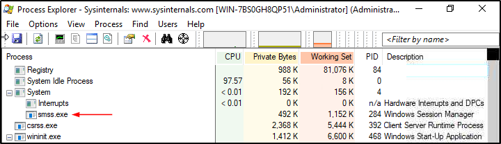
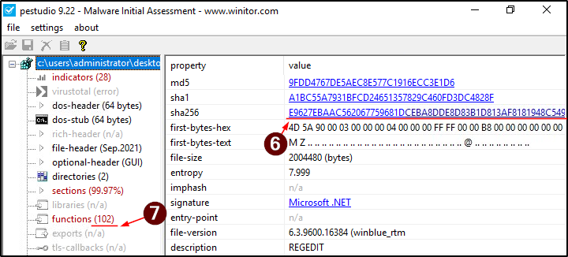
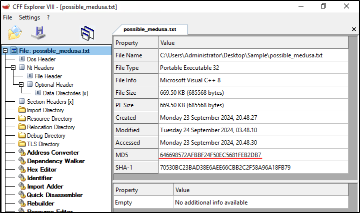
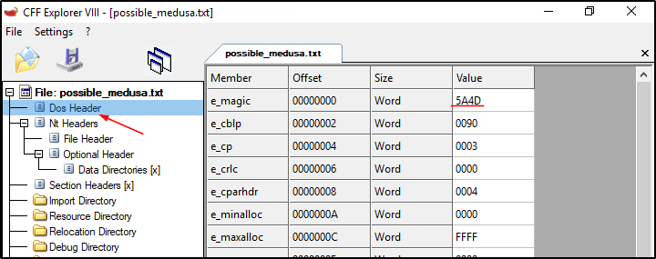
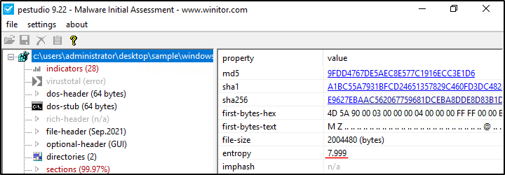
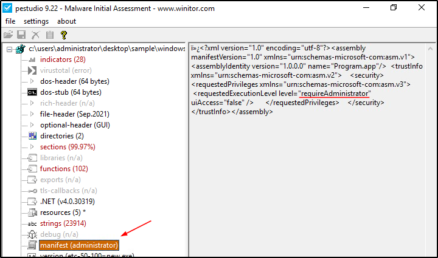
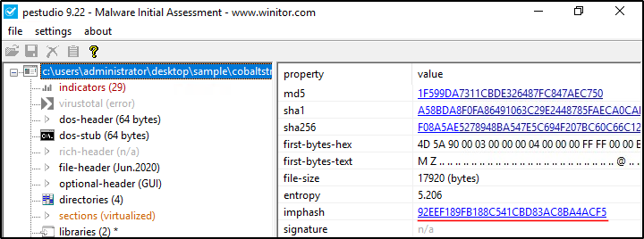
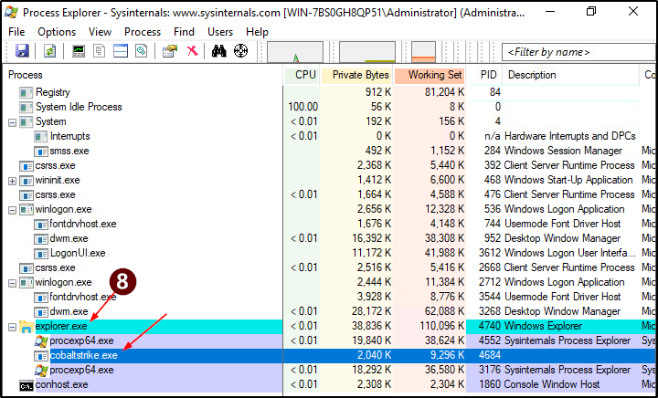
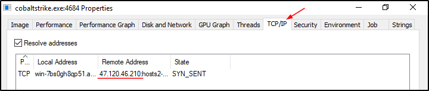
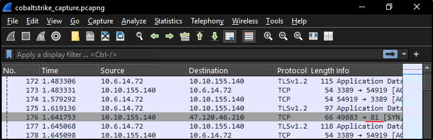

##### Link: [FlareVM: Arsenal of Tools](https://tryhackme.com/room/flarevmarsenaloftools)
---
##### Task 1: Introduction
1. I'm ready to learn more about `FlareVM`!
	- `No answer needed`
---
##### Task 2: Arsenal of Tools
1. Which tool is an Open-source debugger for binaries in x64 and x32 formats?
	- `x64dbg`
2. What tool is designed to analyze and edit Portable Executable (PE) files?
	- `CFF Explorer`
3. Which tool is considered a sophisticated memory editor and process watcher?
	- `Process Hacker`
4. Which tool is used for Disc image acquisition and analysis for forensic use?
	- `FTK Imager`
5. What tool can be used to view and edit a binary file?
	- `HxD`
---
##### Task 3: Commonly Used Tools for Investigation: Overview
1. Which tool was formerly known as FireEye Labs Obfuscated String Solver?
	- Answer: `FLOSS`
2. Which tool offers in-depth insights into the active processes running on your computer?
	- Answer: `Process Explorer`
3. By using the Process Explorer (`procexp`) tool, under what process can we find smss.exe?
	- Open `Process Explorer` from Desktop
		- 
	- Answer: `System`
4. Which powerful Windows tool is designed to help you record issues with your system's apps?
	- Answer: `Procmon`
5. Which tool can be used for Static analysis or studying executable file properties without running the files?
	- Answer: `PEStudio`
6. Using the tool `PEStudio` to open the file `cryptominer.bin` in the Desktop\Sample folder, what is the sha256 value of the file?
	- Open `PEStudio` then open `cryptominer.bin`
		- 
	- Answer: `E9627EBAAC562067759681DCEBA8DDE8D83B1D813AF8181948C549E342F67C0E`
7. Using the tool `PEStudio` to open the file `cryptominer.bin` in the Desktop\Sample folder, how many functions does it have?
	- Answer: `102`
8. What tool can generate file hashes for integrity verification, authenticate the source of system files, and validate their validity?
	- Answer: `CFF Explorer`
9. Using the tool `CFF Explorer` to open the file `possible_medusa.txt` in the `Desktop\Sample` folder, what is the MD5 of the file?
	- Open `CFF Explorer` then open `possible_medusa.txt`
		- 
	- Answer: `646698572AFBBF24F50EC5681FEB2DB7`
10. Use the `CFF Explorer` tool to open the file `possible_medusa.txt` in the `Desktop\Sample` folder. Then, go to the `DOS Header Section.` What is the `e_magic` value of the file?
	- Continue from previous question
		- 
	- Answer: `5A4D`
---
##### Task 4: Analyzing Malicious Files!
1. Using `PEStudio`, open the file windows.exe. What is the `entropy value` of the file windows.exe?
	- Use `PEStudio`
		- 
	- Answer: `7.999`
2. Using `PEStudio`, open the file windows.exe, then go to manifest (administrator section)`.` What is the value under `requestedExecutionLevel`?
	- Use `PEStudio`
		- 
	- Answer: `requireAdministrator`
3. Which function allows the process to use the operating system's shell to execute other processes?
	- Answer: `set_UseShellExecute`
4. Which API starts with R and indicates that the executable uses cryptographic functions?
	- Answer: `RijndaelManaged`
5. What is the `Imphash` of cobaltstrike.exe?
	- Use `PEStudio`
		- 
	- Answer: `92EEF189FB188C541CBD83AC8BA4ACF5`
6. What is the defanged IP address to which the process cobaltstrike.exe is connecting?
	- Open `Process Explorer`
	- Run `cobaltstrike.exe`
	- Find it in `Process Explorer`, double click on it
		- 
	- Go to `TCP/IP` tab, we find the IP `47.120.46.210`
		- 
	- Defang it by replacing `.` with `[.]` to prevent accidental clicking
	- Answer: `47[.]120[.]46[.]210`
7. What is the destination port number used by cobaltstrike.exe when connecting to its C2 IP Address?
	- Open `cobaltstrike_capture.pcapng`
		- 
	- Answer: `81`
8. During our analysis, we found a process called cobaltstrike.exe. What is the `parent process` of cobaltstrike.exe?
	- Check image for question 6
	- Answer: `explorer.exe`
---
##### Task 5: Conclusion
1. Fantastic Room!
	- `No answer needed`
---
