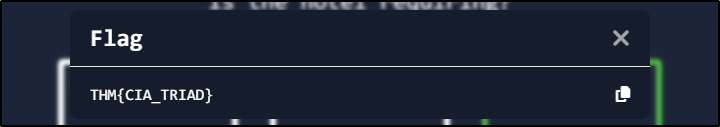

##### Link: [Security Principles](https://tryhackme.com/room/securityprinciples)
---
##### Task 1: Introduction
1. Think how you would describe something as secure.
	- `No answer needed`
---
##### Task 2: CIA
1. Click on "View Site" and answer the five questions. What is the flag that you obtained at the end?
	1. Two companies are negotiating a certain agreement; however, they want to keep the details of the agreement secret. Which security pillar are they emphasizing? `Confidentiality`
	2. You went to cash out a cheque, and the bank teller made you wait for five minutes as they confirmed the signature of the cheque's issuer. Which security function is the bank teller checking? `Integrity`
	3. At a police checkpoint, the police officer suspected that the vehicle registration papers were fake. Which security function does the officer think is lacking? `Integrity`
	4. As the troops got deployed, the leader stressed that they should not communicate their location to anyone while the mission was ongoing. Which security function did the leader want to have? `Confidentiality`
	5. One hotel is stressing that the Internet over its Wi-Fi network must be accessible 24 hours a day, seven days a week. Which security pillar is the hotel requiring? `Availability`
		- 
	- Answer: `THM{CIA_TRIAD}`
---
##### Task 3: DAD
1. The attacker managed to gain access to customer records and dumped them online. What is this attack?
	- `Disclosure`
2. A group of attackers were able to locate both the main and the backup power supply systems and switch them off. As a result, the whole network was shut down. What is this attack?
	- `Destruction/Denial`
---
##### Task 4: Fundamental Concepts of Security Models
1. Click on "View Site" and answer the four questions. What is the flag that you obtained at the end?
	1. Which model dictates “no read down”? `Biba`
	2. Which model states “no read up”? `Bell-LaPadula `
	3. Which model teaches “no write down”? `Bell-LaPadula`
	4. Which model forces “no write up”? `Biba`
		- 
	- Answer: `THM{SECURITY_MODELS}`
---
##### Task 5: Defence-in-Depth
1. Make sure you have read the above.
	- `No answer needed`
---
##### Task 6: ISO/IEC 19249
1. Which principle are you applying when you turn off an insecure server that is not critical to the business?
	- `2`
2. Your company hired a new sales representative. Which principle are they applying when they tell you to give them access only to the company products and prices?
	- `1`
3. While reading the code of an ATM, you noticed a huge chunk of code to handle unexpected situations such as network disconnection and power failure. Which principle are they applying?
	- `5`
---
##### Task 7: Zero Trust versus Trust but Verify
1. Make sure you have read the above.
	- `No answer needed`
---
##### Task 8: Threat versus Risk
1. Make sure you have read the above.
	- `No answer needed`
---
##### Task 9: Conclusion
1. Make sure you have taken notes of all the key terms and acronyms we covered in this room.
	- `No answer needed`
---
