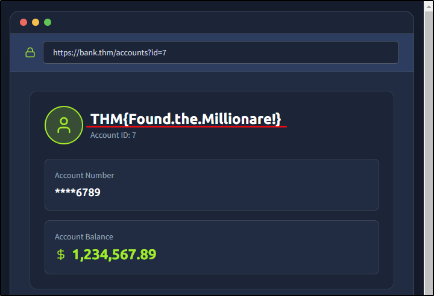
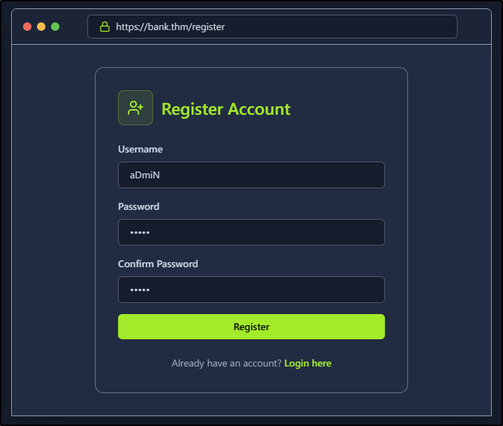
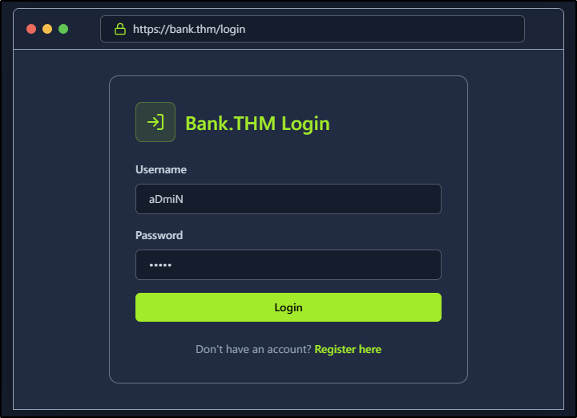
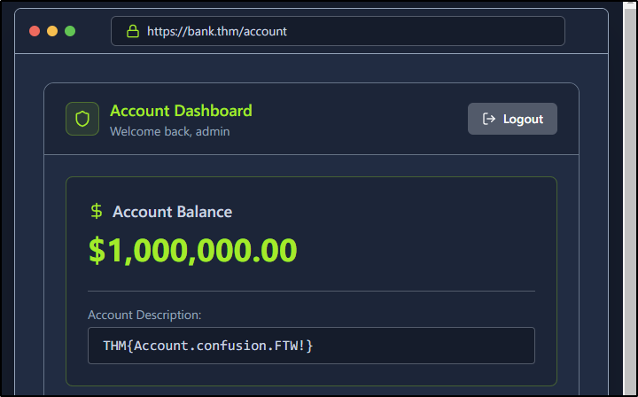
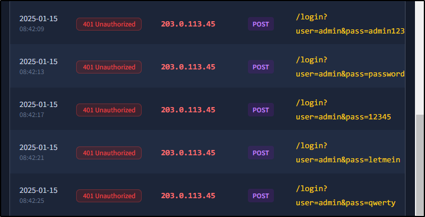
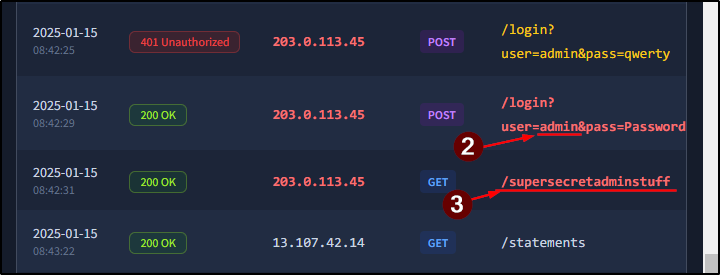

##### Link: [OWASP Top 10 2025: IAAA Failures](https://tryhackme.com/room/owasptopten2025one)
---
##### Task 1: Introduction
1. I am ready to learn about IAAA failures!
	- `No answer needed`
---
##### Task 2: What is IAAA?
1. What does IAAA stand for?
	- `Identity, Authentication, Authorisation, Accountability`
---
##### Task 3: A01: Broken Access Control
1. If you don't get access to more roles but can view the data of another users, what type of privilege escalation is this?
	- Answer: `Horizontal`
2. What is the note you found when viewing the user's account who had more than $ 1 million?
	- Switch `id` to `7`
		- 
	- Answer: `THM{Found.the.Millionare!}`
---
##### Task 4: A07: Authentication Failures
1. What is the flag on the `admin` user's dashboard?
	- Register then login as `aDmiN`
		- 
		- 
		- 
	- Answer: `THM{Account.confusion.FTW!}`
---
##### Task 5: A09: Logging & Alerting Failures
1. It looks like an attacker tried to perform a brute-force attack, what is the IP of the attacker?
	- Check log
		- 
	- Answer: `203.0.113.45`
2. Looks like they were able to gain access to an account! What is the username associated with that account?
	- Check log
		- 
	- Answer: `admin`
3. What action did the attacker try to do with the account? List the endpoint the accessed.
	- Answer: `/supersecretadminstuff`
---
##### Task 6: Conclusion
1. I understand the importance of a secure IAAA implementation in my application!
	- `No answer needed` 
---
