##### Link: [OWASP Top 10 2025: Application Design Flaws](https://tryhackme.com/room/owasptopten2025two)
---
##### Task 1: Introduction
1. I am ready to learn about design flaw vulnerabilities!
	- `No answer needed`
---
##### Task 2: AS02: Security Misconfigurations
1. What's the flag?
	- Open target, we get description of how their API works
		- `http://10.48.167.217:5002/`
			- 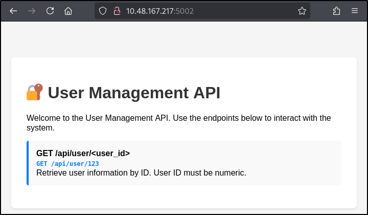
	- Test it, its working as expected
		- `http://10.48.167.217:5002/api/user/1`
			- 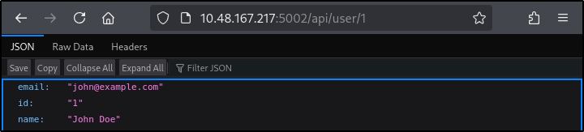
	- Try unexpected input (string), we get error which reveal the flag
		- `http://10.48.167.217:5002/api/user/test`
			- 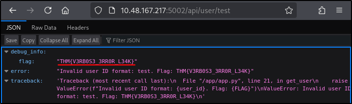
	- Answer: `THM{V3RB0S3_3RR0R_L34K}`
---
##### Task 3: AS03: Software Supply Chain Failures
1. What's the flag?
	- From download task files, we find to run `debug` require `POST` request to `/api/process `contains JSON object with data parameter
		- `app-1763304148639.py`
			- 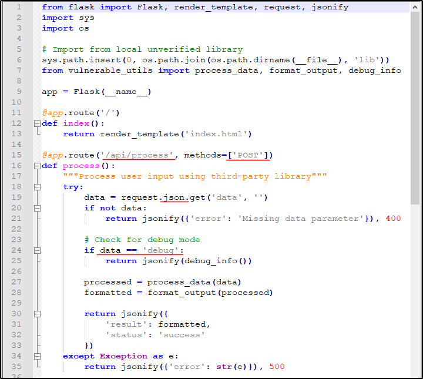
	- Visit target in browser, we see API documentation that confirm this
		- `http://10.48.167.217:5003/`
			- 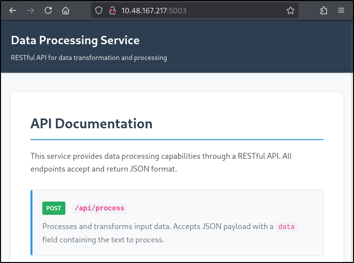
	- Visit `/api/process`
		- `http://10.48.167.217:5003/api/process`
			- 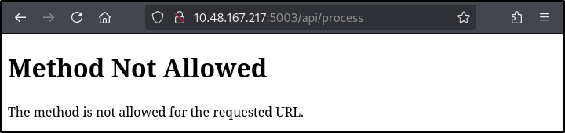
	- Find the request in Burp, send to repeater
		- `Burp`
			- 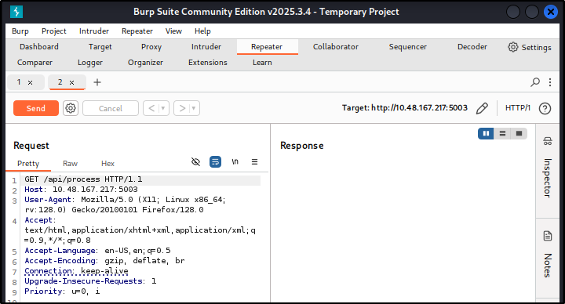
	- Right-click, change request method
		- `Burp`
			- 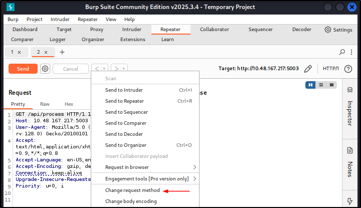
			- 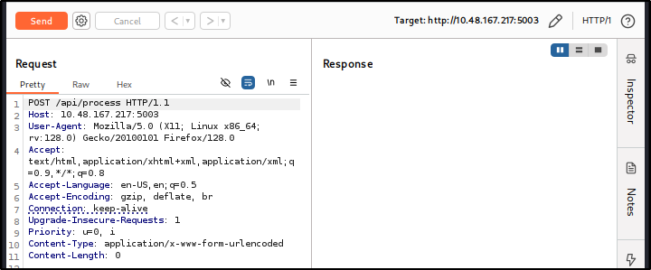
	- Modify `content-type`, add JSON object in request body, then send the request
		- `Burp`
			- 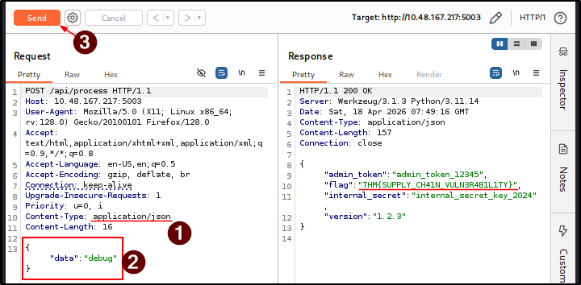
	- Answer: `THM{SUPPLY_CH41N_VULN3R4B1L1TY}`
---
##### Task 4: AS04: Cryptographic Failures
1. What's the flag?
	- Open target, we find encrypted document
		- 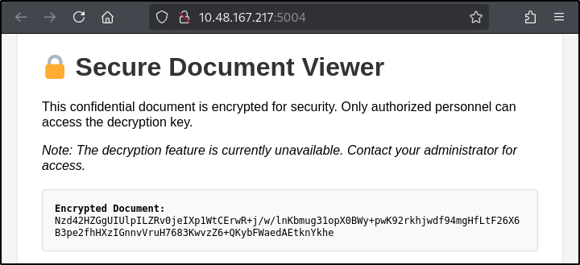
	- Checking source code (`Ctrl+U`), we find it has `descrypt.js` which contains encryption type and key to decrypt it. `ECB with a 128‑bit key` usually refer to `AES-128`
		- 
		- 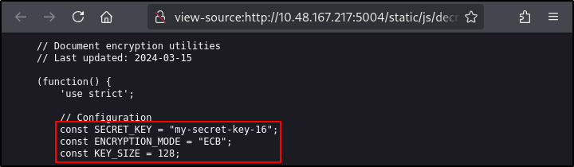
	- Use `https://www.devglan.com/online-tools/aes-encryption-decryption` to decrypt it
		- 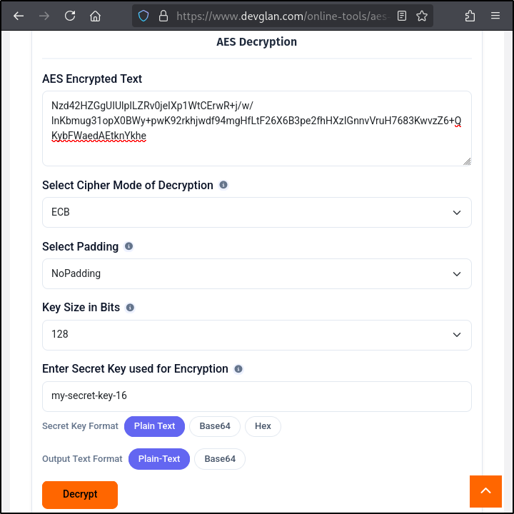
		- 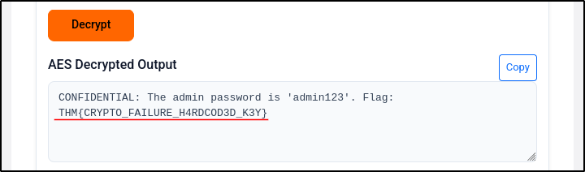
	- Answer: `THM{CRYPTO_FAILURE_H4RDCOD3D_K3Y}`
---
##### Task 5: AS06: Insecure Design
1. What's the flag?
- Answer: `THM{1NS3CUR3_D35IGN_4SSUMPT10N}`
---
##### Task 6: Conclusion
1. I'm ready for the next room!
	- Open target, we see landing page for an app-only messaging app
		- `http://10.48.167.217:5005/`
			- 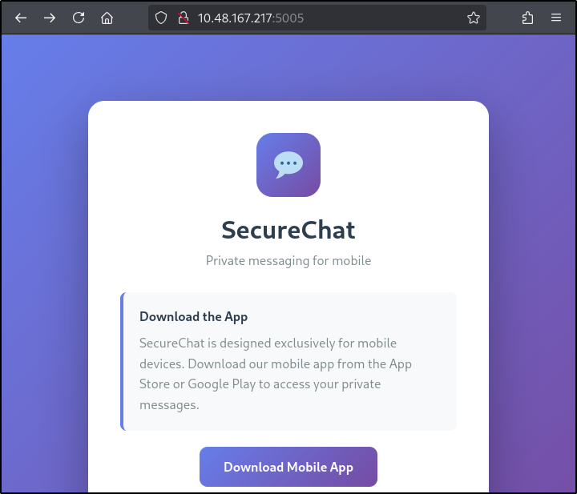
	- We use `FFUF` for content discovery on root path and found nothing
		- `ffuf -u http://10.48.167.217:5005/FUZZ -w /usr/share/wordlists/seclists/Discovery/Web-Content/common.txt`
			- 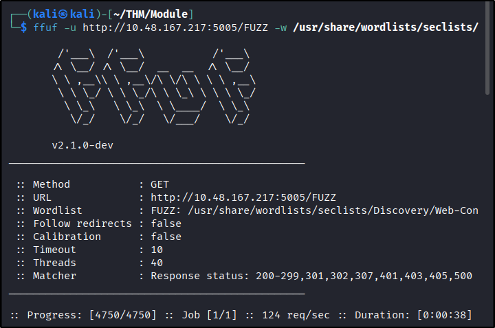
	- Considering its likely to use API, we try again on `/api` and get 1 result: `users`
		- `ffuf -u http://10.48.167.217:5005/api/FUZZ -w /usr/share/wordlists/seclists/Discovery/Web-Content/common.txt`
			- 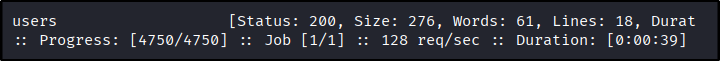
	- When visited, we find JSON data of users
		- `http://10.48.167.217:5005/api/users`
			- 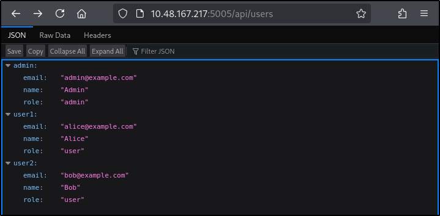
	- Run `FFUF` again for `/api/users`, we get 1 result :`admin`
		- `ffuf -u http://10.48.167.217:5005/api/users/FUZZ -w /usr/share/wordlists/seclists/Discovery/Web-Content/common.txt`
			- 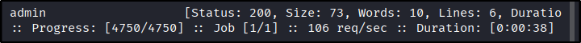
	- It contains similar page with previous page
		- `http://10.48.167.217:5005/api/users/admin`
			- 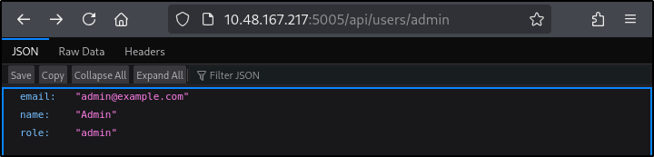
	- Deeper enumeration gives no result, so we review what we have
		- From `/api/messages/admin`, it use username as identifier instead of integer like `userId`
		- `FFUF` only find 1 resource: `/messages`
		- What if there are more resource, but only accessible if we provide the identifier?
	- Try again with `/api/FUZZ/admin`. We get 1 new result: `messages`
		- `ffuf -u http://10.48.167.217:5005/api/FUZZ/admin -w /usr/share/wordlists/seclists/Discovery/Web-Content/common.txt`
			- 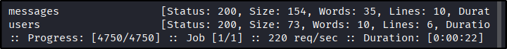
	- Visit it, we get the flag
		- `http://10.48.167.217:5005/api/messages/admin`
			- 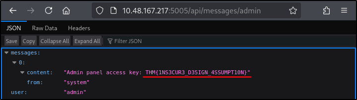
	- `No answer needed`
---
