##### Link: [Hashing Basics](https://tryhackme.com/room/hashingbasics)
---
##### Task 1: Introduction
1. Let’s begin!
	- `No answer needed`
---
##### Task 2: Hash Functions
1. What is the SHA256 hash of the `passport.jpg` file in `~/Hashing-Basics/Task-2`?
	- `sha256sum ~/Hashing-Basics/Task-2/passport.jpg`
		- 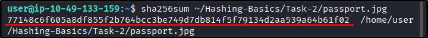
	- Answer: `77148c6f605a8df855f2b764bcc3be749d7db814f5f79134d2aa539a64b61f02`
2. What is the output size in bytes of the MD5 hash function?
	- MD5hash is 32 hexadecimal which equal to 16 bytes which equal to 128 bits
	- Answer: `16`
3. If you have an 8-bit hash output, how many possible hash values are there?
	- `= 2 ^ 8 = 256`
	- Answer: `256`
---
##### Task 3: Insecure Password Storage for Authentication
1. What is the 20th password in rockyou.txt?
	- Use `sed` with `-n` to show specific lines
		- `sed -n '20p' /usr/share/wordlists/rockyou.txt`
		- 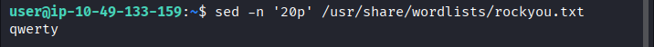
	- Answer: `qwerty`
---
##### Task 4: Using Hashing for Secure Password Storage
1. Manually check the hash `4c5923b6a6fac7b7355f53bfe2b8f8c1` using the rainbow table above.
	- `inS3CyourP4$$`
2. Crack the hash `5b31f93c09ad1d065c0491b764d04933` using an online tool.
	- Use `hashes.com`
		- 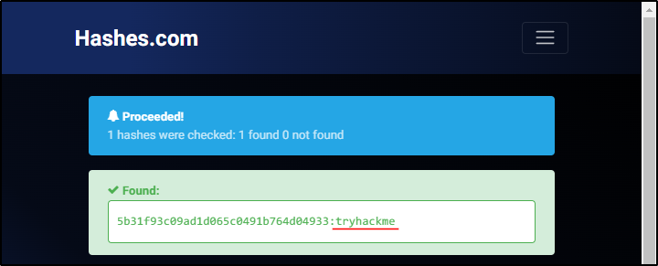
	- `tryhackme`
3. Should you encrypt passwords in password-verification systems? `Yea`/`Nay`
	- `Nay`
---
##### Task 5: Recognizing Password Hashes
1. What is the hash size in `yescrypt`?
	- Check its manual: `man 5 crypt`
		- 
	- `256`
2. What’s the Hash-Mode listed for Cisco-ASA MD5?
	- Visit `https://hashcat.net/wiki/doku.php?id=example_hashes`
		- 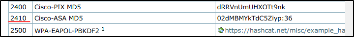
	- `2410`
3. What hashing algorithm is used in Cisco-IOS if it starts with `$9$`?
	-  Visit `https://hashcat.net/wiki/doku.php?id=example_hashes`
		- 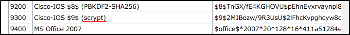
	- `scrypt`
---
##### Task 6: Password Cracking
1. Use `hashcat` to crack the hash, `$2a$06$7yoU3Ng8dHTXphAg913cyO6Bjs3K5lBnwq5FJyA6d01pMSrddr1ZG`, saved in `~/Hashing-Basics/Task-6/hash1.txt`.
	- Checking `hashcat` hash example, there are 4 hash type that match `$2a$0`. 
	- Test with `3200 | bcrypt $2*$, Blowfish (Unix)`, we manage to crack it
		- `hashcat -m 3200 -a 0 '$2a$06$7yoU3Ng8dHTXphAg913cyO6Bjs3K5lBnwq5FJyA6d01pMSrddr1ZG' /usr/share/wordlists/rockyou.txt`
		- 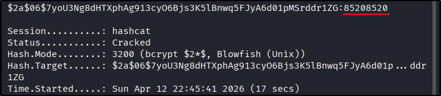
	- Answer: `85208520`
2. Use `hashcat` to crack the SHA2-256 hash, `9eb7ee7f551d2f0ac684981bd1f1e2fa4a37590199636753efe614d4db30e8e1`, saved in `~/Hashing-Basics/Task-6/hash2.txt`.
	- Checking manual, the code is `1400`
		- `hashcat -h | grep "SHA2-256"`
		- `hashcat -m 1400 -a 0 '9eb7ee7f551d2f0ac684981bd1f1e2fa4a37590199636753efe614d4db30e8e1' /usr/share/wordlists/rockyou.txt`
		- 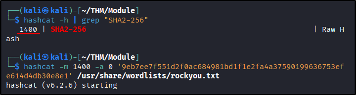
		- 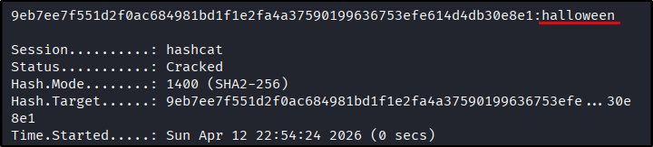
	- Answer: `halloween`
3. Use `hashcat` to crack the hash, `$6$GQXVvW4EuM$ehD6jWiMsfNorxy5SINsgdlxmAEl3.yif0/c3NqzGLa0P.S7KRDYjycw5bnYkF5ZtB8wQy8KnskuWQS3Yr1wQ0`, saved in `~/Hashing-Basics/Task-6/hash3.txt`.
	- Checking `hashcat` hash example, there are 5 hash type that match `$6$`.
	-  Test with `1800 | sha512crypt $6$, SHA512 (Unix)`, we manage to crack it
		- `hashcat -m 1800 -a 0 '$6$GQXVvW4EuM$ehD6jWiMsfNorxy5SINsgdlxmAEl3.yif0/c3NqzGLa0P.S7KRDYjycw5bnYkF5ZtB8wQy8KnskuWQS3Yr1wQ0' /usr/share/wordlists/rockyou.txt`
		- 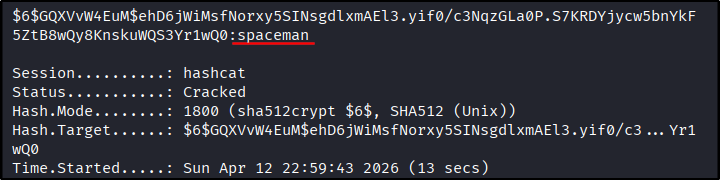
	- Answer: `spaceman`
4. Crack the hash, `b6b0d451bbf6fed658659a9e7e5598fe`, saved in `~/Hashing-Basics/Task-6/hash4.txt`.
	- Checking `hashcat` hash example, we get 0 match
	- Using `https://crackstation.net/` we manage to crack it
		- 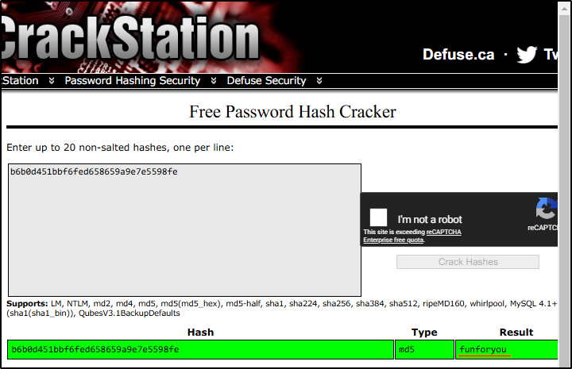
	- Answer: `funforyou`
---
##### Task 7: Hashing for Integrity Checking
1. What is SHA256 hash of `libgcrypt-1.11.0.tar.bz2` found in `~/Hashing-Basics/Task-7`?
	- Use `sha256sum`
		- 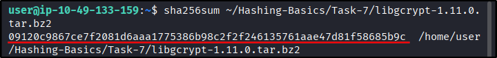
	- `09120c9867ce7f2081d6aaa1775386b98c2f2f246135761aae47d81f58685b9c`
2. What’s the `hashcat` mode number for `HMAC-SHA512 (key = $pass)`?
	- Check `hashcat` hash example
		- 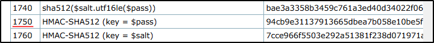
	- `1750`
---
##### Task 8: Conclusion
1. Use `base64` to decode `RU5jb2RlREVjb2RlCg==`, saved as `decode-this.txt` in `~/Hashing-Basics/Task-8`. What is the original word?
	- `echo "RU5jb2RlREVjb2RlCg==" | base64 -d`
		- 
	- `ENcodeDEcode`
2. Ensure you have noted the various concepts and tools explored in this room.
	- `No answer needed`
---
