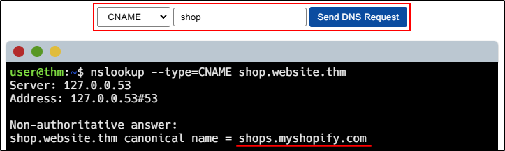
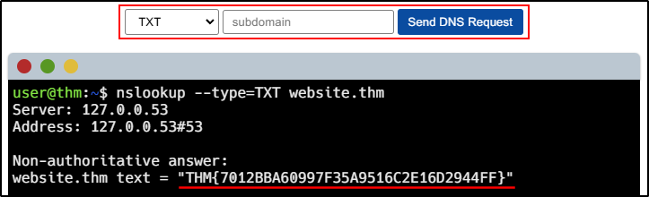
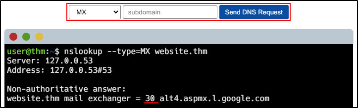
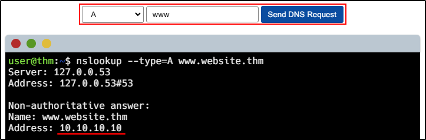

##### Link: [DNS in Detail](https://tryhackme.com/room/dnsindetail)
---
##### Task 1: What is DNS?
1. What does DNS stand for?
	- `Domain Name System`
---
##### Task 2: Domain Hierarchy
1. What is the maximum length of a subdomain?
	- `63`
2. Which of the following characters cannot be used in a subdomain ( 3 b _ - )?
	- `_`
3. What is the maximum length of a domain name?
	- `253`
4. What type of TLD is .co.uk?
	- `ccTLD`
---
##### Task 3: Record Types
1. What type of record would be used to advise where to send email?
	- `MX`
2. What type of record handles IPv6 addresses?
	- `AAAA`
---
##### Task 4: Making A Request
1. What field specifies how long a DNS record should be cached for?
	- `ttl`
2. What type of DNS Server is usually provided by your ISP?l
	- `recursive`
3. What type of server holds all the records for a domain?
	- `authoritative`
---
##### Task 5: Practical
1. What is the `CNAME` of `shop.website.thm`?
	- 
	- Answer: `shops.myshopify.com`
2. What is the value of the `TXT` record of `website.thm`?
	- 
	- Answer: `THM{7012BBA60997F35A9516C2E16D2944FF}`
3. What is the numerical priority value for the `MX record`?
	- 
	- Answer: `30`
4. What is the `IP` address for the `A` record of `www.website.thm`?
	- 
	- Answer: `10.10.10.10`
--- 
